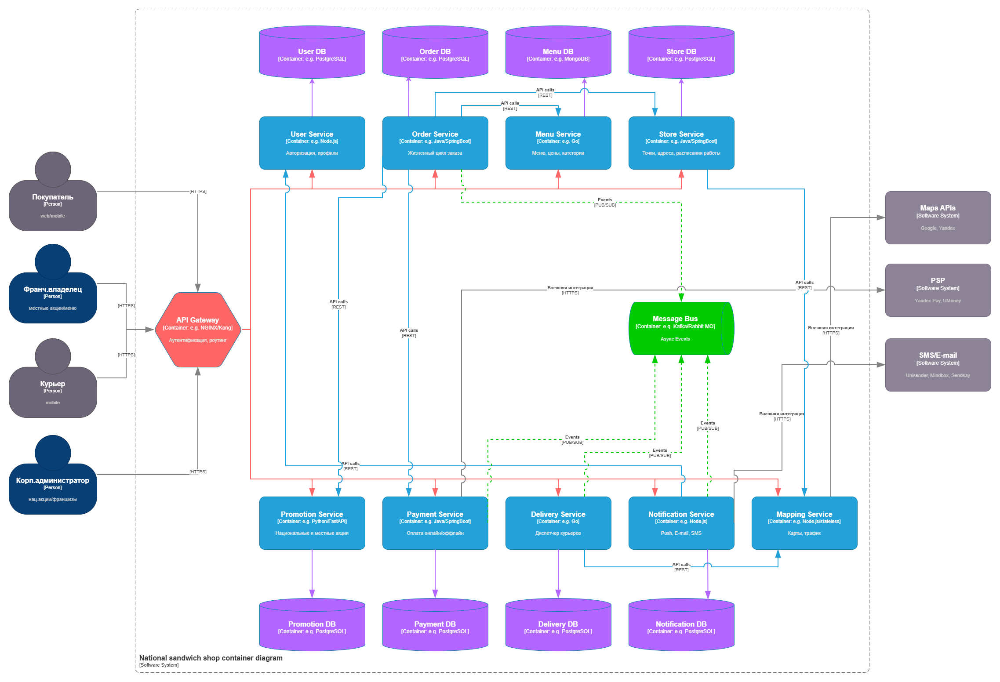

# ДЗ №1 - Архитектурная ката "I'll Have the BLT"

## Архитектурная задача:

**I'll Have the BLT**

A national sandwich shop wants to enable 'fax in your order' but over the Internet instead (in addition to their current fax-in service)

- **Users:** thousands, perhaps one day millions
- **Requirements:**
  - users will place their order, then be given a time to pick up their sandwich and directions to the shop (which must integrate with several external mapping services that include traffic information)
  - if the shop offers a delivery service, dispatch the driver with the sandwich to the user
  - mobile-device accessibility
  - offer national daily promotionals/specials
  - offer local daily promotionals/specials
  - accept payment online or in person/on delivery

- **Additional Context:**
  - Sandwich shops are franchised, each with a different owner.
  - Parent company has near-future plans to expand overseas.
  - Corporate goal is to hire inexpensive labor to maximize profit.

---

## Концепция задачи:

Национальная сеть сэндвич-магазинов хочет перевести заказы с факса на интернет-платформу. Система должна поддерживать:

- **Пользователи:** тысячи, потенциально миллионы покупателей, сотни владельцев франшиз, десятки корпоративных администраторов, курьеры.
- **Требования:**
  - Оформление заказа онлайн с указанием времени готовности и маршрута до конкретного магазина (интеграция с картами + учёт трафика)
  - Диспетчеризация курьеров для доставки (если магазин предлагает услугу доставки)
  - Доступность с мобильных устройств
  - Национальные и локальные акции/спецпредложения
  - Онлайн-оплата или оплата при получении/в магазине
- **Контекст:**
  - Франчайзинговая модель (каждый магазин - независимый владелец)
  - Планы по международной экспансии
  - Стратегия максимизации прибыли через дешёвую рабочую силу

Для разбиения поставленной архитектурной задачи на микросервисы, выбран **Паттерн декомпозиции: Decompose by Business Domain (DDD / Bounded Contexts)**

Каждый микросервис соответствует отдельному ограниченному контексту. Заказы, меню, акции, магазины, доставка, оплата и т.д. - "живут" независимо и не разделяют общую базу данных согласно принципу Database per Service.

---

# 1. Пользовательские сценарии

Пользовательские сценарии описаны в формате, близком к BDD/User Story. Сценарии составляют основу для выделения системных действий и построения модели сервисов.

### <u>Сценарий 1. Покупатель оформляет заказ на самовывоз</u>

**Дано:**  
- Покупатель открыл web/mobile-приложение
- Покупатель выбрал или подтвердил (при автоматическом определении) свою геолокацию  
- Авторизовался в системе через **User Service** (роль `user`)

**Когда:**  
- Система определяет ближайший магазин через **Store Service** и **Mapping Service**  
- Показывает меню выбранного пункта доставки через **Menu Service**  
- Отображает действующие акции (национальные и локальные) через **Promotion Service**  
- Покупатель добавляет позиции в корзину  
- Подтверждает оформление заказа через **Order Service**

**Тогда:**  
- Система рассчитывает итоговую стоимость с учётом скидок  
- Создаёт платёжную сессию в **Payment Service**  
- После успешной онлайн-оплаты создаёт заказ со статусом `confirmed`  
- **Store Service** возвращает ожидаемое время готовности  
- **Mapping Service** запрашивает маршрут с учётом пробок у внешнего API и возвращает время и направление до магазина  
- **Notification Service** отправляет подтверждение заказа (Push/Email)

---

### <u>Сценарий 2. Покупатель оформляет заказ с доставкой</u>

**Дано:**  
- Покупатель открыл web/mobile-приложение, авторизовался в системе через **User Service** (роль `user`)
- Покупатель выбрал или подтвердил (при автоматическом определении) свою геолокацию
- Покупатель выбрал магазин или подтвердил определенный по геолокации, который поддерживает доставку
- Покупатель выбрал позиции меню, указал адрес доставки и способ оплаты

**Когда:**  
- Покупатель подтверждает заказ через **Order Service**
- Order Service запрашивает актуальные данные по позициям в **Menu Service**, проверяет применимость акций через **Promotion Service** и уточняет параметры магазина через **Store Service**
- Если выбрана онлайн-оплата, **Order Service** инициирует создание платежа через **Payment Service**
- После успешной оплаты **Payment Service** публикует событие `PaymentConfirmed`, а **Order Service** переводит заказ в статус готовности к доставке.
- Для заказа с доставкой **Order Service** публикует событие `OrderPlacedForDelivery`, которое обрабатывает **Delivery Service**

**Тогда:**  
- **Delivery Service** подписывается на событие `OrderPlacedForDelivery`, назначает ближайшего доступного курьера и публикует событие `DriverAssigned`
- **Notification Service** отправляет покупателю уведомление о том, что курьер назначен
- Курьер получает задание в мобильном приложении (роль `courier`)
- Курьер забирает заказ из магазина, **Delivery Service** фиксирует статус `OrderPickedUp` и рассчитывает ETA (ожидаемое время прибытия) через **Mapping Service**, а покупатель получает уведомление, что заказ передан в доставку через **Notification Service** 
- После вручения заказа покупателю, курьер отмечает в мобильном приложении завершение доставки, а **Delivery Service** публикует событие `DeliveryCompleted`  
- **Notification Service** отправляет покупателю финальное уведомление о завершении доставки.

---

### <u>Сценарий 3. Владелец франшизы меняет локальное спецпредложение</u>

**Дано:**  
- Владелец франшизы авторизуется через **User Service** (роль `franchise_owner`)

**Когда:**  
- Владелец франшизы создаёт или редактирует локальную акцию в **Promotion Service**
- Владелец франшизы устанавливает дату начала, окончания и условия локальной акции
- Владелец франшизы указывает `scope: local`, `store_id`
- При необходимости, владелец франшизы настраивает исключения для конкретного продукта

**Тогда:**  
- Изменения немедленно видны покупателям конкретного магазина
- **Notification Service** рассылает маркетинговое уведомление (если покупатели дали согласие)
- Акция применяется при формировании заказа в **Order Service**

---

### <u>Сценарий 4. Корпоративный администратор запускает национальную акцию</u>

**Дано:**  
- Корп. администратор авторизуется через **User Service** (роль `corp_admin`)

**Когда:**  
- Корп. администратор создаёт акцию в **Promotion Service** (`scope: national`)  
- Корп. администратор устанавливает дату начала, окончания и условия национальной акции
- При необходимости, корп. администратор настраивает исключения по `store_id`

**Тогда:**  
- Все франчайзинговые магазины видят акцию  
- **Notification Service** рассылает маркетинговое уведомление (если покупатели дали согласие)  
- Акция применяется ко всем подходящим заказам

---

### <u>Сценарий 5. Курьер завершает доставку</u>

**Дано:**  
- **Delivery Service** уже назначил курьера на оплаченный заказ  
- Курьер получил задание в мобильном приложении

**Когда:**  
- Курьер отмечает статус `PickedUp` (забрал из магазина)
- **Delivery Service** публикует событие `OrderPickedUp` 
- Затем отмечает статус `Completed` (вручил покупателю)  
- **Delivery Service** публикует событие `DeliveryCompleted`

**Тогда:**  
- **Order Service** завершает заказ (статус `completed`)  
- **Notification Service** отправляет покупателю финальное уведомление  
- Если была оплата при получении, **Payment Service** фиксирует транзакцию

---

### <u>Сценарий 6. Оплата при доставке / в магазине</u>

**Дано:**  
- Покупатель выбрал оплату "при получении"

**Когда:**  
- **Order Service** фиксирует статус `PaymentPending`  
- Заказ передаётся в доставку или готовится к самовывозу

**Тогда:**  
- При вручении курьер или кассир подтверждает оплату
- **Payment Service** записывает транзакцию с `method: cash_or_card_on_delivery`  
- **Payment Service** публикует событие `PaymentConfirmed`

---

### <u>Сценарий 7. Покупатель отменяет заказ</u>

**Дано:**
- Покупатель авторизован в системе и имеет активный заказ, который ещё не завершён
- Заказ находится в одном из допустимых для отмены статусов, например `new`, `confirmed` или `ready_for_delivery`, если доставка ещё не завершена

**Когда:**
- Покупатель в приложении выбирает команду отмены заказа
- Запрос поступает в **Order Service**, который проверяет текущий статус заказа и возможность отмены
- Если отмена допустима, **Order Service** переводит заказ в статус `cancelled` и публикует событие `OrderCancelled`
- Если заказ уже был оплачен онлайн, **Payment Service** получает событие `OrderCancelled` и инициирует возврат средств или переводит платёж в статус возврата
- Если по заказу уже была создана доставка, **Delivery Service** получает событие `OrderCancelled` и отменяет задание курьеру

**Тогда:**
- **Notification Service** отправляет покупателю уведомление о том, что заказ отменён
- Если был оформлен возврат денег, покупателю отправляется дополнительное уведомление о статусе возврата
- Отменённый заказ сохраняется в истории заказов пользователя со статусом `cancelled`

---

### <u>Сценарий 8. Курьер не смог вручить заказ при доставке</u>

**Дано:**
- Заказ был оплачен и передан в доставку
- **Delivery Service** назначил курьера, и заказ находится в статусе доставки.

**Когда:**
- Курьер прибывает по адресу доставки, но не может вручить заказ, потому что получатель отсутствует по адресу
- Курьер фиксирует в мобильном приложении причину: `recipient_absent`
- **Delivery Service** переводит доставку в статус неуспешного вручения и публикует событие `DeliveryFailed`
- **Order Service** получает событие `DeliveryFailed` и переводит заказ в промежуточный статус, например `delivery_failed`, чтобы система не считала заказ завершённым.

**Тогда:**
- **Notification Service** отправляет покупателю уведомление о неуспешной попытке доставки с указанием причины.
- Система может предложить дальнейший сценарий обработки (определяется бизнес-правилами сети): 
  - повторная доставка;
  - самовывоз;
  - отмена заказа.

Если по правилам компании повторная доставка недоступна, заказ может быть переведён в статус отмены `cancelled`, а связанные сервисы получают соответствующие события для завершения процесса.

---

# 2. Схема взаимодействия сервисов - C4 Container Diagram

Контейнерная диаграмма C4 для платформы онлайн-заказа "I'll Have the BLT" включает:

- **4 актора:** Покупатель - роль `user`, Владелец франшизы - роль `franchise_owner`, Курьер - роль `courier`, Корпоративный администратор - роль `corp_admin`
- **API Gateway**: NGINX/Kong
- **9 микросервисов:** User Service, Order Service, Menu Service, Store Service, Promotion Service, Payment Service, Delivery Service, Notification Service, Mapping Service 
- **8 баз данных:** User DB, Order DB, Menu DB, Store DB, Promotion DB, Payment DB, Delivery DB, Notification DB
- **Message Bus**: Apache Kafka/Rabbit MQ
- **3 внешние системы:** Google/Yanderx Maps, Yandex Pay/UMoney, Unisender/Mindbox/Sendsay



### Описание потоков взаимодействия

#### Акторы и вход в систему
- **Покупатель** работает через web/mobile-клиент и обращается в систему только через API Gateway
- **Владелец франшизы** использует тот же шлюз для управления локальным меню, параметрами точки и локальными акциями
- **Курьер** использует мобильный интерфейс для получения заданий и изменения статусов доставки
- **Корпоративный администратор** управляет национальными акциями и общей франчайзинговой конфигурацией через API Gateway

#### Внутренние контейнеры
- **API Gateway** (NGINX/Kong) - маршрутизация, аутентификация JWT, авторизация по ролям, rate limiting, TLS-терминация
- **User Service** (Node.js) - изолирует пользователей, роли и профильные данные
- **Order Service** (Java/Spring Boot) - содержит основной пользовательский поток оформления заказа, корзину и жизненный цикл заказа
- **Menu Service** (Go) - каталог, цены и доступность позиций
- **Promotion Service** (Python/FastAPI) - национальные и локальные акции
- **Store Service** (Java/Spring Boot) - точки, расписание и доступность доставки
- **Mapping Service** (Node.js) - скрывает интеграцию с картографическими провайдерами
- **Delivery Service** (Go) - назначение курьеров и ход доставки
- **Payment Service** (Java/Spring Boot) - изолирует онлайн-оплату и оплату при получении
- **Notification Service** (Node.js) - отправляет push, email и SMS по доменным событиям

#### Хранилища и внешние системы
- У сервисов разделены базы данных (принцип Database per Service) - это уменьшает связанность и позволяет менять модель данных независимо для каждого контекста
- В архитектуре выделены `Order DB`, `User DB`, `Menu DB` (MongoDB), `Store DB`, `Delivery DB` и шина сообщений **Kafka** для асинхронных событий
- Внешние зависимости вынесены отдельно: **Google Maps/Yandex Maps/HERE** (картография), **Stripe/PayPal** (платёжный шлюз), **Twilio/SendGrid** (SMS/Email провайдеры)

#### Основные потоки взаимодействия
- **Синхронный поток** проходит через API Gateway, когда клиенту нужен немедленный ответ: вход в систему, просмотр меню, применение акций, checkout, создание платёжной сессии
- **Асинхронный поток** идёт через Kafka, когда допустима eventual consistency: подтверждение оплаты, запуск доставки, уведомления, завершение доставки

---

# 3. Описание микросервисов по шаблону Microservices Canvas

Каждый сервис описан по шаблону **Microservices Canvas**: название, назначение и зона ответственности, запросы (queries), команды (commands), события (events), зависимости и вопросы/будущие изменения.

---

### 1) User Service

**Название:** User Service

**Назначение и зона ответственности:**  
Регистрация, аутентификация (JWT/OAuth2), управление ролями (`customer`, `franchise_owner`, `driver`, `corp_admin`), хранение профилей пользователей, адресов доставки.

**Запросы (Queries):**
- `GET /api/v1/users/me` - получить профиль текущего пользователя
- `GET /api/v1/users/me/addresses` - список адресов доставки пользователя
- `GET /api/v1/users/{id}` - информация о пользователе (для администраторов)

**Команды (Commands):**
- `POST /api/v1/auth/register` - регистрация нового пользователя
- `POST /api/v1/auth/login` - вход в систему (возвращает JWT)
- `PUT /api/v1/users/me` - обновление профиля
- `POST /api/v1/users/me/addresses` - добавление адреса доставки
- `PUT /api/v1/users/me/addresses/{id}` - изменение адреса
- `DELETE /api/v1/users/me/addresses/{id}` - удаление адреса

**События (Events):**
- `UserRegistered` - новый пользователь зарегистрирован
- `UserProfileChanged` - профиль изменён
- `UserRoleChanged` - роль пользователя изменена

**Зависимости:**
- API Gateway (для аутентификации всех запросов)
- Notification Service (приветственные и сервисные сообщения)

**Технологии:** Node.js  
**База данных:** PostgreSQL `user_db`

**Вопросы / будущие изменения:**  
Возможен вынос IAM в отдельный внешний IdP (например, Auth0, Keycloak), если сеть франшиз выйдет на международный масштаб.

---

### 2) Menu Service

**Название:** Menu Service

**Назначение и зона ответственности:**  
Каталог меню, состав позиций, базовые цены, доступность товара по магазинам, локальные различия ассортимента. Поддержка категорий и иерархии позиций.

**Запросы (Queries):**
- `GET /api/v1/menu?store_id={id}` - получить меню конкретной точки
- `GET /api/v1/menu/{item_id}` - детали позиции меню
- `GET /api/v1/menu/categories?store_id={id}` - категории меню точки
- `GET /api/v1/menu/search?q={query}&store_id={id}` - поиск по меню

**Команды (Commands):**
- `POST /api/v1/menu/items` - создание новой позиции меню
- `PUT /api/v1/menu/items/{id}` - обновление позиции
- `PUT /api/v1/menu/items/{id}/availability` - изменение доступности
- `PUT /api/v1/menu/items/{id}/price` - изменение цены
- `DELETE /api/v1/menu/items/{id}` - удаление позиции

**События (Events):**
- `MenuItemCreated` - новая позиция добавлена
- `MenuItemChanged` - позиция изменена
- `MenuAvailabilityChanged` - доступность позиции изменилась
- `PriceChanged` - цена изменена

**Зависимости:**
- Store Service (для проверки принадлежности меню точке)
- Promotion Service (использует данные меню при расчёте акций)
- Order Service (запрашивает детали позиций при формировании заказа)

**Технологии:** Go  
**База данных:** MongoDB `menu_db` (гибкая схема для разных категорий позиций)

**Вопросы / будущие изменения:**  
При выходе за рубеж могут появиться валюты, локальные налоги и региональные варианты меню. Для этого у сервиса уже должна быть поддержка полей `country`, `currency`, `store_id`, `locale`.

---

### 3) Promotion Service

**Название:** Promotion Service

**Назначение и зона ответственности:**  
Управление национальными и локальными акциями, правилами скидок, промокодами, временными спецпредложениями. Разделение видимости по `scope: national / local`.

**Запросы (Queries):**
- `GET /api/v1/promotions?store_id={id}` - все акции для точки (национальные + локальные)
- `GET /api/v1/promotions/active?store_id={id}&order_total={amount}` - активные применимые акции
- `POST /api/v1/promotions/validate` - валидация промокода и расчёт скидки

**Команды (Commands):**
- `POST /api/v1/promotions` - создание новой акции
- `PUT /api/v1/promotions/{id}` - редактирование акции
- `DELETE /api/v1/promotions/{id}` - удаление акции
- `POST /api/v1/promocodes/apply` - применение промокода к заказу

**События (Events):**
- `PromotionCreated` - акция создана
- `PromotionChanged` - акция изменена
- `PromotionExpired` - акция истекла
- `PromoCodeRedeemed` - промокод использован

**Зависимости:**
- Menu Service (для проверки применимости акций к позициям)
- Store Service (для локальных акций и исключений)
- Order Service (применяет скидки при checkout)
- Notification Service (уведомления о новых акциях)

**Технологии:** Python/FastAPI  
**База данных:** Redis (кэш активных акций) + PostgreSQL (хранение правил)

**Вопросы / будущие изменения:**  
Правила скидок быстро меняются. Если логика станет слишком сложной, можно выделить отдельный Rule Engine или использовать Drools для управления бизнес-правилами.

---

### 4) Store Service

**Название:** Store Service

**Назначение и зона ответственности:**  
Данные о франчайзинговых точках, часы работы, геолокация, флаг наличия доставки, производственная загрузка точки, расчёт ожидаемого времени готовности заказа.

**Запросы (Queries):**
- `GET /api/v1/stores` - список всех точек
- `GET /api/v1/stores/{id}` - детали конкретной точки
- `GET /api/v1/stores/nearest?lat={lat}&lon={lon}` - ближайшие точки к координатам
- `GET /api/v1/stores/{id}/slots` - доступные слоты времени для самовывоза
- `GET /api/v1/stores/{id}/capacity` - текущая загрузка точки

**Команды (Commands):**
- `POST /api/v1/stores` - создание новой точки (онбординг франшизы)
- `PUT /api/v1/stores/{id}` - обновление информации о точке
- `PUT /api/v1/stores/{id}/delivery-settings` - настройка доставки
- `PUT /api/v1/stores/{id}/capacity` - обновление загрузки
- `PUT /api/v1/stores/{id}/schedule` - изменение расписания работы

**События (Events):**
- `StoreCreated` - новая точка добавлена
- `StoreUpdated` - информация о точке изменена
- `StoreCapacityChanged` - загрузка изменилась
- `StoreClosedTemporarily` - точка временно закрыта

**Зависимости:**
- Mapping Service (для геопоиска и расчёта маршрутов)
- Order Service (для расчёта времени готовности)
- Menu Service (меню привязано к точкам)

**Технологии:** Java/Spring Boot  
**База данных:** PostgreSQL `store_db`

**Вопросы / будущие изменения:**  
Если дешёвая рабочая сила приводит к большому числу ручных ошибок при управлении точками, имеет смысл добавить отдельный back-office UI и аудит изменений по точкам.

---

### 5) Order Service

**Название:** Order Service

**Назначение и зона ответственности:**  
**Корзина + оформление заказа** в одном bounded context. Хранение текущего заказа, состава позиций, статусов (`new → confirmed → ready → completed / cancelled`), расчёта итоговой суммы, сценария checkout. Управление жизненным циклом заказа от создания до завершения.

**Запросы (Queries):**
- `GET /api/v1/cart` - текущая корзина пользователя
- `GET /api/v1/orders/current` - текущий активный заказ
- `GET /api/v1/orders` - список заказов пользователя
- `GET /api/v1/orders/{id}` - детали конкретного заказа

**Команды (Commands):**
- `POST /api/v1/cart/items` - добавить позицию в корзину
- `PUT /api/v1/cart/items/{item_id}` - изменить количество
- `DELETE /api/v1/cart/items/{item_id}` - удалить позицию из корзины
- `POST /api/v1/orders/checkout` - оформить заказ из корзины
- `PUT /api/v1/orders/{id}` - изменить параметры заказа (адрес, время)
- `POST /api/v1/orders/{id}/cancel` - отменить заказ

**События (Events):**
- `OrderCreated` - заказ создан
- `OrderConfirmed` - заказ подтверждён после оплаты
- `OrderCancelled` - заказ отменён
- `OrderReadyForPickup` - заказ готов к самовывозу
- `OrderPlacedForDelivery` - заказ передан в доставку

**Зависимости:**
- Menu Service (проверка состава и цены позиций)
- Promotion Service (проверка промокодов и скидок)
- Store Service (проверка слотов времени, загрузки точки)
- Payment Service (создание платёжной сессии)
- Delivery Service (назначение доставки)
- Notification Service (уведомления о статусах заказа)

**Технологии:** Java/Spring Boot  
**База данных:** PostgreSQL `order_db`

**Вопросы / будущие изменения:**  
В материалах занятия отдельно отмечено, что "корзина" и "оформление заказа" часто получаются слишком связанными и их разумно объединить в один сервис, а оплату - наоборот выделить отдельно.

---

### 6) Payment Service

**Название:** Payment Service

**Назначение и зона ответственности:**  
Создание платёжной сессии, обработка онлайн-оплаты через внешние шлюзы, учёт оплаты при получении (наличные/карта), возвраты, интеграция с Stripe/PayPal. Изолирует бизнес-логику заказов от деталей платёжных протоколов.

**Запросы (Queries):**
- `GET /api/v1/payments/{payment_id}` - статус платежа
- `GET /api/v1/orders/{order_id}/payments` - платежи по заказу

**Команды (Commands):**
- `POST /api/v1/payments` - создание платёжной сессии
- `POST /api/v1/payments/{id}/capture` - подтверждение платежа
- `POST /api/v1/payments/{id}/refund` - возврат средств
- `POST /api/v1/payments/callback` - webhook от платёжного шлюза

**События (Events):**
- `PaymentCreated` - платёжная сессия создана
- `PaymentConfirmed` - оплата подтверждена
- `PaymentFailed` - оплата не прошла
- `RefundCompleted` - возврат выполнен

**Зависимости:**
- Внешний платёжный шлюз (Stripe/PayPal)
- Order Service (связь платежа с заказом)
- Notification Service (уведомления об оплате)

**Технологии:** Java/Spring Boot (PCI-DSS изолированный контекст)  
**База данных:** PostgreSQL (отдельная, не разделяется)

**Вопросы / будущие изменения:**  
В материалах занятия отдельно показано, что оплату полезно выносить в отдельный сервис, чтобы сервис заказов не знал внутренности внешнего шлюза и чтобы платёжную логику можно было переиспользовать в других сценариях (например, пополнение счёта в личном кабинете).

---

### 7) Delivery Service

**Название:** Delivery Service

**Назначение и зона ответственности:**  
Управление курьерами, назначение доставки, расчёт ETA, отслеживание статусов выполнения доставки. Реестр курьеров и их доступности.

**Запросы (Queries):**
- `GET /api/v1/deliveries/{id}` - статус доставки
- `GET /api/v1/drivers/{id}/assignments` - текущие назначения курьера
- `GET /api/v1/delivery/eta?order_id={id}` - ожидаемое время доставки

**Команды (Commands):**
- `POST /api/v1/deliveries` - создание задания на доставку
- `POST /api/v1/deliveries/{id}/assign-driver` - назначение курьера
- `POST /api/v1/deliveries/{id}/picked-up` - курьер забрал заказ
- `POST /api/v1/deliveries/{id}/completed` - доставка завершена
- `POST /api/v1/deliveries/{id}/failed` - доставка не удалась

**События (Events):**
- `DeliveryRequested` - запрошена доставка
- `DriverAssigned` - курьер назначен
- `OrderPickedUp` - заказ забран из точки
- `DeliveryCompleted` - доставка завершена
- `DeliveryFailed` - доставка не выполнена

**Зависимости:**
- Order Service (подписка на `OrderPlacedForDelivery`)
- Store Service (адрес точки для забора заказа)
- Mapping Service (расчёт маршрута и ETA)
- Notification Service (уведомления курьеру и покупателю)

**Технологии:** Go  
**База данных:** PostgreSQL `delivery_db`

**Вопросы / будущие изменения:**  
Если у части точек нет доставки, сервис должен поддерживать гибридную модель - собственные курьеры, сторонний подрядчик (интеграция с "Яндекс Доставкой" или Uber) и полное отсутствие доставки.

---

### 8) Mapping Service

**Название:** Mapping Service

**Назначение и зона ответственности:**  
Единая обёртка над внешними картографическими API (Google Maps, HERE). Поиск ближайшей точки, построение маршрута до магазина, расчёт времени в пути с учётом трафика. Абстрагирует логику от конкретного поставщика карт.

**Запросы (Queries):**
- `GET /api/v1/maps/route` - построение маршрута между двумя точками
- `GET /api/v1/maps/nearest-store` - поиск ближайшего магазина по координатам
- `GET /api/v1/maps/eta` - расчёт времени в пути с учётом трафика

**Команды (Commands):**  
Фактически нет бизнес-команд; только технические вызовы внешних API.

**События (Events):**  
Опционально `TrafficSnapshotUpdated` - для кэширования данных о пробках.

**Зависимости:**
- Внешние картографические провайдеры (Google Maps/HERE)
- Store Service (для поиска точек по геолокации)
- Delivery Service (для расчёта маршрутов курьеров)

**Технологии:** Node.js  
**База данных:** Нет (прокси к внешним API, возможен Redis для кэша)

**Вопросы / будущие изменения:**  
При экспансии за рубеж важно не зашивать одного поставщика карт, а оставить "адаптерный" слой с переключением провайдера по стране (например, Google Maps в Европе, "Яндекс Карты" в России, Baidu Maps в Китае).

---

### 9) Notification Service

**Название:** Notification Service

**Назначение и зона ответственности:**  
Отправка push-уведомлений, email, SMS по событиям заказа, оплаты и доставки. Подписка на доменные события из Kafka. Хранение шаблонов сообщений. Поддержка мультиязычности.

**Запросы (Queries):**
- `GET /api/v1/notifications/{id}` - детали отправленного уведомления
- `GET /api/v1/notification-templates` - список шаблонов уведомлений

**Команды (Commands):**
- `POST /api/v1/notifications/send` - отправка уведомления вручную
- `PUT /api/v1/notification-templates/{id}` - редактирование шаблона

**События (Events):**
- `NotificationSent` - уведомление отправлено
- `NotificationFailed` - ошибка отправки

**Зависимости:**
- User Service (получение каналов доставки: email, phone, push-токены)
- Order Service (подписка на события заказов)
- Payment Service (подписка на события оплаты)
- Delivery Service (подписка на события доставки)
- Внешние email/SMS провайдеры (Twilio, SendGrid)

**Технологии:** Node.js  
**База данных:** MongoDB (шаблоны уведомлений)

**Вопросы / будущие изменения:**  
При зарубежной экспансии сервис должен поддерживать локали, часовые пояса и юридические ограничения на маркетинговые рассылки (GDPR, CAN-SPAM).

---

# 4. Зоны ответственности микросервисов (краткая сводка)

| Сервис                   | Зона ответственности                                                              |
|--------------------------|-----------------------------------------------------------------------------------|
| **User Service**         | Идентичность пользователей: регистрация, аутентификация, роли, профили, адреса    |
| **Menu Service**         | Каталог позиций меню, цены, доступность, категории                                |
| **Promotion Service**    | Национальные и локальные акции, промокоды, правила скидок                         |
| **Store Service**        | Реестр франчайзинговых точек, расписание, загрузка, слоты готовности              |
| **Order Service**        | **Корзина + оформление заказа**: жизненный цикл заказа, состав, статусы, checkout |
| **Payment Service**      | Платёжные сессии, онлайн-оплата, оплата при получении, возвраты                   |
| **Delivery Service**     | Диспетчеризация курьеров, назначение доставки, отслеживание статусов              |
| **Mapping Service**      | Интеграция с картами: маршруты, трафик, поиск ближайшей точки                     |
| **Notification Service** | Отправка push/email/SMS по доменным событиям                                      |

**Принцип изоляции данных:** Каждый микросервис владеет **только своей БД** - прямой SQL-доступ между сервисами запрещён. Межсервисные данные (например, детали заказа в Delivery Service) передаются через **события или REST-вызовы**, не через JOIN.

---

# 5. Контракты взаимодействия микросервисов

### 5.1. Синхронные контракты (REST)

| Откуда               | Куда              | Контракт                                      | Назначение                                            |
|----------------------|-------------------|-----------------------------------------------|-------------------------------------------------------|
| API Gateway          | User Service      | `POST /auth/login`<br>`GET /users/me`         | Вход и профиль пользователя                           |
| API Gateway          | Menu Service      | `GET /menu?store_id=...`                      | Получение меню точки                                  |
| API Gateway          | Promotion Service | `GET /promotions?store_id=...`                | Показ локальных и национальных акций                  |
| API Gateway          | Store Service     | `GET /stores/nearest?lat=...&lon=...`         | Выбор ближайшей точки                                 |
| API Gateway          | Order Service     | `POST /cart/items`<br>`POST /orders/checkout` | Корзина и checkout                                    |
| Order Service        | Menu Service      | `GET /menu/{item_id}`                         | Проверка состава и цены позиции                       |
| Order Service        | Promotion Service | `POST /promotions/validate`                   | Проверка промокода и скидок                           |
| Order Service        | Store Service     | `GET /stores/{id}/slots`                      | Проверка, когда точка может выдать заказ              |
| Order Service        | Payment Service   | `POST /payments`                              | Создание платёжной сессии                             |
| Delivery Service     | Mapping Service   | `GET /maps/eta?from=...&to=...`               | Расчёт ETA курьера                                    |
| Store Service        | Mapping Service   | `GET /maps/nearest-store?lat=...&lon=...`     | Выбор точки по географии                              |
| Notification Service | User Service      | `GET /users/{id}`                             | Получение каналов доставки уведомлений (email, phone) |

**Примеры API-контрактов:**

```http
# Вход в систему
POST /api/v1/auth/login
Content-Type: application/json
{
  "email": "user@example.com",
  "password": "..."
}
→ 200 OK { "access_token": "...", "refresh_token": "...", "user_id": "..." }

# Получение меню точки
GET /api/v1/menu?store_id=123&lang=ru
→ 200 OK {
  "categories": [
    {
      "name": "Сэндвичи",
      "items": [
        {"id": "item-1", "name": "BLT", "price": 250, "available": true}
      ]
    }
  ]
}

# Оформление заказа
POST /api/v1/orders/checkout
Content-Type: application/json
{
  "store_id": 123,
  "delivery_type": "pickup",
  "delivery_address": null,
  "payment_method": "online",
  "promo_code": "WELCOME10"
}
→ 201 Created {
  "order_id": "ord-456",
  "total_price": 450,
  "estimated_ready_time": "2026-03-24T12:30:00Z",
  "payment_url": "https://stripe.com/checkout/..."
}

# Создание платежа
POST /api/v1/payments
Content-Type: application/json
{
  "order_id": "ord-456",
  "amount": 450,
  "currency": "RUB",
  "method": "online"
}
→ 200 OK {
  "payment_id": "pay-789",
  "status": "pending",
  "checkout_url": "https://stripe.com/checkout/..."
}

# Расчёт маршрута
GET /api/v1/maps/route?from_lat=XX.XXXX&from_lon=XX.XXXX&store_id=123
→ 200 OK {
  "eta_minutes": 15,
  "distance_km": 3.2,
  "polyline": "...",
  "store_address": "ул. Тверская, 1"
}
```

---

### 5.2. Асинхронные контракты (События Kafka)

| Событие                  | Producer          | Consumer(s)                                                 | Минимальный payload                                         | Когда публикуется                         |
|--------------------------|-------------------|-------------------------------------------------------------|-------------------------------------------------------------|-------------------------------------------|
| `OrderCreated`           | Order Service     | Payment Service<br>Notification Service                     | `order_id`, `user_id`, `store_id`, `total`, `delivery_type` | После успешного checkout                  |
| `PaymentConfirmed`       | Payment Service   | Order Service<br>Delivery Service<br>Notification Service   | `order_id`, `payment_id`, `amount`, `paid_at`               | После подтверждения оплаты внешним шлюзом |
| `PaymentFailed`          | Payment Service   | Order Service<br>Notification Service                       | `order_id`, `reason`                                        | При отказе или таймауте оплаты            |
| `OrderPlacedForDelivery` | Order Service     | Delivery Service                                            | `order_id`, `store_id`, `customer_address`, `promised_time` | Для заказов с доставкой после оплаты      |
| `DriverAssigned`         | Delivery Service  | Order Service<br>Notification Service                       | `order_id`, `driver_id`, `driver_phone`, `eta`              | После назначения курьера                  |
| `OrderReadyForPickup`    | Order Service     | Notification Service                                        | `order_id`, `pickup_time`, `store_address`                  | Когда самовывозный заказ готов            |
| `DeliveryCompleted`      | Delivery Service  | Order Service<br>Notification Service                       | `order_id`, `completed_at`                                  | После вручения заказа покупателю          |
| `OrderCancelled`         | Order Service     | Payment Service<br>Delivery Service<br>Notification Service | `order_id`, `reason`, `cancelled_by`                        | При отмене заказа                         |
| `PromotionCreated`       | Promotion Service | Menu Service<br>Notification Service                        | `promo_id`, `scope`, `store_ids`, `valid_from`, `valid_to`  | При создании новой акции                  |
| `PromotionChanged`       | Promotion Service | API cache<br>Notification Service                           | `promo_id`, `changes`                                       | При изменении условий акции               |

**Примеры событий (JSON payload):**

```json
// OrderCreated
{
  "event_type": "OrderCreated",
  "event_id": "evt-123",
  "timestamp": "2026-03-24T12:00:00Z",
  "data": {
    "order_id": "ord-456",
    "user_id": "user-789",
    "store_id": 123,
    "total": 450,
    "currency": "RUB",
    "delivery_type": "delivery",
    "items": [
      {"menu_item_id": "item-1", "quantity": 2, "price": 250}
    ]
  }
}

// PaymentConfirmed
{
  "event_type": "PaymentConfirmed",
  "event_id": "evt-124",
  "timestamp": "2026-03-24T12:01:30Z",
  "data": {
    "order_id": "ord-456",
    "payment_id": "pay-789",
    "amount": 450,
    "currency": "RUB",
    "method": "card",
    "paid_at": "2026-03-24T12:01:28Z"
  }
}

// DriverAssigned
{
  "event_type": "DriverAssigned",
  "event_id": "evt-125",
  "timestamp": "2026-03-24T12:05:00Z",
  "data": {
    "order_id": "ord-456",
    "driver_id": "drv-321",
    "driver_name": "Иван",
    "driver_phone": "+79001234567",
    "eta_minutes": 25,
    "assigned_at": "2026-03-24T12:05:00Z"
  }
}

// DeliveryCompleted
{
  "event_type": "DeliveryCompleted",
  "event_id": "evt-126",
  "timestamp": "2026-03-24T12:30:00Z",
  "data": {
    "order_id": "ord-456",
    "driver_id": "drv-321",
    "completed_at": "2026-03-24T12:30:00Z",
    "delivery_rating": null
  }
}
```

---

### 5.3. Правила взаимодействия

**Синхронные вызовы** используются, когда:
- Клиенту нужен немедленный ответ (просмотр меню, расчёт корзины, создание платёжной сессии)
- Операция должна быть выполнена транзакционно в рамках одного запроса
- Допустима блокировка потока выполнения

**Асинхронные события** используются, когда:
- Операция не должна блокировать клиента (уведомления, назначение курьера)
- Требуется eventual consistency (после оплаты запускается доставка)
- Несколько сервисов должны отреагировать на одно событие (подписка нескольких consumers)

**Важные принципы:**
- В лекции отдельно подчёркнуто, что сетевые вызовы значительно медленнее локальных и синхронное взаимодействие ухудшает доступность
- Связка `Order Service ↔ Payment Service ↔ Delivery Service` оформляется через события, чтобы уменьшить связанность
- Для критического пользовательского флоу "каталог → корзина → checkout → оплата" минимизированы синхронные вызовы между сервисами

---

### 5.4. Паттерны взаимодействия

**Saga Pattern (Choreography-based)** используется для распределённых транзакций:
1. **Order Service** создаёт заказ и публикует `OrderCreated`
2. **Payment Service** обрабатывает оплату и публикует `PaymentConfirmed` или `PaymentFailed`
3. **Order Service** переводит заказ в статус `confirmed` или `cancelled`
4. **Delivery Service** назначает курьера для подтверждённых заказов с доставкой
5. Каждый сервис может откатить свою часть транзакции через компенсирующие действия

**API Gateway Pattern:**
- Единая точка входа для всех клиентов
- Агрегация запросов (BFF pattern при необходимости)
- Аутентификация и авторизация на уровне шлюза
- Rate limiting и circuit breaking

**Database per Service:**
- Каждый сервис владеет своей базой данных
- Запрещён прямой SQL-доступ между сервисами
- Данные передаются через API или события
- Eventual consistency вместо distributed transactions

---

## Заключение

В данной работе выполнена декомпозиция архитектурной задачи "I'll Have the BLT" на микросервисную архитектуру с использованием паттерна **Decompose by Business Domain (DDD)**. 

**Результаты декомпозиции:**
- 9 микросервисов, каждый с чётко определённой зоной ответственности
- Разделение баз данных (Database per Service pattern)
- Асинхронная коммуникация через Kafka (Choreography Saga pattern)
- Синхронная коммуникация через REST поверх API Gateway
- Описание каждого сервиса по шаблону Microservices Canvas
- Формализованные контракты взаимодействия (REST API + события)

**Архитектура готова к:**
- Горизонтальному масштабированию (независимое масштабирование сервисов)
- Международной экспансии (поддержка локалей, валют, региональных провайдеров)
- Независимой разработке командами (каждый bounded context - отдельная команда)
- Добавлению новых каналов заказа (киоски в торговых центрах, голосовые ассистенты)
- Интеграции с внешними сервисами доставки (при масштабировании франшизы)

**Будущие возможные изменения:**
- Выделение отдельного сервиса аналитики и отчётности
- Внедрение CQRS для сложных запросов (например, dashboard владельца франшизы)
- Добавление сервиса программ лояльности
- Интеграция с системами учёта ресторанов (Kitchen Display System)
- Выделение отдельного сервиса управления запасами (Inventory Service)

---