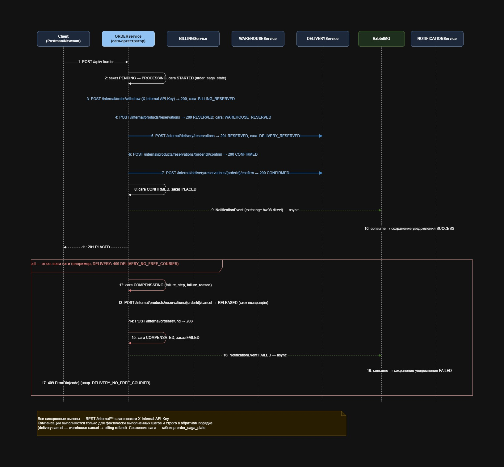

# HW08 - Распределенные транзакции

Домашнее задание №8 по курсу "Microservice Architecture" OTUS.

## Цель

Выполнить домашнее задание №8 (см. файл [README.md](./README.md)). Спроектировать взаимодействие сервисов при создании заказов. 
Запустить 6 микросервиса (User, Billing, Order, Delivery, Warehouse, Notification) в Kubernetes (minikube + Helm)
с доступом через `http://{{baseUrl}}/api/v1/...` (nginx ingress) и прогнать postman-сценарии через newman.

## Решение задачи производилось под Windows 11, Docker Desktop и MINIKUBE

## Директории проекта

- `USERService/`, `BILLINGService/`, `ORDERService/`, `DELIVERYService/` , `WAREHOUSEService/`, `NOTIFICATIONService/` - Spring Boot микросервисы
- `COMMONDomain/` - общая библиотека домена
- `DEV/` - файлы docker для локальной разработки
- `hw08chart/` - Helm chart с манифестами Kubernetes
- `scripts/` - PowerShell-скрипты по этапам
- `postman/` - коллекции Postman и environment для Newman
- `reports/` - отчёты выполнения стресс-тестирования
- `diagrams/` - диаграммы (сиквенс саги, C4 Container) в формате draw.io

---

## Архитектура Minikube Cluster

```
┌──────────────────────────────────────────────────────────────────────────────────────────────────────┐
│                            Minikube Cluster (namespace: default)                                     │
│                                                                                                      │
│  ingress-nginx (subchart), host: arch.homework                                                       │
│   Основной ingress (публичный API + internal для тестов):                                            │
│    /api/v1/auth|user|profile|roles         → hw08-user-service:8000                                  │
│    /api/v1/account                         → hw08-billing-service:8001                               │
│    /api/v1/order                           → hw08-order-service:8002                                 │
│    /api/v1/notification                    → hw08-notification-service:8003                          │
│    /api/v1/products|stocks                 → hw08-warehouse-service:8004                             │
│    /api/v1/delivery                        → hw08-delivery-service:8005                              │
│    /internal/products | /internal/delivery → warehouse/delivery (только для postman-тестов,          │
│                                               доступ защищён заголовком X-Internal-API-Key)          │
│   health-ingress (rewrite → /actuator/health):                                                       │
│    /health/user | billing | order | notification | warehouse | delivery   (6 путей)                  │
│                                                                                                      │
│  Deployments (replicas=1):                                                                           │
│   Сага создания заказа — синхронный REST /internal/** (по k8s DNS, минуя ingress):                   │
│    hw08-order-service ──► hw08-billing-service    POST /internal/order/withdraw|refund               │
│    hw08-order-service ──► hw08-warehouse-service  /internal/products/reservations (reserve/          │
│                                                    confirm/cancel/status)                            │
│    hw08-order-service ──► hw08-delivery-service   /internal/delivery/reservations (reserve/          │
│                                                    confirm/cancel/status)                            │
│   Автосоздание биллинг-аккаунта при регистрации:                                                     │
│    hw08-user-service ──► hw08-billing-service     POST /internal/account                             │
│   Асинхронные уведомления — AMQP (единственный канал через брокер):                                  │
│    hw08-order-service ─ publish ─► hw08-rabbitmq (exchange hw08.direct) ◄─ listen ─                  │
│                                                    hw08-notification-service                         │
│                                                                                                      │
│  StatefulSets postgres:16-alpine (PVC 1Gi каждый, database-per-service):                             │
│   hw08-postgres-user | hw08-postgres-billing | hw08-postgres-order                                   │
│   hw08-postgres-notification | hw08-postgres-warehouse | hw08-postgres-delivery                      │
│  Deployment rabbitmq:4.1.3-management: hw08-rabbitmq (5672, 15672)                                   │
└──────────────────────────────────────────────────────────────────────────────────────────────────────┘
```

Внутренние вызовы биллинга (`/internal/account`, `/internal/order/*`) в ingress не публикуются — сервис-сервис взаимодействие идёт по k8s DNS.

---

## Паттерн распределённой транзакции: оркестрируемая Сага (Saga)

Создание заказа в решении — распределённая транзакция, затрагивающая три независимых микросервиса
со своими базами данных: деньги (BILLINGService), товар на складе (WAREHOUSEService) и курьер на слоте
доставки (DELIVERYService). Единой ACID-транзакции между ними быть не может (database-per-service),
поэтому применён паттерн **сага (Saga)**: серия локальных транзакций, после каждой из которой при отказе
выполняются компенсирующие операции, откатывающие уже сделанные шаги. Итог — eventual consistency.

Выбран вариант **оркестрируемой саги (Saga with Orchestrator)** — централизованное управление цепочкой
шагов из одного места. Альтернативы отклонены:

- **2PC/XA** — блокирующий протокол с координатором как единой точкой отказа; не подходит для независимо
  развиваемых сервисов со своими БД и длительного многостадийного процесса.
- **Хореография (событийная сага)** — без единой точки управления трудно отслеживать состояние цепочки
  из трёх и более шагов и запускать компенсации в гарантированно обратном порядке.

### Как реализована

- **Оркестратор** — ORDERService (метод `createOrder` в `OrderServiceImpl`). Состояние саги хранится
  в отдельной таблице `order_saga_state` (1:1 с заказом по уникальному `order_id`): поля `saga_status`,
  `failure_step`, `failure_reason` — прозрачность и аудит каждой саги.
- Все шаги и компенсации — **синхронные REST-вызовы** на внутренние эндпоинты `/internal/**` с заголовком
  `X-Internal-API-Key` (см. п. 6): оркестратору нужен немедленный результат шага, чтобы принять решение
  о следующем шаге или запуске компенсаций.
- **Форвардные шаги**: (1) BILLING `POST /internal/order/withdraw` — списание средств;
  (2) WAREHOUSE `POST /internal/products/reservations` — резерв товара (available −= qty, reserved += qty);
  (3) DELIVERY `POST /internal/delivery/reservations` — резерв курьера на слот.
- **Confirm-фаза** после успеха всех шагов: WAREHOUSE `.../{orderId}/confirm` (reserved −= qty, товар списан),
  DELIVERY `.../{orderId}/confirm`; для BILLING confirm — no-op (деньги уже списаны). Заказ → PLACED,
  сага → CONFIRMED.
- **Компенсации** при отказе любого шага выполняются строго в обратном порядке и только для фактически
  выполненных шагов: DELIVERY `.../{orderId}/cancel` → WAREHOUSE `.../{orderId}/cancel`
  (available += qty, reserved −= qty) → BILLING `POST /internal/order/refund`. Заказ → FAILED.
- Внешние HTTP-вызовы выполняются **вне транзакции БД**: `createOrder` не помечен `@Transactional`,
  каждое сохранение состояния — короткая транзакция репозитория. Нет длинных транзакций, удерживающих
  соединения на время HTTP-обменов.
- **Надёжность**: все шаги идемпотентны (billing — уникальность `(orderId, тип операции)` + частичный
  уникальный индекс; warehouse — per-item `idempotencyKey`; delivery — одна бронь на `orderId`) — повтор
  шага или компенсации безопасен. Ветвление логики — по HTTP-статусу и машинному коду `ErrorDto.code`
  (общие `ErrorCodes` из COMMONDomain). Ретраев нет: любой отказ шага ведёт к компенсации; отказ самой
  компенсации переводит сагу в статус `COMPENSATION_FAILED` и требует ручного разбирательства.
- Уведомление пользователя об итоге саги (PLACED/FAILED) — асинхронно через RabbitMQ в NOTIFICATIONService
  (см. п. 8).
- Следствие: PLACED-заказ после успешной саги **неотменяем** — ресурсы CONFIRMED и откат невозможен;
  `POST /api/v1/order/{id}/cancel` вернёт 409 `ORDER_STATE_CONFLICT`.

### Шаги саги

| Шаг | Сервис           | Forward                                | Confirm                      | Компенсация                   |
|-----|------------------|----------------------------------------|------------------------------|-------------------------------|
| 1   | BILLINGService   | `POST /internal/order/withdraw`        | no-op                        | `POST /internal/order/refund` |
| 2   | WAREHOUSEService | `POST /internal/products/reservations` | `POST .../{orderId}/confirm` | `POST .../{orderId}/cancel`   |
| 3   | DELIVERYService  | `POST /internal/delivery/reservations` | `POST .../{orderId}/confirm` | `POST .../{orderId}/cancel`   |

### Статусы саги

`STARTED → BILLING_RESERVED → WAREHOUSE_RESERVED → DELIVERY_RESERVED → CONFIRMED`;
при отказе: `COMPENSATING → COMPENSATED` или `COMPENSATION_FAILED`.

### Полный поток (happy path + ветка компенсации) — на сиквенс-диаграмме


### Общая схема взаимодействия контейнеров


---

## Перед запуском

1. Запустить Docker Desktop
2. Убедиться, что установлены `minikube`, `helm`, `node`, `newman`, `newman-reporter-htmlextra`

---

## Подготовка окружения

### 1. Очистка старого окружения

```bash
# Удалить старый релиз hw07 если он есть
helm uninstall hw07
```
или
```bash
# воспользоваться скриптом удаления
.\scripts\07-helm-hw08-uninstall.ps1
```

```bash
# Удалить PersistentVolume для старого PostgreSQL если они остались
kubectl delete pvc data-hw07-postgresql-*
```

### 2. Запуск minikube

```bash
.\scripts\02-start-minikube.ps1
```

**Важно:** `minikube start --memory=10240` (10 ГБ) — 6 сервисов + 6 PostgreSQL + RabbitMQ + ingress.

### 3. Сборка и публикация Docker образов

```bash
.\scripts\01-build-and-push.ps1 -DockerHubLogin akinxela
```

Образы: `akinxela/otusapp:hw08-user`, `:hw08-billing`, `:hw08-order`, `:hw08-delivery`, `:hw08-warehouse`, `:hw08-notification`.

### 4. Добавить DNS записи

```bash
# Узнать IP minikube кластера
minikube ip
```

Добавить в `C:\Windows\System32\drivers\etc\hosts`:
```
<minikube-ip> arch.homework
```

Если ingress недоступен - запустить 
```bash
# Запустить minikube tunnel 
minikube tunnel
```

---

## Установка приложения

### 4. Установка через Helm

```bash
.\scripts\03-helm-hw08-install.ps1
```

**Важно:** namespace - `default`.

Проверка статуса:
```bash
kubectl get pods
```

---

## Важные моменты реализации

### 5. Мультимодульный проект
В рамках домашнего задания, для упрощения выбран мультимодульный проект Gradle. 
В реальном проекте, разработка каждого микросервиса должна осуществляться в отдельном git репозитории

### 6. Внутреннее взаимодействие микросервисов
Взаимодействие сервис-сервис реализовано только через синхронный REST на внутренние эндпоинты
`/internal/...` (без публичного API и без ingress внутри кластера).

Защита: каждый запрос к `/internal/**` обязан содержать заголовок `X-Internal-API-Key` со значением,
совпадающим с `INTERNAL_API_KEY` целевого сервиса (env, в k8s — Secret → env). Проверку выполняет общий
servlet-фильтр `InternalApiFilterConfig` из COMMONDomain, подключённый ко всем сервисам: заголовок
отсутствует или ключ неверный — **401 Unauthorized** с `ErrorDto` (общий обработчик
`InternalApiKeyExceptionHandler`); если ключ в сервисе не сконфигурирован — fail-closed **500**.

В кластере вызовы идут по k8s DNS мимо ingress (env `BILLING_SERVICE_URL`, `WAREHOUSE_SERVICE_URL`,
`DELIVERY_SERVICE_URL`); наружу через ingress выведены только `/internal/products` и `/internal/delivery`
— осознанно для postman k8s-тестов, доступ по-прежнему возможен только с ключом. Internal-эндпоинты
биллинга наружу не публикуются.

Таблица внутренних вызовов:

| Кто          | Кого             | Эндпоинт                                                                                                                    | Назначение                                                 |
|--------------|------------------|-----------------------------------------------------------------------------------------------------------------------------|------------------------------------------------------------|
| USERService  | BILLINGService   | `POST /internal/account`                                                                                                    | автосоздание биллинг-аккаунта при регистрации пользователя |
| ORDERService | BILLINGService   | `POST /internal/order/withdraw`                                                                                             | списание средств (шаг саги)                                |
| ORDERService | BILLINGService   | `POST /internal/order/refund`                                                                                               | возврат (компенсация саги / отмена заказа)                 |
| ORDERService | WAREHOUSEService | `POST /internal/products/reservations`                                                                                      | резерв товара (all-or-nothing по позициям заказа)          |
| ORDERService | WAREHOUSEService | `POST /internal/products/reservations/{orderId}/confirm` \| `/cancel`, `GET .../{orderId}`                                  | подтверждение/снятие резерва, статус                       |
| ORDERService | DELIVERYService  | `POST /internal/delivery/reservations`                                                                                      | резерв курьера на слот                                     |
| ORDERService | DELIVERYService  | `POST /internal/delivery/reservations/{orderId}/confirm` \| `/cancel`, `GET .../{orderId}`, `GET .../by-id/{reservationId}` | подтверждение/отмена/статус брони                          |

Идемпотентность внутренних операций делает безопасными повторные вызовы оркестратором (повтор шага или
компенсации не приводит к двойным эффектам).

### 7. Общая библиотека
По принципу DRY общие для всех микросервисов классы вынесены в отдельную библиотеку COMMONDomain:

- базовые классы сущностей `AbstractEntity` / `AuditableEntity` (id, optimistic-lock `@Version`, аудит
  created/updated/createdBy/lastModifiedBy);
- единый контракт ошибок: `ErrorDto` (`message, status, timestamp, code`) и машинные коды ошибок
  `ErrorCodes` (14 констант: `INSUFFICIENT_STOCK`, `BILLING_INSUFFICIENT_FUNDS`, `DELIVERY_NO_FREE_COURIER`,
  `ORDER_STATE_CONFLICT`, `CONCURRENT_MODIFICATION` и др.);
- общие исключения (`NotFoundException`, `DuplicateResourceException`, `BillingServiceException`,
  `ProductReservationException`, `InternalApiKeyException` и др.);
- межсервисные DTO (wire-контракты) биллинга, склада, доставки и `NotificationEvent`;
- инфраструктура защиты `/internal/**`: `InternalApiFilterConfig` + `InternalApiKeyConfig`;
- `EnvLoader` — подхват `hw08/.env` при локальном запуске.

Зачем: единый wire-контракт DTO между оркестратором и сервисами в одном месте исключает рассинхронизацию
контрактов; один общий фильтр защищает `/internal/**` во всех сервисах; по контракту ошибок
(`ErrorDto` + машинные коды) сага-оркестратор ветвит логику (компенсация vs отказ); единообразная база
сущностей и аудита ускоряет добавление нового сервиса.

В реальном проекте COMMONDomain собирается отдельно и подключается к каждому микросервису как зависимость
(опубликованный артефакт), а не как модуль одного репозитория.

### 8. Использование брокера сообщений.
Брокер сообщений RabbitMQ используется в решении **только для одного асинхронного канала между двумя
микросервисами**: ORDERService → NOTIFICATIONService. ORDERService публикует `NotificationEvent`
в exchange `hw08.direct` (очередь `notification.queue`) — уведомления об итогах создания заказа
(PLACED/FAILED); NOTIFICATIONService потребляет сообщения и сохраняет уведомления. Только эти два сервиса
подключены к брокеру (`spring-boot-starter-amqp` только в них). Таким образом используется архитектурный
паттерн — «событийное взаимодействие с использованием брокера сообщений для нотификаций (уведомлений)».

Принципиально: **сага и все шаги распределённой транзакции реализованы через синхронный REST API
(`/internal/**`), не через брокер**. Оркестратору требуется немедленный результат каждого шага, чтобы
принять решение о следующем шаге или запуске компенсаций; событийная схема сделала бы управление состоянием
саги существенно сложнее. Брокер выбран именно для уведомлений, т.к. это fire-and-forget сценарий:
отправитель не ждёт ответа, потеря/задержка не влияет на консистентность заказа, а асинхронность
разгружает основной поток саги.

---

## Ключевые принятые решения

1. Оркестрируемая сага в ORDERService (не 2PC, не хореография); состояние саги — отдельная таблица
   `order_saga_state` (1:1 с заказом).
2. Порядок шагов BILLING → WAREHOUSE → DELIVERY; компенсации в обратном порядке только по фактически
   выполненным шагам; confirm биллинга — no-op.
3. Внешние HTTP-вызовы вне транзакции БД (`createOrder` без `@Transactional`), сохранения состояния —
   короткими транзакциями репозитория.
4. Идемпотентность всех шагов саги и компенсаций: billing — уникальность `(orderId, тип операции)`
   + частичный уникальный индекс (миграция V3); warehouse — per-item `idempotencyKey`; delivery — одна
   бронь на `orderId`; refund без исходного withdraw — мягкий no-op 200 (компенсация не ломается).
5. Единый контракт ошибок: HTTP-статус + машинный код `ErrorDto.code` (общие `ErrorCodes`);
   бизнес-отказы — 409 с кодом (`INSUFFICIENT_STOCK`, `BILLING_INSUFFICIENT_FUNDS`,
   `DELIVERY_NO_FREE_COURIER`), технические — 409 `CONCURRENT_MODIFICATION` / `DATA_INTEGRITY_VIOLATION`,
   400/404 — немедленный отказ шага.
6. Защита `/internal/**` общим фильтром COMMONDomain по заголовку `X-Internal-API-Key`
   (401 при неверном/отсутствующем ключе; fail-closed 500, если ключ не сконфигурирован).
7. COMMONDomain — общая библиотека домена, DTO-контрактов, ошибок и internal-фильтра (DRY).
8. RabbitMQ — только асинхронные уведомления ORDER → NOTIFICATION; сага — синхронный REST.
9. Отмена PLACED-заказа после успешной саги невозможна (ресурсы CONFIRMED) → 409 `ORDER_STATE_CONFLICT`;
   отменены могут быть только резервы в статусе RESERVED.
10. База: database-per-service — 6 отдельных PostgreSQL (StatefulSet + PVC 1Gi), Flyway-миграции,
    `ddl-auto: validate`.
11. Helm chart `hw08chart`: namespace `default`, host `arch.homework`, ingress публикует публичный API
    и два internal-маршрута только для тестов; health-ingress — 6 путей с rewrite на `/actuator/health`.
12. Мультимодульный Gradle-проект вместо отдельных git-репозиториев (упрощение в рамках ДЗ).
13. LAZY-загрузка в WAREHOUSEService: `@NamedEntityGraph` + entity graphs в репозиториях + bytecode
    enhancement (Gradle-плагин `org.hibernate.orm`) — inverse-side `@OneToOne` без enhancement физически
    не может быть LAZY.
14. Доменные исключения с фабриками и машинным кодом (`ProductReservationException`,
    `DeliveryReservationException`, `CourierAssignmentException` → 500 как «should be unreachable»,
    `OrderStateConflictException`) вместо catch-all на `IllegalStateException` — снята маскировка
    непредвиденных ошибок под бизнес-400.
15. Биллинг-аккаунт создаётся автоматически при регистрации пользователя (USERService → BILLINGService
    `POST /internal/account`, идемпотентно).

---

## Postman-тесты

### 9. Запуск тестов (Kubernetes)

```bash
.\scripts\06-run-postman-k8s.ps1 -HtmlReport
```

Отчёты сохраняются в `reports/k8s/` с timestamp в имени файла.
Т.к. отчеты собирались в файлы html (с помощью newman-reporter-htmlextra), то для их просмотра необходимо открыть файлы отчетов в любом браузере.
Чтобы посмотреть данных запроса и данных ответа, необходимо развернуть "схлопнутые" части отчета.

### Структура коллекций

Пять коллекций в `postman/k8s/` используют `{{baseUrl}}` = `http://arch.homework` (через Ingress helm chart `hw08chart`):

| Коллекция                       | Сценарий                                                                                                                                 |
|---------------------------------|------------------------------------------------------------------------------------------------------------------------------------------|
| `otus-hw8-success-k8s`          | Happy path саги BILLING -> WAREHOUSE -> DELIVERY: 201 PLACED, резервы CONFIRMED, баланс 90, сток 19, уведомление SUCCESS                 |
| `otus-hw8-failed-billing-k8s`   | Отказ на шаге BILLING (нулевой баланс, депозита нет): 502, заказ FAILED, компенсаций нет, уведомление FAILED                             |
| `otus-hw8-failed-warehouse-k8s` | Отказ на шаге WAREHOUSE (сток меньше qty): 409 INSUFFICIENT_STOCK, refund, заказ FAILED, уведомление FAILED                              |
| `otus-hw8-failed-delivery-k8s`  | Отказ на шаге DELIVERY (нет свободного курьера в слоте): 409 DELIVERY_NO_FREE_COURIER, refund и снятие резерва стока, уведомление FAILED |
| `otus-hw8-cancel-conflict-k8s`  | Попытка отмены размещённого заказа: 409 ORDER_STATE_CONFLICT, заказ и резервы остаются CONFIRMED                                         |

Каждая коллекция начинается с health-проверок шести сервисов через `/health/<service>` (health-ingress с rewrite на `/actuator/health`), 
далее проходит E2E-сценарий и опрашивает NOTIFICATIONService до появления уведомления (до 10 попыток). 
Internal-эндпоинты склада и доставки (`/internal/products`, `/internal/delivery`) вызываются с заголовком `X-Internal-API-Key`; 
internal-эндпоинты биллинга через ingress не публикуются — межсервисные вызовы в кластере идут по k8s DNS.

**Важно:** Тесты используют `{{baseUrl}}` с initial значением `http://arch.homework`; домен должен резолвиться на IP ingress-контроллера (minikube tunnel и/или запись в файле hosts).

---

### 10. Удаление приложения

```bash
.\scripts\07-helm-hw08-uninstall.ps1
```
