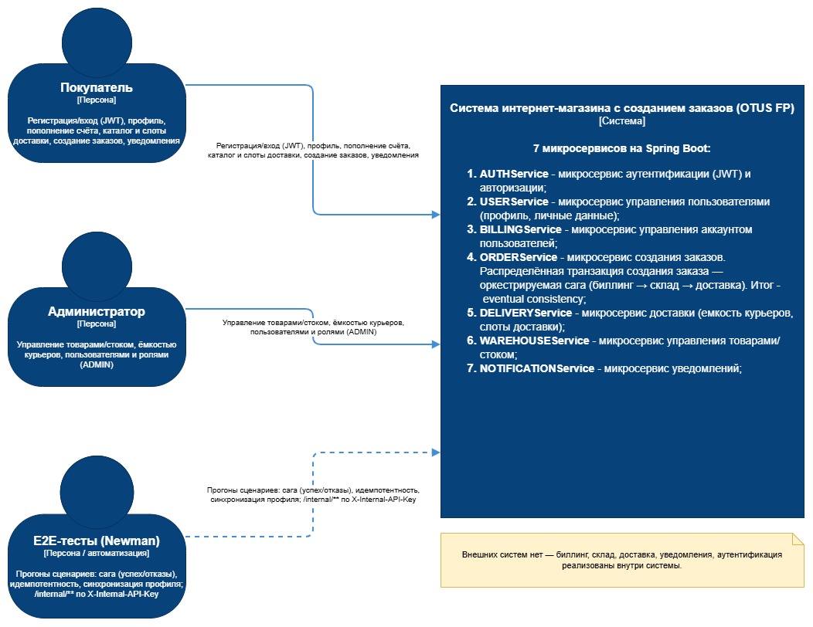
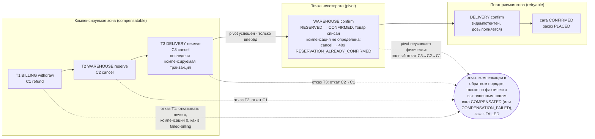
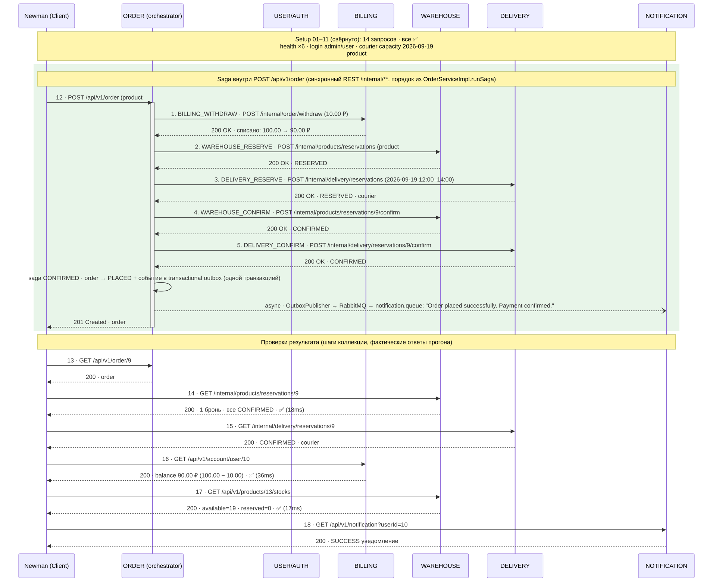
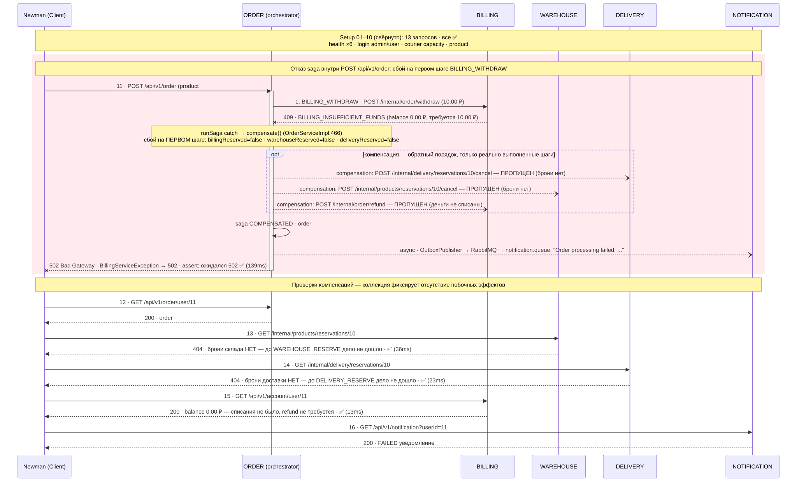
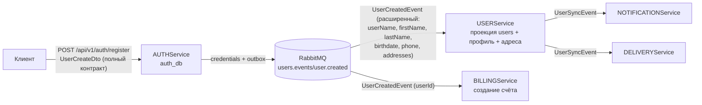
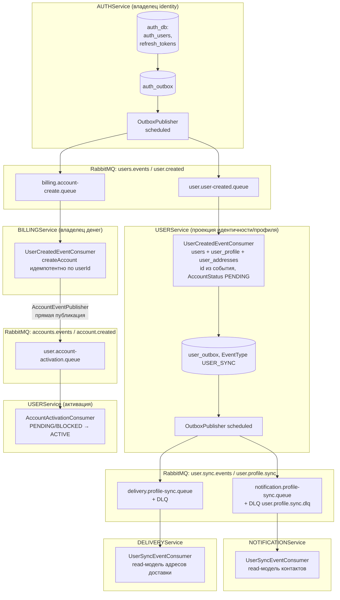
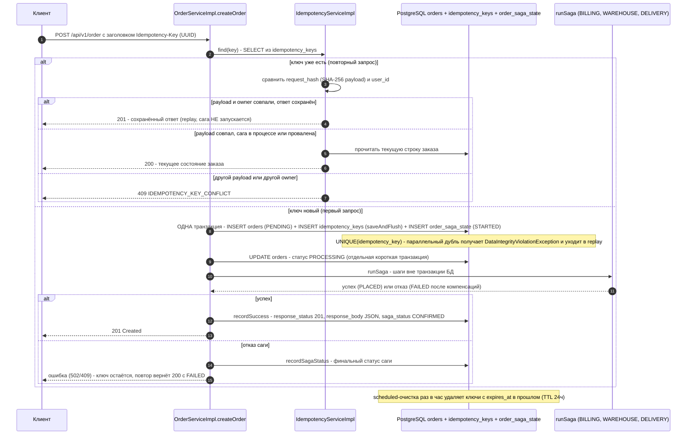
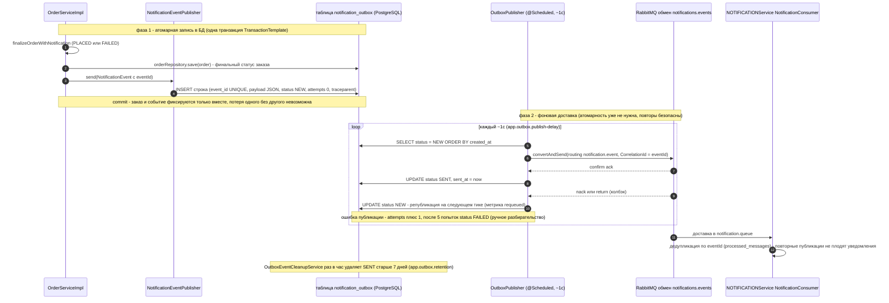

# ФИНАЛЬНЫЙ ПРОЕКТ - Идемпотентность и коммутативность API в HTTP и очередях

Домашнее задание №10 (Final Project, далее FP) по курсу "Microservice Architecture" OTUS.

> Этот документ - развёрнутая версия отчёта о финальном проекте. Каждое решение
> объяснено подробно: что сделано, почему именно так и что произошло бы, если бы этого не было.
> Все факты (таймауты, статусы, имена таблиц, очередей и классов) сверены с кодом.

Расшифровка заголовка: 
**идемпотентность** - свойство операции при повторном выполнении с теми же входными данными выдавать тот же результат и 
не производить побочных эффектов во второй раз (повторный платёж не списывает деньги дважды); 
**коммутативность** - независимость результата от порядка операций 
(в контексте очередей сообщений - повторные и переставленные доставки событий не ломают состояние системы).

---

## Цель

Выполнить домашнее задание №10 - финальный проект по курсу(см. файл [README.md](./README.md)). Спроектировать взаимодействие сервисов при создании заказов.
Запустить 7 микросервисов (Auth, User, Billing, Order, Delivery, Warehouse, Notification) в Kubernetes (minikube + Helm)
с доступом через `http://{{baseUrl}}/api/v1/...` (nginx ingress) и прогнать postman-сценарии через newman.

Что это означает по частям?:
- **Спроектировать взаимодействие сервисов при создании заказов** - создание заказа затрагивает сразу
  три независимых микросервиса (списание денег, резерв товара, резерв курьера). 
  У каждого сервиса своя база данных, поэтому "одной транзакцией" операцию выполнить физически невозможно. Требовалось выбрать
  и реализовать [паттерн распределённой транзакции](#паттерн-распределённой-транзакции-оркестрируемая-сага-saga) 
  (в решении - оркестрируемая сага), [идемпотентность](#10-идемпотентность-и-отказоустойчивость) всех шагов (безопасность повторов) и 
  [отказоустойчивость](#16-отказоустойчивость-circuit-breaker--retry--ratelimiter-resilience4j) (ретраи,
  circuit breaker - "автоматический выключатель", восстановление "зависших" саг).
- **Запустить 7 микросервисов в Kubernetes** - minikube это локальный одноподовый кластер Kubernetes для
  разработки; Helm - пакетный менеджер Kubernetes (шаблоны манифестов + значения). У каждого сервиса
  собственный PostgreSQL (паттерн database-per-service, "база данных на сервис") и общий брокер сообщений
  RabbitMQ.
- **Доступ через `http://{{baseUrl}}/api/v1/...` (nginx ingress)** - ingress в Kubernetes это единая
  точка входа по HTTP: маршрутизатор (контроллер nginx-ingress) принимает внешние запросы и по пути URL
  направляет их в нужный сервис кластера. `{{baseUrl}}` - переменная Postman, подставляемая при прогоне.
- **Прогнать postman-сценарии через newman** - Postman-коллекция это файл с описанием запросов и проверок
  (assertions - утверждений об ожидаемых ответах); newman - консольный runner (запускатель) таких
  коллекций, позволяющий выполнять тесты из командной строки и получать HTML/JSON-отчёт.

---

## Решение задачи производилось под Windows 11, Docker Desktop и MINIKUBE

Операционная система разработчика - Windows 11; контейнеры собираются и запускаются через Docker Desktop; 
кластер Kubernetes разворачивается локально через minikube. 
Все вспомогательные скрипты (раздел "[Директории проекта](#директории-проекта)") - PowerShell-скрипты (`.ps1`), то есть рассчитаны на Windows.

---

## Директории проекта

Описание назначения каждой директории репозитория:

- `AUTHService/`, `USERService/`, `BILLINGService/`, `ORDERService/`, `DELIVERYService/` , `WAREHOUSEService/`, `NOTIFICATIONService/` - Spring Boot микросервисы.
  Каждый каталог - самостоятельный модуль Gradle со своим исходным кодом, своей конфигурацией
  (`application.yaml`), своими Flyway-миграциями схемы БД и своими тестами. Spring Boot - фреймворк
  для самодостаточных Java-приложений со встроенным веб-сервером (Tomcat).
- `COMMONDomain/` - общая библиотека домена. Модуль (jar-библиотека), который подключается ко всем
  микросервисам как зависимость и содержит общие классы: базовые сущности, контракты ошибок и DTO
  (Data Transfer Object - объект передачи данных, "проводной" формат между сервисами), компоненты
  безопасности, фильтр защиты внутренних эндпоинтов. Подробнее - [раздел 8](#8-общая-библиотека).
- `DEV/` - файлы docker для локальной разработки. В первую очередь `DEV/docker-compose.yaml` - описание
  локального стенда: 7 контейнеров PostgreSQL (по одному на сервис) и RabbitMQ.
- `charts/` - Helm chart-ы с манифестами Kubernetes. Helm-чарт это параметризуемый набор
  шаблонов Kubernetes-манифестов (Deployment - декларация "запусти N копий приложения", StatefulSet -
  то же для приложений с постоянным хранилищем, Service - внутреннее DNS-имя сервиса, Ingress - правила
  внешней маршрутизации, Secret - хранение чувствительных значений) плюс файл значений `values.yaml`.
- `scripts/` - PowerShell-скрипты по этапам: сборка и публикация Docker-образов
  (`01-build-and-push.ps1`), запуск minikube (`02-start-minikube.ps1`), установка приложения
  (`03-helm-fp-install.ps1`), прогон тестов (`05-run-postman-local.ps1`, `06-run-postman-k8s.ps1`),
  удаление приложения (`07-helm-fp-uninstall.ps1`), генерация диаграмм (`08-gen-saga-diagrams.ps1`).
- `postman/` - коллекции Postman и environment для Newman (k8s-прогоны - `postman/k8s/`, локальные - `postman/local/`).
  Environment (файл окружения) - набор переменных (`{{baseUrl}}`, ключи, URL сервисов), которые newman
  подставляет в запросы коллекции.
- `reports/` - HTML-отчёты newman по прогонам postman-коллекций (`reports/k8s/`, `reports/local/`).
  Отчёты формируются плагином `newman-reporter-htmlextra` и открываются в любом браузере.
- `diagrams/` - диаграммы (сиквенсы: сага, transactional outbox, идемпотентность; C4 Context и C4 Container) в формате draw.io.
  Сиквенс-диаграмма (sequence diagram, диаграмма последовательности) показывает обмен сообщениями между
  участниками во времени; C4 - нотация описания архитектуры четырёх уровней (Context, Container,
  Component, Code), здесь использованы два верхних: Context (система и её пользователи) и Container
  (приложения/базы внутри системы). Часть диаграмм экспортирована в растровые (`.jpg`/`.png`) и
  векторные (`.svg`) изображения. О saga-диаграммах см. также [./diagrams/README.md](./diagrams/README.md).

---

## Архитектура Minikube Cluster

Раздел описывает, как именно развёрнуто приложение внутри локального кластера: через какую точку входа
приходят запросы, что с чем разговаривает и где хранятся данные. Это "карта местности", к которой
отсылают все последующие разделы.

```
┌──────────────────────────────────────────────────────────────────────────────────────────────────────┐
│                            Minikube Cluster (namespace: otus-msa-fp)                                 │
│                                                                                                      │
│  ingress-nginx (subchart), host: arch.finalproject                                                   │
│   Основной ingress (публичный API + internal для тестов):                                            │
│    /api/v1/auth|user|roles                → fp-auth-service:8006                                     │
│    /api/v1/profile                        → fp-user-service:8000                                     │
│    /api/v1/account                        → fp-billing-service:8001                                  │
│    /api/v1/order                          → fp-order-service:8002                                    │
│    /api/v1/notification                   → fp-notification-service:8003                             │
│    /api/v1/products|stocks                → fp-warehouse-service:8004                                │
│    /api/v1/delivery                       → fp-delivery-service:8005                                 │
│    /internal/account | /internal/order    → fp-billing-service (только для postman-тестов;           │
│    /internal/products | /internal/delivery | /internal/contacts → warehouse / delivery /             │
│    notification; доступ защищён заголовком X-Internal-API-Key)                                       │
│   health-ingress (rewrite → /actuator/health):                                                       │
│    /health/auth | user | billing | order | notification | warehouse | delivery   (7 путей)           │
│    Grafana - /grafana · Loki - /loki (gateway, релиз logging)                                        │
│                                                                                                      │
│  Deployments (replicas=1): auth, user, billing, order, notification, warehouse, delivery             │
│   Сага создания заказа - только синхронный REST /internal/** (по k8s DNS, минуя ingress):            │
│    fp-order-service ─► fp-billing-service    POST /internal/order/withdraw|refund                    │
│    fp-order-service ─► fp-warehouse-service  /internal/products/reservations                         │
│                                                (reserve/confirm/cancel/status)                       │
│    fp-order-service ─► fp-delivery-service   /internal/delivery/reservations                         │
│                                                (reserve/confirm/cancel/status)                       │
│   Автосоздание биллинг-аккаунта при регистрации:                                                     │
│    основной путь - событие user.created из outbox AUTHService через RabbitMQ (BILLING                │
│    создаёт счёт идемпотентно); запасной синхронный путь: fp-user-service ─►                          │
│    fp-billing-service POST /internal/account; проба активации: GET /internal/account/user/{userId}   │
│   Асинхронные событийные каналы - AMQP (4 канала через брокер):                                      │
│    1. users.events / user.created                fp-auth-service      → USER, BILLING                │
│    2. user.sync.events / user.profile.sync       fp-user-service      → NOTIFICATION, DELIVERY       │
│    3. accounts.events / account.created          fp-billing-service   → USER                         │
│    4. notifications.events / notification.event  fp-order-service → NOTIFICATION (outbox, DLQ)       │
│                                                                                                      │
│  StatefulSets postgres:16-alpine (PVC 1Gi каждый, database-per-service, итого 7):                    │
│   fp-postgres-auth | fp-postgres-user | fp-postgres-billing | fp-postgres-order                      │
│   fp-postgres-notification | fp-postgres-warehouse | fp-postgres-delivery                            │
│  Deployment rabbitmq:4.1.3-management: fp-rabbitmq (5672, 15672; метрики 15692, rabbitmq_prometheus) │
└──────────────────────────────────────────────────────────────────────────────────────────────────────┘
```

Пояснения к схеме по блокам (сверху вниз):

- **namespace (пространство имён) `otus-msa-fp`** - логический раздел кластера, в котором живут все
  ресурсы приложения. Отдельные namespace используются для инфраструктуры наблюдения:
  `otus-msa-logging` (логи), `otus-msa-tracing` (трассировка), `otus-msa-monitoring` (метрики) - см.
  разделы [14](#14-бизнес-метрики-и-дашборды) и [15](#15-observability-логирование-трассировка-и-propagation).
- **ingress-nginx, host `arch.finalproject`** - контроллер входящего HTTP-трафика (ставится как subchart,
  то есть вложенный Helm-чарт того же релиза). Все внешние запросы приходят на одно доменное имя и
  распределяются по префиксу пути: `/api/v1/auth` в AUTHService, `/api/v1/order` в ORDERService и так
  далее. Номера портов (8000–8006) - порты приложений внутри кластера.
- **Основной ingress публикует два класса маршрутов**: публичные `/api/v1/...` (для клиентов с JWT -
  JSON Web Token, [см. раздел 6.1](#6-внутреннее-взаимодействие-микросервисов)) и внутренние `/internal/...` (защищены заголовком
  `X-Internal-API-Key`). Внутренние маршруты выведены наружу **только** ради postman-тестов из-за
  пределов кластера; сервисы между собой ходят по внутренней DNS кластера, минуя ingress (см. ниже).
- **health-ingress** - отдельный ingress для проверок живости: 7 путей вида `/health/<сервис>`
  переписываются (rewrite) в актуаторный эндпоинт `/actuator/health` соответствующего сервиса. Health-чек
  (проверка здоровья) нужен и тестам (каждая коллекция начинается с них), и оператору.
- **Deployments (replicas=1)** - семь прикладных подов, по одной реплике каждого сервиса (StatefulSet'ы данных при этом не масштабируются никогда).
- **Сага создания заказа** ходит из fp-order-service в billing/warehouse/delivery **синхронным REST по
  внутренним путям `/internal/**`** и по **k8s DNS напрямую** (имена вида `fp-billing-service`
  резолвятся встроенным DNS кластера в IP сервиса), минуя ingress. Минуя - потому что ingress нужен
  внешним клиентам, а внутри кластера дополнительный хоп только добавляет задержку и точку отказа.
- **Автосоздание биллинг-аккаунта** - пример асинхронной репликации с синхронным запасным путём:
  при регистрации пользователя AUTHService публикует событие `user.created` (через свой transactional
  outbox - [см. раздел 9](#9-использование-брокера-сообщений)), BILLINGService создаёт счёт. Если событийный путь не сработал, USERService
  может создать счёт синхронным вызовом `POST /internal/account`, а факт активации проверяет read-запросом
  `GET /internal/account/user/{userId}`.
- **Четыре асинхронных событийных канала AMQP** (AMQP - Advanced Message Queuing Protocol, протокол
  очередей сообщений, который реализует RabbitMQ): перечислены пары "обмен / routing-key → продюсер →
  консьюмеры". Обмен (exchange) принимает сообщения от продюсеров и по routing-key (ключ маршрутизации)
  раскладывает их в очереди. Подробности - [раздел 9](#9-использование-брокера-сообщений).
- **StatefulSets postgres:16-alpine** - StatefulSet это тип рабочей нагрузки Kubernetes для приложений,
  которым нужны стабильное имя и постоянный диск; постоянный диск оформляется как PVC (PersistentVolumeClaim - заявка на том хранилища), 
  здесь по 1 ГБ на каждую из 7 баз. Паттерн database-per-service: у каждого
  микросервиса физически отдельная база, общих таблиц между сервисами нет - это принципиальное условие,
  из которого вытекает потребность в саге (см. следующий раздел).
- **rabbitmq:4.1.3-management** - брокер сообщений; порт 5672 (AMQP), 15672 (веб-консоль управления),
  15692 (метрики плагина rabbitmq_prometheus).

---



*Диаграмма C4 уровня Context: какие внешние акторы (клиенты, администратор) взаимодействуют с системой
и какие системы участвуют. Исходник: `./diagrams/fp-c4-context.drawio`.*

---


*Диаграмма C4 уровня Container: 7 микросервисов, их базы данных, RabbitMQ и связи между ними
(синхронный REST саги и асинхронные событийные каналы). Исходник: `./diagrams/fp-c4-container.drawio`.*

Внутренние маршруты (`/internal/account`, `/internal/order` → billing; `/internal/products` → warehouse; 
`/internal/delivery` → delivery; `/internal/contacts` → notification) выведены в ingress осознанно - только для postman-тестов, 
доступ по-прежнему по заголовку `X-Internal-API-Key`; сервис-сервис взаимодействие в кластере идёт по k8s DNS мимо ingress.

Почему это безопасно: наличие маршрута в ingress не делает его публичным в практическом смысле - каждый
запрос обязан предъявить общий секретный ключ `X-Internal-API-Key`, совпадающий со значением переменной
окружения `INTERNAL_API_KEY` целевого сервиса (в Kubernetes секрет хранится в Secret и попадает в под как
переменная окружения). Без ключа ответ - 401 Unauthorized (подробно в [разделе 6](#6-внутреннее-взаимодействие-микросервисов)).

---

## Паттерн распределённой транзакции: оркестрируемая Сага (Saga)

Этот раздел объясняет, как устроено создание заказа - главная бизнес-операция системы. Операция
затрагивает три независимых микросервиса со своими базами данных; классической атомарной транзакции
между ними быть не может, поэтому применён паттерн сага. Ниже разобраны: почему именно сага и почему
оркестрируемая, как реализованы шаги, подтверждения и компенсации, какие статусы проходит сага и как
она ведёт себя при отказах.

Создание заказа в решении - распределённая транзакция, затрагивающая три независимых микросервиса
со своими базами данных: деньги (BILLINGService), товар на складе (WAREHOUSEService) и курьер на слоте
доставки (DELIVERYService). Единой ACID-транзакции между ними быть не может (database-per-service),
поэтому применён паттерн **сага (Saga)**: серия локальных транзакций, после каждой из которой при отказе
выполняются компенсирующие операции, откатывающие уже сделанные шаги. Итог - eventual consistency.

Расшифровка терминов:

- **Распределённая транзакция** - изменение данных, которое должно быть выполнено "всё или ничего"
  сразу в нескольких независимых системах (здесь - в трёх разных базах PostgreSQL, принадлежащих трём
  разным сервисам).
- **ACID** - четыре свойства классической транзакции одной базы данных: Atomicity (атомарность - либо
  всё, либо ничего), Consistency (консистентность - переход из одного корректного состояния в другое),
  Isolation (изолированность - параллельные транзакции не мешают друг другу), Durability
  (долговечность - зафиксированное не теряется). Механизм транзакций PostgreSQL действует в пределах
  одной базы; "растянуть" его на три базы трёх сервисов стандартными средствами нельзя - для этого
  понадобился бы общий координатор и блокировки во всех трёх базах одновременно.
- **database-per-service ("база данных на сервис")** - архитектурное правило микросервисов: у каждого
  сервиса своя schema и своя СУБД, прямые обращения к чужой базе запрещены. Именно оно делает ACID
  между сервисами невозможным.
- **Сага** - паттерн, заменяющий распределённую транзакцию: длинная операция разбивается на цепочку
  локальных транзакций; у каждой локальной транзакции есть **компенсирующая операция** - действие,
  отменяющее её эффект (не "откат транзакции", а новое бизнес-действие: например, компенсация списания
  денег - возврат денег). Если очередной шаг не удался, уже выполненные шаги откатываются компенсациями.
- **eventual consistency (согласованность в конечном счёте, "итоговая согласованность")** - гарантия
  более слабая, чем мгновенная согласованность: система может кратковременно находиться в несогласованном
  состоянии (деньги списаны, а товар ещё не зарезервирован), но при отсутствии новых сбоев обязательно
  придёт к согласованному состоянию (либо все ресурсы выделены, либо все освобождены).

Выбран вариант **оркестрируемой саги (Saga with Orchestrator)** - централизованное управление цепочкой
шагов из одного места. Оркестратор - участник, который знает весь "сценарий". Он сам вызывает шаги по
порядку, фиксирует прогресс и сам решает, когда запускать компенсации. 
Альтернативы **2PC/XA** и **Хореография (событийная сага)** не выбраны потому что:

- **2PC/XA** - блокирующий протокол с координатором как единой точкой отказа; не подходит для независимо
  развиваемых сервисов со своими БД и длительного многостадийного процесса.
  Расшифровка: 2PC (two-Phase Commit, двухфазный протокол фиксации) и XA (eXtended Architecture, стандарт 
  распределённых транзакций) работают так: координатор сначала просит всех участников "приготовиться" (на первой фазе
  каждый участник блокирует ресурсы и обещает зафиксировать изменения), затем рассылает "фиксировать"
  или "откатить". Проблема в том, что между фазами ресурсы всех участников заблокированы. Если координатор падает,
  участники остаются в подвешенном состоянии. Для микросервисов со своими независимыми PostgreSQL и
  HTTP-обменами, занимающими секунды, такой протокол и недоступен практически (сервисы не подключены к
  общему XA-координатору), и вреден (долгие блокировки, единая точка отказа).
- **Хореография (событийная сага)** - без единой точки управления трудно отслеживать состояние цепочки
  из трёх и более шагов и запускать компенсации в гарантированно обратном порядке.
  Расшифровка: в хореографии центрального сценария нет - каждый сервис после своей локальной транзакции
  публикует событие, а следующий сервис реагирует на него. Для двух-трёх линейных шагов это работает,
  но логика "отката" размывается по всем участникам: никто не знает полную картину цепочки, поэтому
  порядок компенсаций (строго обратный) и критерий "компенсировать только то, что фактически
  выполнилось" приходится восстанавливать по разрозненным событиям. 

Оркестратор хранит состояние саги в одной таблице и потому тривиально знает, какие шаги выполнены.

### Как реализована

- **Оркестратор** - ORDERService (метод `createOrder` в `OrderServiceImpl`). Состояние саги хранится
  в отдельной таблице `order_saga_state` (1:1 с заказом по уникальному `order_id`): поля `saga_status`,
  `failure_step`, `failure_reason` - прозрачность и аудит каждой саги.

      Почему оркестратор именно ORDERService? заказ - агрегирующий объект, ради которого выполняется вся
      цепочка, поэтому ему естественно владеть сценарием. Таблица order_saga_state связана с таблицей orders
      отношением 1:1 через ограничение UNIQUE на order_id и внешний ключ на orders(id); failure_step
      (VARCHAR(30)) хранит имя шага, на котором произошёл отказ (например, BILLING_WITHDRAW), а
      failure_reason (VARCHAR(2048)) - текст причины (обрезаемый до 2048 символов). Без такой таблицы
      состояние цепочки жило бы только в памяти процесса и терялось при крахе пода; с таблицей любой
      экземпляр сервиса (в том числе после перезапуска) может прочитать "на каком шаге остановилась сага"
      и довести её до конца - на этом построен recovery, см. пункт 10.5.

- Все шаги и компенсации - **синхронные REST-вызовы** на внутренние эндпоинты `/internal/**` с заголовком
  `X-Internal-API-Key`, см. [пункт.6](#6-внутреннее-взаимодействие-микросервисов). Оркестратору нужен немедленный 
  результат шага, чтобы принять решение о следующем шаге или запуске компенсаций.

      REST (Representational State Transfer) - стиль HTTP-API: запрос-ответ с методами POST/GET/PUT и
      JSON-телом. Синхронность здесь принципиальна. Сага - последовательный алгоритм, и после каждого шага
      оркестратор должен знать "успех или отказ", чтобы идти дальше или разворачивать компенсации. Асинхронная
      событийная схема (через RabbitMQ) заставила бы ждать ответное событие, хранить ожидание в состоянии и
      обрабатывать тайм-ауты событий - то есть фактически заново изобрести оркестрацию, но сложнее. Защита
      заголовком нужна, потому что внутренние эндпоинты выполняют чувствительные операции (списание денег)
      без пользовательского JWT.

- **Форвардные шаги**:<br> 
  (1) BILLING `POST /internal/order/withdraw` - списание средств;<br>
  (2) WAREHOUSE `POST /internal/products/reservations` - резерв товара (available −= qty, reserved += qty);<br>
  (3) DELIVERY `POST /internal/delivery/reservations` - резерв курьера на слот.<br>


  "Форвардный шаг" (forward step) - прямое действие саги, в отличие от компенсирующего.<br> 
  Расшифровка эффектов:<br> 
   - списание средств уменьшает баланс счёта пользователя и фиксирует транзакцию WITHDRAW;
   - резерв товара перекладывает quantity единиц товара из счётчика available ("доступно к продаже") в
  счётчик reserved ("зарезервировано, но ещё не продано"); 
   - резерв курьера занимает слот доставки (дата + интервал времени) у свободного курьера. 
  Порядок шагов BILLING → WAREHOUSE → DELIVERY выбран осознанно, см. [пункт 11.2](#11-ключевые-принятые-решения): 
  сначала проверяется "главный" дефицитный ресурс - деньги. Если у пользователя нет средств, то незачем занимать 
  товар и курьера и потом дважды компенсировать.


- **Confirm-фаза** после успеха всех шагов:<br> 
   - WAREHOUSE `.../{orderId}/confirm` (reserved −= qty, товар списан);<br>
   - DELIVERY `.../{orderId}/confirm`;<br>
   - для BILLING confirm - no-op (деньги уже списаны). 
  Заказ → PLACED, сага → CONFIRMED.


    Confirm-фаза - необязательная, но использованная здесь вторая стадия. Резервы фиксируются как
    окончательные. No-op (от "no operation" - "операция отсутствует") в биллинге означает, что
    подтверждение для денег не нужно по смыслу: списание на шаге 1 уже окончательное, "разблокировать"
    нечего - в этой саге деньги списываются сразу, а не резервируются. Товар же на confirm переходит из
    состояния "зарезервирован" в состояние "продан" (reserved уменьшается, товар окончательно списан),
    курьер - из "предварительно занят" в "назначен на заказ". Статусы заказа: PENDING (создан) →
    PROCESSING (сага идёт) → PLACED (размещён, успешно) или FAILED (сага провалена и компенсирована).


- **Компенсации** при отказе любого шага выполняются строго в обратном порядке и только для фактически
  выполненных шагов: DELIVERY `.../{orderId}/cancel` → WAREHOUSE `.../{orderId}/cancel`
  (available += qty, reserved −= qty) → BILLING `POST /internal/order/refund`. Заказ → FAILED.


    Обратный порядок обязателен! Компенсации снимают эффекты в порядке, обратном наложению (сначала
    освобождаем самого "молодого" - курьера, затем товар, затем возвращаем деньги). Компенсируются только
    фактически выполненные шаги - в коде оркестратора это три локальных булевых флага
    (billingReserved, warehouseReserved, deliveryReserved), которые выставляются в true сразу после
    успеха соответствующего шага; компенсатор проверяет флаги и не трогает сервисы, где эффект не возник.
    Если бы компенсировались все шаги подряд "на всякий случай", сервисы получали бы cancel/refund для
    заказов, которых у них нет, и отвечали бы ошибками, которые пришлось бы специально игнорировать.

- Внешние HTTP-вызовы выполняются **вне транзакции БД**: `createOrder` не помечен `@Transactional`,
  каждое сохранение состояния - короткая транзакция репозитория. Нет длинных транзакций, удерживающих
  соединения на время HTTP-обменов.


    @Transactional - аннотация Spring, оборачивающая метод в транзакцию базы данных. Если бы метод
    createOrder был транзакционным, транзакция оставалась бы открытой всё время, пока идут HTTP-вызовы
    к трём сервисам (в худшем случае до десятков секунд с учётом ретраев и тайм-аутов). Открытая транзакция
    удерживает соединение из пула и блокировки; при нескольких параллельных заказах пул соединений
    PostgreSQL исчерпался бы, и сервис встал. Вместо этого каждый записывающий вызов репозитория
    (сохранение заказа, переход статуса саги) - самостоятельная короткая транзакция на миллисекунды, а
    финальное сохранение заказа вместе с outbox-событием группирует метод TransactionTemplate
    (программная транзакция, тоже короткая - она содержит только две записи в одну базу).

- **Надёжность**: все шаги идемпотентны (billing - уникальность `(orderId, тип операции)` + частичный
  уникальный индекс; warehouse - per-item `idempotencyKey`; delivery - одна бронь на `orderId`) - повтор
  шага или компенсации безопасен. Ветвление логики - по HTTP-статусу и машинному коду `ErrorDto.code`
  (общие `ErrorCodes` из COMMONDomain). Транзитные ошибки (5xx, тайм-ауты, 409
  `CONCURRENT_MODIFICATION`) ретраятся до 3 попыток с экспоненциальным backoff; бизнес-отказы ведут
  к немедленной компенсации. Отказ самой компенсации переводит сагу в статус `COMPENSATION_FAILED`
  и требует ручного разбирательства; зависшие после краха саги доводятся scheduled-recovery
  (см. раздел ["Идемпотентность и отказоустойчивость"](#10-идемпотентность-и-отказоустойчивость)).


  Развёрнутое пояснение каждого элемента:
  - *Идемпотентность шагов* - условие корректности ретраев и recovery: поскольку HTTP-ответ может
    потеряться уже после выполнения операции на стороне сервиса ("деньги списаны, но ответ не дошёл"),
    оркестратор обязан иметь возможность повторить вызов без двойного эффекта. Механизмы по сервисам
    подробно разобраны в [разделе 10](#10-идемпотентность-и-отказоустойчивость); здесь важно, 
    что они делают безопасными и повтор шага, и повтор компенсации.
  - *Машинный код ошибки* - строковое поле `code` в объекте ошибки `ErrorDto` (единый контракт ошибок
    COMMONDomain: `message` - текст для человека, `status` - HTTP-статус, `timestamp`, `code` - машинный
    код). HTTP-статуса оркестратору недостаточно: статус 409 (Conflict) может означать и "недостаточно
    средств" (бизнес-отказ - немедленно компенсировать), и "параллельное изменение строки" (техническая
    гонка - безопасно повторить). Машинный код (`BILLING_INSUFFICIENT_FUNDS` против
    `CONCURRENT_MODIFICATION`) позволяет ветвиться точно, по смыслу, а не догадываться по тексту
    сообщения.
  - *Транзитные ошибки* (transient - преходящие) - сбои, которые с вероятностью исчезнут при повторе:
    сетевые ошибки и тайм-ауты, ошибки сервера 5xx (Internal Server Error и т.п.), конфликт
    оптимистической блокировки 409 `CONCURRENT_MODIFICATION`. Они ретраятся (повторяются) с
    экспоненциальным backoff: пауза между попытками 200 мс, затем 400 мс (умножение на 2) - всего до
    3 попыток. Backoff (бэкофф, "отступление") нужен, чтобы не добивать перегруженный сервис частыми
    повторами.
  - *Бизнес-отказы* - осмысленные "нет" от сервиса: недостаточно денег, недостаточно товара, нет
    свободного курьера. Повторять их бесполезно (ситуация сама не изменится за 400 мс), поэтому шаг
    немедленно падает и запускается компенсация.
  - *`COMPENSATION_FAILED`* - статус, в который сага переходит, если не удалась сама компенсация
    (например, сервис-владелец ресурса недоступен). Автоматика на этом останавливается: состояние
    фиксируется в таблице `order_saga_state`, и оно требует вмешательства человека - это осознанное решение
    ("лучше явно сообщить о проблеме, чем бесконечно повторять и заметать след").
  - *Scheduled-recovery* - фоновая задача по расписанию (scheduled - "запланированный"), которая
    подбирает саги, не двигавшиеся дольше порога (по умолчанию 5 минут), и доводит их до терминального
    состояния, восстанавливая фактическую картину read-запросами. Подробно - [пункт 10.5](#10-идемпотентность-и-отказоустойчивость).

- **Уведомление** пользователя об итоге саги (PLACED/FAILED) - асинхронно через RabbitMQ в NOTIFICATIONService
  см. [раздел 9](#9-использование-брокера-сообщений).


    Уведомление - не часть распределённой транзакции: его потеря не нарушит консистентность заказа,
    поэтому оно отправляется "fire-and-forget"-стилем (бросил и забыл) через брокер, но надёжно - с
    записью в transactional outbox и дедупликацией на стороне получателя (разделы 9, 10.2, 10.4).

- Следствие: PLACED-заказ после успешной саги **неотменяем** - ресурсы CONFIRMED и откат невозможен;
  `POST /api/v1/order/{id}/cancel` вернёт 409 `ORDER_STATE_CONFLICT`.


    Логика следующая: confirm-фаза перевела ресурсы в финальное состояние (товар продан, курьер назначен).
    Компенсирующие операции для финальных ресурсов не определены - "отменить продажу" означало бы новую
    бизнес-операцию (возврат товара), которой в системе нет. Поэтому метод отмены заказа
    (cancelOrder) сначала возвращает деньги, но на попытке снять резерв склада получает отказ с
    машинным кодом RESERVATION_ALREADY_CONFIRMED (или HTTP 400/409) и транслирует его в ответ
    409 ORDER_STATE_CONFLICT ("конфликт состояния заказа"), не меняя статус заказа. Фактически отмена
    возможна только для заказов с резервами в промежуточном статусе RESERVED; для заказа, прошедшего
    полную сагу, отмена всегда конфликтна.

### Шаги саги

| Шаг | Сервис           | Forward                                | Confirm                      | Компенсация                   |
|-----|------------------|----------------------------------------|------------------------------|-------------------------------|
| 1   | BILLINGService   | `POST /internal/order/withdraw`        | no-op                        | `POST /internal/order/refund` |
| 2   | WAREHOUSEService | `POST /internal/products/reservations` | `POST .../{orderId}/confirm` | `POST .../{orderId}/cancel`   |
| 3   | DELIVERYService  | `POST /internal/delivery/reservations` | `POST .../{orderId}/confirm` | `POST .../{orderId}/cancel`   |


    Как читать таблицу? Каждая строка - один ресурс саги. Столбец Forward - прямой шаг (выполняется всегда),
    Confirm - подтверждение ресурса после успеха всех трёх прямых шагов (для денег не требуется - no-op),
    Компенсация - откат прямого шага (выполняется только если прямой шаг фактически прошёл, и только при
    отказе саги). У всех операций резервов склада и доставки есть также read-эндпоинт статуса
    (GET .../reservations/{orderId}), которым пользуются recovery и разрешение неопределённости confirm
    (пункты 10.5, 10.6).

### Статусы саги

`STARTED → BILLING_RESERVED → WAREHOUSE_RESERVED → DELIVERY_RESERVED → CONFIRMED`;
при отказе: `COMPENSATING → COMPENSATED` или `COMPENSATION_FAILED`.

Расшифровка каждого статуса (хранится в строке `order_saga_state.saga_status`, переходит короткими
транзакциями после каждого шага):

- `STARTED` - сага запущена, заказ сохранён в статусе PENDING/PROCESSING, ни один шаг ещё не выполнен;
- `BILLING_RESERVED` - деньги списаны (шаг 1 выполнен);
- `WAREHOUSE_RESERVED` - товар зарезервирован (шаги 1–2 выполнены);
- `DELIVERY_RESERVED` - курьер на слот зарезервирован (все три прямых шага выполнены);
- `CONFIRMED` - confirm-фаза завершена (склад и доставка подтверждены), заказ переводится в PLACED;
- `COMPENSATING` - произошёл отказ, выполняется обратный прогон компенсаций (в строку саги также
  записаны `failure_step` и `failure_reason`);
- `COMPENSATED` - все нужные компенсации выполнены, заказ FAILED (терминальный "чистый" отказ);
- `COMPENSATION_FAILED` - какая-то компенсация не удалась, состояние ресурсов требует ручного
  разбирательства (терминальный "грязный" отказ).

Промежуточные статусы (от STARTED до DELIVERY_RESERVED, а также COMPENSATING) - это ещё и **точки
возобновления**: если процесс оркестратора погибнет между шагами, recovery-задача найдёт сагу в таком
статусе, уточнит фактическое состояние ресурсов read-запросами и достроит сагу до терминального статуса 
[пункт 10.5](#10-идемпотентность-и-отказоустойчивость).

### Зоны саги: компенсируемая → pivot → повторяемая

В классической теории саг цепочка локальных транзакций делится **поворотной транзакцией (pivot
transaction)** на две зоны: до неё каждый шаг **компенсируем** (compensatable - для него определена
отменяющая операция), после неё шаги становятся **повторяемыми** (retryable - их можно только
довыполнить, отменить уже нельзя). Если pivot-транзакция завершилась успешно, сага обязана быть
доведена до конца в любом случае: компенсации теряют смысл, а все последующие действия обязательны
для достижения согласованного конечного состояния. Если pivot завершился ошибкой - все ранее
выполненные шаги откатываются компенсациями. Наша сага этой канонической схеме следует.

| Зона                                    | Шаги (локальные транзакции)                                                                                                                                                                                                                                                                  | Статусы саги                                                          | Обратный ход                                                                                                                                                                                                                                                         |
|-----------------------------------------|----------------------------------------------------------------------------------------------------------------------------------------------------------------------------------------------------------------------------------------------------------------------------------------------|-----------------------------------------------------------------------|----------------------------------------------------------------------------------------------------------------------------------------------------------------------------------------------------------------------------------------------------------------------|
| **Компенсируемая зона** (compensatable) | T1 `POST /internal/order/withdraw` (BILLING); T2 `POST /internal/products/reservations` (WAREHOUSE); T3 `POST /internal/delivery/reservations` (DELIVERY) - **последняя компенсируемая транзакция**                                                                                          | `STARTED → BILLING_RESERVED → WAREHOUSE_RESERVED → DELIVERY_RESERVED` | Есть: компенсации C1 `refund` / C2 `cancel` / C3 `cancel`, строго в обратном порядке и только для фактически выполненных шагов                                                                                                                                       |
| **Точка невозврата (pivot)**            | WAREHOUSE `POST .../reservations/{orderId}/confirm` - **первая повторяемая транзакция**: резерв переходит RESERVED → CONFIRMED, товар списан (reserved −= qty). Компенсация для неё не определена по построению: `cancel` на CONFIRMED-резерв возвращает 409 `RESERVATION_ALREADY_CONFIRMED` | (confirm-фаза; статус саги ещё `DELIVERY_RESERVED`)                   | Нет: успех - только вперёд; неуспех (confirm фактически не выполнен, что подтверждено read-пробой) - полный откат C3 → C2 → C1, сага `COMPENSATED`, заказ `FAILED`                                                                                                   |
| **Повторяемая зона** (retryable)        | BILLING confirm - no-op (деньги окончательно списаны ещё на T1, подтверждать нечего); DELIVERY `POST .../{orderId}/confirm`; запись `saga_status = CONFIRMED` + заказ `PLACED`                                                                                                               | `DELIVERY_RESERVED → CONFIRMED`                                       | Нет: шаги идемпотентны и довыполняются до успеха - ретраи `@Retry`, read-пробы состояния резервов, recovery-достройка `completeConfirmPhase`; статус `CONFIRMED` исключён из `RECOVERABLE_STATUSES`, т.е. ни один код-путь не может запустить компенсацию после него |



**Отклонения реализации от канонической схемы.** Канон предполагает, что исход pivot-транзакции
детектируется точно ("успех → только вперёд", "неуспех → чистый откат"). В распределённой системе
детекция исхода принципиально best-effort, и на этом стыке в реализации есть два угла, оба с одним
корнем - недостоверным определением исхода pivot:

1. **Ложный провал pivot.** WAREHOUSE confirm фактически закоммичен на складе, но HTTP-ответ потерян,
   и read-проба `GET .../reservations/{orderId}` тоже не удалась (метод `isWarehouseReservationConfirmed`
   при любом исключении возвращает false - "на всякий случай"). Оркестратор классифицирует pivot как
   провал и запускает уже бессмысленную компенсацию: `warehouse.cancel` упирается в 409
   `RESERVATION_ALREADY_CONFIRMED`, `compensationFailed = true` - сага `COMPENSATION_FAILED`, заказ
   `FAILED` при фактически списанном товаре. Чистого отката, который теория гарантирует при провале
   pivot, не получается.
2. **Отказ повторяемого шага после успешного pivot.** `DELIVERY_CONFIRM` в синхронном пути `runSaga` -
   обычный шаг: если он упал после исчерпания ретраев и проба доставки не подтвердила CONFIRMED,
   исключение попадает в общий компенсационный catch, хотя pivot (склад) уже необратимо успешен.
   Компенсация снова упирается в 409 склада - тот же `COMPENSATION_FAILED`. По канону шаги за pivot
   должны ретраиться до успеха, а не запускать компенсации; recovery этот случай не чинит -
   `COMPENSATION_FAILED` вне `RECOVERABLE_STATUSES`, а из статуса `COMPENSATING` recovery продолжает
   компенсации (`compensateActual`), а не движение вперёд.

Оба отклонения - осознанный last resort ("последнее средство"), а не потеря данных: система
останавливается в явном "грязном" терминальном статусе с аудитом (`failure_step`, `failure_reason` в
`order_saga_state`) и эскалирует случай человеку. Каноническое "после pivot сага доводится до конца
в любом случае" ослаблено до "доводится до конца **или** явно эскалируется как нерешаемая
автоматически". Строго forward-only поведение после pivot гарантировано на путях, где исход определён
достоверно: успешная read-проба ("proceeding without compensation"), recovery-ветка
`completeConfirmPhase` (пробы засчитывают CONFIRMED как "занято") и кейс "сага CONFIRMED, заказ не
PLACED" (`completeConfirmedOrder`).

Особое внимание на частный случай: в штатном сценарии (confirm-фаза проходит без потерь ответов)
отклонения недостижимы - обе ветки требуют сочетания "pivot физически успешен + и ответ, и проба
недостоверны", вероятность которого минимизирована тремя слоями (ретраи, пробы, recovery), а
оставшийся риск закрыт машинным кодом `RESERVATION_ALREADY_CONFIRMED`, который оркестратор умеет
распознавать (пункты 10.6, 10.7).

### Полный поток (happy path + ветка компенсации) - на сиквенс-диаграмме

Happy path ("счастливый путь") - сценарий без ошибок: все шаги и confirm-фаза прошли успешно, заказ
PLACED. Ветка компенсации - сценарий отказа одного из шагов с обратным прогоном компенсаций и заказом
FAILED. Обе ветки показаны на диаграмме последовательности ниже.


Дополнительно - сводная блок-схема взаимодействия (успех, отказ, компенсации, роль RabbitMQ и
`SagaRecoveryService`), построенная автоматически по результатам реальных прогонов newman 2026-09-10:



**Успешный прогон** (коллекция `otus-fp-success-k8s`, реальный прогон newman от 2026-09-10: 21 запрос,
41 проверка-assertion, 0 проваленных, длительность прогона 17.9с на локальной машине в minikube):



**Ветка отказа BILLING** (коллекция `otus-fp-failed-billing-k8s`: нулевой баланс, списание невозможно;
реальный прогон newman от 2026-09-10: 19 запросов, 36 проверок, 0 проваленных, длительность 15,1 с).
Обратите внимание: при отказе на первом же шаге компенсаций нет - откатывать ещё нечего, заказ
сразу FAILED:



SVG (Scalable Vector Graphics - векторный формат, масштабируется без потери качества) предпочтительнее
растровых PNG/JPG для просмотра на экране; исходные описания диаграмм (`saga-flow.mmd`,
`saga-success-sequence.mmd`, `saga-failed-billing-sequence.mmd` в формате Mermaid) и инструкция по
регенерации - в `diagrams/README.md` (генератор - `scripts/08-gen-saga-diagrams.ps1`).

### Общая схема взаимодействия контейнеров


Диаграмма C4 Container дублируется здесь (впервые показана в разделе "Архитектура Minikube Cluster"),
поскольку на неё удобно смотреть вместе с описанием саги: стрелки синхронного REST `/internal/**`
(оркестратор ORDERService → billing/warehouse/delivery) и стрелки асинхронных событий через RabbitMQ
(ORDERService → NOTIFICATIONService) на ней различимы, как и отдельные базы данных каждого сервиса.

---

## Перед запуском

Инструкция по предварительным условиям: что должно быть установлено и запущено до начала развёртывания.

1. Установить и запустить Docker Desktop
2. Убедиться, что установлены `minikube`, `helm`, `node`, `newman`, `newman-reporter-htmlextra`


    Пояснения. Docker Desktop предоставляет движок контейнеров и CLI docker/kubectl-связку; minikube
    создаёт локальный кластер Kubernetes внутри виртуальной машины Docker; helm ставит приложение чартом
    charts/finalproject (и попутно инфраструктурные чарты мониторинга/логов/трассировки); node нужен
    потому, что newman - это npm-пакет (npm - пакетный менеджер Node.js): консольный запускатель
    Postman-коллекций; newman-reporter-htmlextra - плагин-репортёр newman, формирующий HTML-отчёты в
    папке reports/.

---

## Подготовка окружения

Пошаговая подготовка локального стенда: очистка от предыдущих домашних заданий, запуск кластера,
сборка и публикация образов, настройка DNS. Порядок шагов обязателен: helm-установка (раздел
"Установка приложения") ожидает работающий minikube и загруженные образы.

### 1. Очистка старого окружения

```powershell
# Удалить старый релизы hw05-hw09 если они есть
helm uninstall hw0X
```
или
```powershell
# воспользоваться скриптом удаления
.\scripts\07-helm-fp-uninstall.ps1
```

```powershell
# Удалить PersistentVolume для старого PostgreSQL если они остались
kubectl delete pvc data-hw09-postgresql-*
```


    Зачем? hw05-hw09 - релизы предыдущих домашних заданий в том же кластере. Если не удалить их, поды и
    сервисы hw останутся занимать память кластера (а minikube запущен с фиксированным лимитом - см. шаг 2),
    и могут конфликтовать по именам. Команда kubectl delete pvc data-hw09-postgresql-* удаляет заявки на
    постоянные тома (PersistentVolumeClaim) старой базы: StatefulSet создаёт PVC с предсказуемыми именами
    (data-<имя StatefulSet>-<номер>), и после удаления релиза они не исчезают сами - хранилище остаётся
    занятым, поэтому их удаляют явно по маске.

---

### 2. Запуск minikube

```powershell
.\scripts\02-start-minikube.ps1
```

**Важно:** `minikube start --memory=10240` (10 ГБ) - 7 сервисов + 7 PostgreSQL + RabbitMQ + Ingress + 
Prometheus + Grafana + Loki + Alloy + Tempo.


    Почему так много памяти: в кластере одновременно живут 7 подов Spring Boot (JVM - виртуальная машина
    Java, каждая потребляет сотни мегабайт), 7 подов PostgreSQL, RabbitMQ, контроллер ingress и 
    стек мониторинга/логов/трасировки. 10240 МБ - эмпирически подобранный лимит, при котором все поды помещаются и
    переходят в состояние Ready; с меньшим лимитом поды зависают в статусе Pending (ожидают ресурсов).

---

### 3. Сборка и публикация Docker образов

```powershell
.\scripts\01-build-and-push.ps1 -DockerHubLogin XXXXXXXX
```

Образы: `XXXXXXXX/otusapp:fp-auth`, `:fp-user`, `:fp-billing`, `:fp-order`, `:fp-delivery`, `:fp-warehouse`, `:fp-notification`.


    Что делает скрипт? Скрипт собирает каждый модуль Gradle в исполняемый jar (Java-архив), собирает из каждого jar
    Docker-образ и публикует его в Docker Hub (публичный реестр образов) под логином XXXXXXXX в репозиторий
    otusapp, различая сервисы тегами (fp-auth, fp-user и т.д.). Один репозиторий + разные теги - способ
    не заводить восемь репозиториев. Публикация нужна потому, что Kubernetes-нода берёт образы по ссылке на
    реестр (альтернатива - загрузка образов в minikube локально, что и делается установочным скриптом как
    страховка - см. раздел "Установка приложения").

---

### 4. Добавить DNS записи

```powershell
# Узнать IP minikube кластера
minikube ip
```

Добавить в `C:\Windows\System32\drivers\etc\hosts`:
```
<minikube-ip> arch.finalproject
```

Если ingress недоступен - запустить
```powershell
# Запустить minikube tunnel
minikube tunnel
```


    Зачем? ingress-правила маршрутизируют по заголовку Host, то есть по доменному имени запроса
    (arch.finalproject). Это имя внутреннее, в публичном DNS его нет, поэтому резолвинг (преобразование
    имени в IP) настраивается вручную: строка <minikube-ip> arch.finalproject в файле hosts указывает
    ОС, что имя arch.finalproject соответствует IP-адресу кластера minikube. minikube tunnel -
    дополнительная программа, создающая сетевой маршрут с хост-машины в кластер: на некоторых драйверах
    (minikube с Docker Desktop на Windows) IP кластера не маршрутизируется сам по себе, и tunnel строит
    туннель, после чего ingress становится достижим.

---

## Установка приложения

Раздел о развёртывании всего стека одной командой: скрипт ставит (или обновляет) Helm-релиз приложения
в namespace `otus-msa-fp`.

### 4. Установка через Helm

```powershell
.\scripts\03-helm-fp-install.ps1
```

**Важно:**
- Скрипт автоматически определяет наличие релиза и выполняет `helm install` или `helm upgrade`.
- Перед установкой скрипт предварительно загружает необходимые образы (Loki, Alloy, Postgres, RabbitMQ, 
  busybox и локальные образы микросервисов) в minikube (`minikube image load`), чтобы избежать ошибок DNS 
  при pull из внешних реестров внутри VM.


    Пояснения. "Релиз" (release) в Helm - установленный экземпляр чарта под определённым именем; одно и то
    же приложение в кластере может существовать один раз (повторная установка с тем же именем - это
    обновление helm upgrade, а не вторая копия). helm upgrade применяет новые значения/шаблоны к уже
    работающему релизу, сохраняя PVC баз данных (данные не теряются). Загрузка образов командой
    minikube image load копирует образы напрямую в хранилище образов minikube-ноды: тогда Kubernetes
    находит образ локально и не обращается в Docker Hub (pull - "стягивание" образа из реестра), что
    исключает проблемы с DNS/сетью внутри виртуальной машины и лимитами публичных реестров.

Проверка статуса:
```powershell
kubectl get pods -n 'otus-msa-fp'
```

Команда выводит список подов namespace с их состояниями; успешная установка - все поды в состоянии
`Running` (контейнеры запущены) и готовности `1/1` (readiness-проба пройдена, под принимает трафик).

---

## Важные моменты реализации

Крупный раздел: описание архитектурных и инфраструктурных решений - от структуры репозитория ([5](#5-мультимодульный-проект)) и
внутреннего API ([6](#6-внутреннее-взаимодействие-микросервисов)) до аутентификации (6.1), тестов ([7](#7-тесты)), 
общей библиотеки ([8](#8-общая-библиотека)), брокера сообщений ([9](#9-использование-брокера-сообщений)), 
идемпотентности и отказоустойчивости ([10](#10-идемпотентность-и-отказоустойчивость)), 
ключевых решений списком ([11](#11-ключевые-принятые-решения)).

### 5. Мультимодульный проект

В рамках домашнего задания, для упрощения выбран мультимодульный проект Gradle.
В реальном проекте, разработка каждого микросервиса должна осуществляться в отдельном git репозитории

Что такое мультимодульный проект Gradle (monorepo): один репозиторий, в котором корневой `settings.gradle` 
объявляет список модулей (`AUTHService`, `USERService`, ..., `COMMONDomain`). У каждого модуля свой
`build.gradle` (зависимости, сборка), но сборка всех модулей запускается одной командой из корня, и
модули могут зависеть друг от друга как от проектных зависимостей (`COMMONDomain` подключён ко всем).
    
    Почему это упрощение и чем оно хуже polyrepo? В реальной микросервисной практике каждый
    сервис живёт в отдельном git-репозитории со своим CI/CD (continuous integration / continuous delivery -
    автоматическая сборка, тестирование и выкладка), своим циклом релизов и своими правами доступа команды.
    Мультимодульность же допускает "случайные" связи между модулями, общие версии библиотек и одну историю
    коммитов - то есть ослабляет независимость сервисов, ради которой микросервисы и заводят. В рамках ДЗ
    плюсы перевешивают, т.к. общие контракты DTO и библиотека безопасности изменяются одним коммитом, а единая
    сборка исключает рассинхронизацию версий COMMONDomain. Осознанный компромисс зафиксирован в пункте 11.12.

---

### 6. Внутреннее взаимодействие микросервисов

Раздел о том, как сервисы вызывают друг друга, и как эти вызовы защищены. Это фундамент двух других
тем: шаги саги (синхронные вызовы `/internal/**`) и postman-тесты (которые дергают internal-эндпоинты
напрямую через ingress).

Взаимодействие сервис-сервис реализовано только через синхронный REST на внутренние эндпоинты
`/internal/...` (без публичного API и без ingress внутри кластера).

"Внутренние эндпоинты" выделены отдельным префиксом пути (`/internal/...`), чтобы их можно было
защищать единым правилом и не смешивать с публичным API (`/api/v1/...`), которое доступно обычным
пользователям с JWT. Внутри кластера вызов идёт по DNS-имени сервиса Kubernetes (например,
`http://fp-billing-service:8001/internal/order/withdraw`) напрямую - ingress в этом пути не участвует.

**Защита**. Каждый запрос к `/internal/**` обязан содержать заголовок `X-Internal-API-Key` со значением,
совпадающим с `INTERNAL_API_KEY` целевого сервиса (env, в k8s - Secret → env). Проверку выполняет
общая логика из COMMONDomain: ключ сравнивается в `InternalApiKeySupport`, а в контуре она
встроена в Security-цепочку №0 каждого сервиса как фильтр `InternalApiKeyAuthFilter`
(цепочка `securityMatcher("/internal/**")` с `@Order(0)` - валидация ключа не зависит от порядка
servlet-фильтров и не дублируется standalone-фильтром). Если заголовок отсутствует или ключ неверный -
**401 Unauthorized** с `ErrorDto`; если ключ в сервисе не сконфигурирован - fail-closed **500**.

Развёрнутое пояснение:
- **Общий секрет (shared secret)**: значение ключа одинаково во всех сервисах и хранится вне кода - в
  переменных окружения (`env`), а в Kubernetes - в объекте Secret, который монтируется в под как
  переменная окружения. Такой ключ отличает "_свой_" сервис-сосед по кластеру от произвольного
  HTTP-клиента. Это не замена JWT (пользовательской аутентификации) - это второй, служебный контур:
  JWT отвечает на вопрос "_какой пользователь_", а internal-ключ - "_имеет ли вызывающий право вообще
  стучаться во внутренний API_".
- **Security-цепочка №0**: Spring Security позволяет объявить несколько независимых цепочек фильтров,
  каждая со своим `securityMatcher` (селектором путей) и приоритетом `@Order`. Цепочка с `@Order(0)`
  (нулевой, наивысший приоритет) и матчером `/internal/**` перехватывает все internal-запросы первой и
  проверяет только ключ - без JWT-логики. Это надёжнее, чем "_ещё один общий servlet-фильтр_", потому что
  встроено прямо в механизм безопасности Spring и его порядок определён декларативно.
- **fail-closed ("отказ-закрыт")**: если сервис запущен без сконфигурированного `INTERNAL_API_KEY`,
  проверка не может сравнивать ключи, и internal-API отвечает ошибкой 500 вместо того, чтобы "пропускать всех".
  Альтернатива fail-open (пустить всех при отсутствии конфигурации) означала бы, что "_забывчивость_" при
  настройке открывает внутренний API.

В кластере вызовы идут по k8s DNS мимо ingress (env `BILLING_SERVICE_URL`, `WAREHOUSE_SERVICE_URL`,
`DELIVERY_SERVICE_URL`); наружу через ingress выведены `/internal/products`, `/internal/delivery`,
`/internal/account`, `/internal/order` - осознанно для postman k8s-тестов, доступ по-прежнему
возможен только с ключом. В PROD данные endpoints необходимо закрыть в ingress маршрутах.

Базовые URL сервисов-соседей передаются клиентам как переменные окружения, и в кластере они содержат
DNS-имена сервисов (например `http://fp-billing-service:8001`), а в локальной разработке - `http://localhost:800x`.
Так один и тот же код работает на обоих стендах без различий в логике.

Таблица внутренних вызовов:

| Кто          | Кого             | Эндпоинт                                                                                                                    | Назначение                                                            |
|--------------|------------------|-----------------------------------------------------------------------------------------------------------------------------|-----------------------------------------------------------------------|
| USERService  | BILLINGService   | `POST /internal/account`                                                                                                    | создание биллинг-аккаунта (запасной синхронный путь)                  |
| USERService  | BILLINGService   | `GET /internal/account/user/{userId}`                                                                                       | read-only проверка наличия аккаунта (тайм-аут активации) по ключу     |
| ORDERService | BILLINGService   | `POST /internal/order/withdraw`                                                                                             | списание средств (шаг саги)                                           |
| ORDERService | BILLINGService   | `POST /internal/order/refund`                                                                                               | возврат (компенсация саги / отмена заказа)                            |
| ORDERService | WAREHOUSEService | `POST /internal/products/reservations`                                                                                      | резерв товара (all-or-nothing по позициям заказа)                     |
| ORDERService | WAREHOUSEService | `POST /internal/products/reservations/{orderId}/confirm` \| `/cancel`, `GET .../{orderId}`                                  | подтверждение/снятие резерва, статус                                  |
| ORDERService | DELIVERYService  | `POST /internal/delivery/reservations`                                                                                      | резерв курьера на слот (с передачей `userId` владельца заказа)        |
| ORDERService | DELIVERYService  | `POST /internal/delivery/reservations/{orderId}/confirm` \| `/cancel`, `GET .../{orderId}`, `GET .../by-id/{reservationId}` | подтверждение/отмена/статус брони                                     |

    Как читать таблицу? Строки - "кто кого вызывает и зачем". All-or-nothing ("всё или ничего") резерва
    товара означает, что резерв создаётся сразу на все позиции заказа атомарно: если хотя бы по одной
    позиции не хватает стока, отказывает весь резерв. GET - эндпоинты статуса используются как read-пробы
    (запросы без побочных эффектов) при восстановлении саги и при разрешении неопределённости confirm-шагов
    (пп. 10.5, 10.6). GET .../by-id/{reservationId} - дополнительный запрос брони доставки по её
    собственному идентификатору.

Идемпотентность внутренних операций делает безопасными повторные вызовы оркестратором (повтор шага или
компенсации не приводит к двойным эффектам).

### 6.1. Аутентификация и авторизация (AUTHService + JWT + RBAC + ownership)

Раздел о том, как система узнаёт пользователя и решает, что ему разрешено. Аутентификация
(authentication - "_кто ты_") и авторизация (authorization - "_что тебе можно_") вынесены в отдельный
сервис AUTHService, а проверка токенов каждым сервисом выполняется локально, без обращений к AUTH.
Ниже - схема распределения данных регистрации, ключевые компоненты безопасности и полная таблица прав
доступа публичных API.

Расшифровка аббревиатур заголовка: **JWT** (JSON Web Token) - самоподписанный токен в формате JSON,
содержащий claims (утверждения: идентификатор пользователя, роли, срок действия) и криптографическую
подпись; подпись позволяет любому сервису, знающему секрет, убедиться в подлинности токена без запроса
к выпустившему его сервису. **RBAC** (Role-Based Access Control - управление доступом по ролям) -
права назначаются не пользователям, а ролям (здесь USER и ADMIN), а пользователь получает права своей
роли. **Ownership** (владение) - проверка "этот ресурс принадлежит текущему пользователю": например,
заказ может читать его владелец или администратор.

Аутентификация вынесена из USERService (наследие предыдущих ДЗ) в отдельный сервис **AUTHService** 
(порт 8006, БД `auth_db`). AUTHService - единственный Issuer токенов и единственный владелец secrets
(BCrypt-хэшей паролей, HMAC-ключа JWT, refresh-токенов); остальные сервисы валидируют JWT
**локально по подписи**, без обращения в БД.

    Пояснения. Issuer ("эмитент", выпускающая сторона) - единственный сервис, который умеет создавать
    токены. Секреты сосредоточены в одном месте: 
    - пароли хранятся как BCrypt-хэши (BCrypt - алгоритм хэширования паролей с "солью" и намеренно медленным вычислением; 
    - стойкость 12 в нотации BCrypt-12 означает 2^12 раундов - перебор паролей по хэшу непрактичен, а восстановить пароль из хэша невозможно);
    - подпись JWT считается по алгоритму HMAC (Hash-based Message Authentication Code - код аутентификации на основе 
    хэш-функции с секретным ключом: кто владеет ключом, тот может подписывать, все остальные - только проверять); 
    - refresh-токены хранятся как SHA-256-хэши (см. ниже). Остальные сервисы знают только HMAC-ключ проверки и 
    валидируют подпись сами - это убирает сетевое обращение к AUTH (и его БД) из каждого запроса, 
    то есть AUTH не становится "узким местом" и единой точкой отказа для всех API-вызовов.

Схема:


    Как читать схему (слева направо)? Клиент регистрируется одним запросом в AUTHService, который сохраняет
    credentials (учётные данные: email, хэш пароля, роли) и в той же транзакции записывает событие
    user.created в свой outbox (таблица auth_outbox; что такое transactional outbox и почему события
    публикуются именно так - раздел 9 и пункт 10.4). Событие содержит не только userId, но и весь профиль
    (userName, firstName, lastName, дата рождения, телефон, список адресов), чтобы подписчики могли
    построить свои проекции без обратных запросов к AUTH. Два консьюмера: USERService строит проекцию
    пользователя (профиль + адреса), BILLINGService создаёт счёт. USERService, в свою очередь, публикует
    UserSyncEvent (снимок контактов и адресов) для NOTIFICATIONService (нужны контакты для уведомлений)
    и DELIVERYService (нужны адреса доставки). Проекция (projection, также "read-модель") - локальная
    копия чужих данных в том виде, в каком они нужны данному сервису. Данные принадлежат сервису-источнику,
    а копия поддерживает eventual consistency.

Ключевые элементы:

- **AUTHService**: `auth_users` (email + password_hash BCrypt-12 + роли USER/ADMIN),
  `refresh_tokens` (opaque UUID на клиенте, в БД только SHA-256 хэш; ротация при каждом refresh;
  reuse detection - повторное предъявление ротированного токена удаляет ВСЕ refresh-токены
  пользователя и возвращает 401), свой transactional outbox (`auth_outbox`) с eventId,
  детерминированным от userId. Эндпоинты: `/api/v1/auth/register|login|refresh` - permitAll,
  `/api/v1/auth/logout` - по JWT; админ-API `/api/v1/user` и `/api/v1/roles` - только ADMIN.


      Пояснения. Двухтокенная схема - короткоживущий access-токен (JWT на 15 минут, см. 11.20) для
      запросов и долгоживущий refresh-токен (30 дней) для получения нового access-токена без пароля.
      Opaque ("непрозрачный") означает, что refresh-токен - случайный UUID без полезной нагрузки:
      клиент предъявляет его как есть, а сервис ищет его хэш в БД. Хранение только SHA-256-хэша (а не
      самого токена) защищает базу: утечка таблицы не позволит войти. Ротация - каждый успешный
      refresh выдаёт новый refresh-токен и invalidated (делает недействительным) старый. Reuse
      detection (обнаружение повторного использования): если предъявлен уже ротированный (старый) токен,
      это с высокой вероятностью кража - легитимный клиент получил бы новый, - поэтому сервис удаляет ВСЕ
      refresh-токены пользователя (полная "перезагрузка" сессий) и возвращает 401, вынуждая заново войти
      по паролю. permitAll - правило Spring Security "доступно без аутентификации"; authenticated -
      "требуется валидный JWT".

- **COMMONDomain (`ru.otus.hw.security`)**: общие для всех сервисов компоненты -
  `AuthPrincipal` (userId/email/roles из claims), `JwtTokenProvider` (генерация - только AuthService,
  валидация - всеми), `JwtAuthenticationFilter` (Bearer → principal в SecurityContext;
  невалидный токен → 401 JSON `ErrorDto`), `OwnershipChecker` - бин `@authz` с методом
  `ownerOrAdmin(userId)` для спел-выражений, `InternalApiKeyAuthFilter` для цепочки №0,
  `AuthSecurityDefaults` - permitAll-пути (actuator/swagger) и единые 401/403-обработчики.

      Пояснения. AuthPrincipal - объект "текущий пользователь" (идентификатор, email, роли), собранный
      из claims токена; SecurityContext - хранилище текущего пользователя в потоке запроса Spring
      Security. JwtAuthenticationFilter читает заголовок Authorization: Bearer <токен>, валидирует
      подпись и помещает principal в контекст. OwnershipChecker зарегистрирован как бин с именем
      @authz, и его метод ownerOrAdmin(userId) вызывается из SpEL-выражений (SpEL - Spring Expression
      Language, язык выражений Spring) в аннотациях method security типа
      @PostAuthorize("@authz.ownerOrAdmin(...)"), то есть проверка владения выполняется декларативно на
      уровне контроллеров. Единые 401/403-обработчики гарантируют, что отказ аутентификации
      (401 Unauthorized - "кто ты? не знаю") и авторизации (403 Forbidden - "знаю, но нельзя") во всех
      сервисах выглядят одинаково - JSON по контракту ErrorDto.

- **Каждый сервис** имеет SecurityConfig из трёх цепочек: №0 `@Order(0)` - `/internal/**` по
  `X-Internal-API-Key`; №1 `/actuator/**` permitAll (health/metrics); №2 - swagger permitAll,
  `/api/v1/**` authenticated (JWT).

      Пояснения: actuator - управляющие эндпоинты Spring Boot (/actuator/health - живость,
      /actuator/metrics, /actuator/prometheus - метрики); они открыты без токена, потому что их опрашивают
      Kubernetes-пробы и Prometheus (внутри кластера). Swagger - UI документации OpenAPI, тоже открыт для
      разработчиков. Цепочки перечислены в порядке приоритета: internal-запросы никогда не попадут в
      JWT-цепочку и наоборот.

- **USERService** не хранит credentials: роль - проекция (users.id присваивается из события AuthService, 
  профиль и адреса создаются консьюмером `UserCreatedEvent`); `GET /api/v1/profile` берёт userId из claims JWT.

      Пояснение: после выделения AUTHService у USERService не осталось собственных "первичных" данных
      аутентификации - миграция V7 physically удалила колонки password/roles из его таблицы. Идентификатор
      пользователя задаёт AUTH, а USERService повторяет его у себя (users.id равен userId из события),
      чтобы все сервисы говорили об одном и том же идентификаторе. userId для текущего запроса берётся из
      подписанного токена, а не из параметров запроса - клиент не может прочитать чужой профиль, подставив
      чужой id.

- **Таблица прав доступа публичных API**:

| Сервис              | Эндпоинт                                                            | Правило                                                     |
|---------------------|---------------------------------------------------------------------|-------------------------------------------------------------|
| AUTHService         | `register`/`login`/`refresh`                                        | permitAll                                                   |
| AUTHService         | `logout`                                                            | authenticated                                               |
| AUTHService         | `/api/v1/user/**`, `/api/v1/roles/**`                               | ADMIN                                                       |
| USERService         | `/api/v1/profile`                                                   | authenticated (userId из JWT)                               |
| BILLINGService      | `POST /api/v1/account`                                              | authenticated, userId создаваемого счёта = userId из JWT    |
| BILLINGService      | `GET /api/v1/account/{id}`                                          | владелец счёта или ADMIN (`@PostAuthorize` по userId счёта) |
| BILLINGService      | `GET /api/v1/account/user/{userId}`                                 | self или ADMIN                                              |
| BILLINGService      | `POST /{userId}/deposit` \| `/withdraw`                             | self или ADMIN                                              |
| ORDERService        | `POST /api/v1/order`                                                | authenticated; userId только из JWT (из тела не читается)   |
| ORDERService        | `GET /{id}`, `GET /user/{userId}`, cancel                           | владелец заказа (orders.user_id) или ADMIN                  |
| WAREHOUSEService    | `GET /api/v1/products`, `/stocks`                                   | любой authenticated                                         |
| WAREHOUSEService    | создание/изменение/удаление товаров                                 | ADMIN                                                       |
| DELIVERYService     | `GET .../orders/{orderId}/reservation`, `GET .../reservations/{id}` | владелец брони (user_id брони) или ADMIN                    |
| DELIVERYService     | `GET .../slots`, capacity по дате                                   | любой authenticated                                         |
| DELIVERYService     | `PUT courier-capacity/{date}`, фильтрованный список броней          | ADMIN                                                       |
| NOTIFICATIONService | `GET /api/v1/notification?userId=`                                  | self или ADMIN                                              |

    Как читать таблицу: "permitAll" - доступно анонимно (иначе нельзя: зарегистрироваться/войти должен
    уметь неаутентифицированный клиент); "authenticated" - нужен валидный JWT любого пользователя;
    "ADMIN" - нужна роль ADMIN в claims; "self или ADMIN" - ownership-проверка: пользователь с userId из
    токена совпадает с userId ресурса, либо он администратор. Правило "userId только из JWT (из тела не
    читается)" в создании заказа важно: клиент физически не может создать заказ от чужого имени, даже
    подставив чужой userId в тело запроса.

- **Отказы method security**: во всех `GlobalExceptionHandler` добавлен обработчик
  `AccessDeniedException` с пробросом исключения, чтобы его обрабатывал ExceptionTranslationFilter
  (единый 403 JSON), а не catch-all обработчик.

      Пояснение: method security (аннотации @PreAuthorize`/`@PostAuthorize на методах) при отказе
      бросает AccessDeniedException. Если глобальный обработчик исключений контроллеров
      (@ControllerAdvice) перехватит его своим универсальным обработчиком ("catch-all"), ответ
      получится в неверном формате/статусе. Поэтому обработчик объявлен, но **пробрасывает** исключение
      дальше - обратно в фильтр ExceptionTranslationFilter Spring Security, который формирует
      единообразный 403 через настроенный accessDeniedHandler.

---

### 7. Тесты

Автономные (unit) и интеграционные тесты по сервисам. Интеграционные тесты используют Testcontainers -
библиотеку, поднимающую реальные контейнеры (PostgreSQL, WireMock - заглушка HTTP-сервисов) на время
теста, что позволяет проверять SQL-миграции и реальные HTTP-обмены без постоянного стенда.

| Сервис              | Количество тестов |
|---------------------|-------------------|
| AUTHService         | 21                |
| BILLINGService      | 70                |
| DELIVERYService     | 46                |
| NOTIFICATIONService | 29                |
| ORDERService        | 113               |
| USERService         | 54                |
| WAREHOUSEService    | 32                |

Больше всего тестов у ORDERService (113) - в нём сосредоточена самая сложная
логика (оркестратор саги, идемпотентность, recovery, resilience-слои), и у BILLINGService (70) -
деньги требуют тщательной проверки всех ветвей (депозит/снятие/возврат, идемпотентность, гонки).
Всего (unit tests + integration tests) - 365 тестов.

---

### 8. Общая библиотека

Раздел о модуле COMMONDomain - что в него вынесено и почему. Это реализация принципа DRY.

По принципу DRY общие для всех микросервисов классы вынесены в отдельную библиотеку COMMONDomain:

- базовые классы сущностей `AbstractEntity` / `AuditableEntity` (id, optimistic-lock `@Version`, аудит
  created/updated/createdBy/lastModifiedBy);

  **Optimistic lock** (оптимистическая блокировка) реализуется колонкой `version`: при сохранении
  Hibernate добавляет к UPDATE условие `WHERE version = <прочитанный>`, и если строку успел изменить
  кто-то другой, UPDATE не срабатывает, а Spring бросает исключение - конфликт обнаруживается без
  блокировок на чтение. **Аудит** - автоматически заполняемые поля "_когда и кем создано/изменено_".

- единый контракт ошибок: `ErrorDto` (`message, status, timestamp, code`) и машинные коды ошибок
  `ErrorCodes` (18 констант: `INSUFFICIENT_STOCK`, `BILLING_INSUFFICIENT_FUNDS`, `DELIVERY_NO_FREE_COURIER`,
  `ORDER_STATE_CONFLICT`, `CONCURRENT_MODIFICATION` и др.);

  Полный перечень кодов по состоянию кода репозитория: `INSUFFICIENT_STOCK`,
  `DELIVERY_NO_FREE_COURIER`, `DELIVERY_CAPACITY_CONFLICT`, `DELIVERY_RESERVATION_STATE_CONFLICT`,
  `DELIVERY_COURIER_ASSIGNMENT_FAILED`, `BILLING_INSUFFICIENT_FUNDS`, `BILLING_ACCOUNT_NOT_FOUND`,
  `BILLING_INVALID_AMOUNT`, `BILLING_ACCOUNT_INACTIVE`, `ORDER_STATE_CONFLICT`, `VALIDATION_FAILED`,
  `MALFORMED_REQUEST`, `DATA_INTEGRITY_VIOLATION`, `CONCURRENT_MODIFICATION`,
  `IDEMPOTENCY_KEY_CONFLICT`, `RESERVATION_ALREADY_CONFIRMED`, `CIRCUIT_BREAKER_OPEN`, `RATE_LIMITED`.

- общие исключения (`NotFoundException`, `DuplicateResourceException`, `BillingServiceException`,
  `ProductReservationException`, `InternalApiKeyException` и др.);
- межсервисные DTO (wire-контракты) биллинга, склада, доставки и `NotificationEvent`;
- инфраструктура защиты `/internal/**`: `InternalApiFilterConfig` + `InternalApiKeyConfig`;
- `EnvLoader` - подхват `fp/.env` при локальном запуске.


    Зачем: единый wire-контракт DTO между оркестратором и сервисами в одном месте исключает рассинхронизацию
    контрактов; один общий фильтр защищает /internal/** во всех сервисах; по контракту ошибок
    (ErrorDto + машинные коды) сага-оркестратор ветвит логику (компенсация vs отказ); единообразная база
    сущностей и аудита ускоряет добавление нового сервиса.

Развёрнутое пояснение: **wire-контракт** - соглашение о форме JSON, которым обмениваются два сервиса. 
Если продюсер и консьюмер описывают его двумя разными классами в двух репозиториях, они неизбежно 
разойдутся (одно поле переименовали, другое забыли добавить), и интеграция сломается в рантайме. 
Общий класс `NotificationEvent`/DTO-запросы в COMMONDomain делает расхождение невозможным на уровне 
компиляции. **DRY** (Don't Repeat Yourself - "не повторяйся") здесь практический: фильтр internal-ключа 
написан один раз и подключён ко всем семи сервисам, исправление бага безопасности в одном месте чинит 
все сервисы.

    В реальном проекте COMMONDomain собирается отдельно и подключается к каждому микросервису как зависимость
    (опубликованный артефакт), а не как модуль одного репозитория.
    То есть публикуется в артефакторий (хранилище jar-пакетов, например Nexus/Artifactory) под версией
    x.y.z, и каждый сервис-репозиторий зависит от конкретной версии. Общая библиотека в микросервисной
    архитектуре - компромисс: она связывает сервисы версионированием (изменение контракта требует выпуска
    новой версии и обновления всех потребителей), поэтому в неё выносят только действительно устойчивые
    вещи: контракты ошибок, wire-DTO, безопасность - но не бизнес-логику.

---

### 9. Использование брокера сообщений.

Раздел об асинхронной части архитектуры: зачем понадобился RabbitMQ, какие четыре канала через него проходят,
и, главное, почему сага при этом осталась синхронной? Здесь же показан полный путь данных
пользователя от регистрации до проекций в NOTIFICATION и DELIVERY.

Брокер сообщений RabbitMQ используется в решении для **четырёх асинхронных событийных каналов**
(продюсеры фиксируют события через свой transactional outbox - см. пп. 10.4 и 10.8):

| # | Обмен / routing-key                           | Продюсер                             | Очереди (консьюмеры)                                                                                     | Назначение                                                                                                    |
|---|-----------------------------------------------|--------------------------------------|----------------------------------------------------------------------------------------------------------|---------------------------------------------------------------------------------------------------------------|
| 1 | `users.events` / `user.created`               | AUTHService (`auth_outbox`)          | `user.user-created.queue` (USERService), `billing.account-create.queue` (BILLINGService)                 | репликация идентичности: проекция пользователя/профиля/адресов в USER, идемпотентное создание счёта в BILLING |
| 2 | `user.sync.events` / `user.profile.sync`      | USERService (`user_outbox`)          | `notification.profile-sync.queue` (NOTIFICATIONService), `delivery.profile-sync.queue` (DELIVERYService) | репликация профиля в read-модели контактов и адресов (у канала есть `user.profile.sync.dlq`)                  |
| 3 | `accounts.events` / `account.created`         | BILLINGService                       | `user.account-activation.queue` (USERService)                                                            | активация биллинг-аккаунта в проекции пользователя                                                            |
| 4 | `notifications.events` / `notification.event` | ORDERService (`notification_outbox`) | `notification.queue` (NOTIFICATIONService, DLQ `notification.queue.dlq`)                                 | уведомления об итогах создания заказа (PLACED/FAILED)                                                         |


    Как читать таблицу? У каждого канала свой обмен (exchange) и свой routing-key. Обмен канала 1 -
    users.events, сообщение адресуется ключом user.created; обмен маршрутизирует его в **две** очереди
    (подписки двух сервисов), то есть это fan-out ("веерная рассылка"): одно событие - несколько независимых
    получателей, у каждого своя очередь и своя копия сообщения. У каналов 2 и 4 есть **DLQ** (Dead Letter
    Queue - "очередь не доставленных/мёртвых сообщений"): сообщения, которые consumer не смог обработать
    даже после всех ретраев, не выбрасываются, а перекладываются в отдельную очередь для разбирательства
    (подробно в пункте 10.2).

`spring-boot-starter-amqp` подключён в **шести сервисах** - всех, кроме WAREHOUSEService: склад
участвует в саге и работает только синхронно. Консьюмеры идемпотентны: дедупликация по
`eventId`/natural key (см. п. 10.2), у очередей объявлены DLQ. Продюсеры ORDER, AUTH и USER пишут
события не напрямую в брокер, а через свой transactional outbox: событие фиксируется в одной
транзакции с бизнес-изменением, доставку обеспечивает scheduled-`OutboxPublisher`
с publisher-confirms (см. п. 10.4); доставленные события периодически очищаются (см. п. 10.8).

Через transactional outbox идут **критичные** события трёх
сервисов - `user.created` (AUTH), `UserSyncEvent` (USER), `NotificationEvent` об итогах заказа (ORDER).
Побочные "best-effort" уведомления (сообщения вида ACCOUNT_CREATED/ACCOUNT_ACTIVATED, которые
BILLINGService и USERService рассылают о жизненном цикле аккаунта) публикуются одноимёнными классами
`NotificationEventPublisher` в этих сервисах напрямую через RabbitTemplate, без outbox: потеря такого
уведомления допустима (фиксируется ERROR-логом) и не влияет на консистентность - основной путь
(создание счёта) всё равно идёт через событийный канал/синхронный запасной. Репликация
`eventId`-дедупликации на стороне NOTIFICATION защищает и их: для успеха создания счёта eventId берётся
из входного `UserCreatedEvent`, для сбоя - детерминированно вычисляется из userId, поэтому ретраи
listener'а не плодят дубли уведомлений. **Natural key** (естественный ключ) - бизнес-уникальный
идентификатор вместо синтетического:userId для проекции пользователя, `(orderId, тип транзакции)` для
биллинга и т.п.

Принципиально! **Сага и все шаги распределённой транзакции реализованы через синхронный REST API
(`/internal/**`), не через брокер**. Оркестратору требуется немедленный результат каждого шага, чтобы
принять решение о следующем шаге или запуске компенсаций; событийная схема сделала бы управление состоянием
саги существенно сложнее. Брокер используется только для fire-and-forget потоков (уведомления об итогах
заказа, репликация проекций идентичности/профиля/аккаунтов), где задержка не влияет на консистентность
заказа, а асинхронность разгружает основной поток саги.

    Fire-and-forget ("выстрелил и забыл") - отправка без ожидания ответа. Почему репликация проекций
    асинхронна, а сага синхронна: у задач противоположные требования. Саге нужен вердикт каждого шага "здесь
    и сейчас" - от него зависит следующая ветка алгоритма. Репликации профиля нужна только гарантированная 
    eventual доставка: NOTIFICATION не может показать контакты в ту же миллисекунду после регистрации - и
    не должен; синхронные же вызовы при регистрации (AUTH → USER → BILLING → NOTIFICATION → DELIVERY
    цепочкой) связали бы доступность всех сервисов в произведение их доступностей и превратили бы
    регистрацию в каскадный отказ при падении любого звена. Асинхронная схема даёт независимость: каждый
    получатель применит событие, когда сможет, а не доставленное событие broker сохранит в durable-очереди
    (durable - "устойчивая", переживает перезапуск брокера).

Полный путь данных пользователя (расширенная схема распределения данных из USERService - куда и зачем
попадает каждая порция данных; все имена очередей/обменов/классов сверены с кодом):



Развернутые пояснение к схеме - назначение каждой проекции и почему репликация асинхронная:

- **USERService** - проекция идентичности "для людей": таблица `users` (id берётся из события AUTH -
  единый userId во всех сервисах, а не автономная автоинкрементная последовательность BIGSERIAL),
  профиль (`user_profile`) и адреса (`user_addresses`), плюс статус аккаунта `AccountStatus`
  (PENDING при создании, ACTIVE после события от BILLING). Зачем нужен статус? Счёт в биллинге создаётся
  асинхронно, и USER маркирует "_счёт ещё не готов_" вместо того, чтобы блокирующе ждать BILLING.
- **BILLINGService** - создаёт счёт по `user.created`. Идемпотентность по natural key `userId`
  (уникальный индекс `accounts.user_id`): повторная доставка события возвращает существующий счёт,
  а не создаёт второй. Запасной синхронный путь `POST /internal/account` из USERService существует на
  случай, если событийный путь недоступен; он упирается в ту же уникальность, поэтому двойной счёт
  невозможен в любом порядке.
- **NOTIFICATIONService хранит контакты** (email/телефон из `UserSyncEvent`): чтобы отправить
  уведомление, сервису нужны каналы связи с пользователем; запрашивать их синхронно у USER при каждом
  уведомлении означало бы жёсткую связку и задержку. Локальная read-модель контактов делает
  NOTIFICATION автономным.
- **DELIVERYService хранит адреса доставки** (`delivery_user_addresses`): аналогично - оформлению
  брони нужны адреса, а их владелец USER; проекция устраняет синхронную зависимость доставки от
  доступности USER.
- **AccountActivationConsumer (USER)** замыкает цикл: BILLING публикует `account.created`, USER
  переводит пользователя PENDING/BLOCKED → ACTIVE (переход BLOCKED → ACTIVE - самовосстановление при
  позднем появлении счёта) и шлёт best-effort уведомление ACCOUNT_ACTIVATED. Идемпотентность:
  повтор события для уже ACTIVE пользователя - no-op (только лог).
- **`UserSyncEvent`** публикуется из outbox USERService при любом изменении профиля (создание проекции
  и `PUT /profile`); это полный снимок (снэпшот) контактов и адресов, а не дельта - потребителю не
  нужно знать предыдущее состояние, он просто перезаписывает свою read-модель (идемпотентно).

---

### 10. Идемпотентность и отказоустойчивость

Самый содержательный раздел финального проекта. Идемпотентность (безопасность повторов) здесь - не
"приятное свойство", а обязательное условие, потому что повторы в системе заложены конструктивно:
ретраи транзитных ошибок (10.6), повторные публикации outbox (10.4), redelivery брокера, восстановление
зависших саг scheduled-задачей (10.5) - все они могут вызвать одну и ту же операцию второй раз.

**Важно** Все изменения аддитивны для wire-контрактов.

    "Аддитивны" (additive - "добавляющие") означает: новые поля в DTO добавляются как опциональные
    (например, eventId в NotificationEvent), старые поля не удаляются и не меняют смысл; клиенты
    предыдущей версии (hw05-hw09) продолжают работать - неизвестные поля JSON просто игнорируются
    десериализатором, отсутствующие трактуются как null, и для них предусмотрены legacy-ветки (см. 10.2).

#### 10.1. Idempotency-Key для POST /api/v1/order (ORDERService)

Проблема, которая здесь решается. Клиент отправил `POST /order`, сеть "моргнула", ответ не дошёл - клиент
не знает, создан ли заказ, и повторяет запрос. Без защиты каждый повтор создавал бы новый заказ, новое
списание денег и новые резервы. Решение - клиентский **ключ идемпотентности** (`Idempotency-Key`):
клиент генерирует UUID (Universally Unique Identifier - универсальный уникальный идентификатор) на
одну логическую операцию и переиспользует его при повторе; сервер по ключу отличает "первый запрос" от
"повтора первого запроса".

- Заголовок `Idempotency-Key` Если UUID имеет невалидный формат, то ошибка 400 `MALFORMED_REQUEST`. 
  В случае если заголовок отсутствует поведение без изменений (обратная совместимость с предыдущими ДЗ).
  В PROD данный функционал нужно "выпилить" обязательно.

      Ключ опционален. Запросы без заголовка идут по прежнему пути (обратная совместимость с hw05-hw05), но и не
      получают защиты от дублей - защита оплачивается дисциплиной клиента. Невалидный формат (не UUID) -
      ошибка клиента 400 Bad Request с машинным кодом MALFORMED_REQUEST: молча игнорировать мусорный ключ
      было бы хуже, клиент должен знать, что защита не сработала.

- Ключ + SHA-256 payload + владелец сохраняются в таблицу `idempotency_keys` (миграция V4) **в одной
  транзакции с первым сохранением заказа**: повтор ключа никогда не создаёт второй заказ.

      SHA-256 payload - хэш (отпечаток) тела запроса. OrderCreateDto сериализуется в JSON детерминированным
      образом (порядок полей record-класса фиксирован, даты в ISO-формате - отдельный ObjectMapper для
      хэширования, чтобы результат не зависел от MVC-конфигурации), и от JSON берётся криптографический хэш
      (64 hex-символа). Хэш нужен, чтобы отличить повтор того же запроса от другого запроса с тем же
      ключом. Единая транзакция (метод OrderCreationServiceImpl.createOrderWithKey: INSERT заказа
      (PENDING) + saveAndFlush записи ключа + INSERT состояния саги STARTED) означает атомарность: либо
      заказ и резерв ключа зафиксированы вместе, либо не зафиксированы вообще. Критична уникальность
      (UNIQUE (idempotency_key) в БД): при параллельных одинаковых запросах второй INSERT нарушает
      уникальность, Spring бросает DataIntegrityViolationException, и второй поток переключается на replay
      (воспроизведение сохранённого результата) вместо создания второго заказа. Строка ключа также хранит
      user_id (владелец), order_id, response_status/response_body (сохранённый успешный ответ),
      saga_status (последний статус саги) и expires_at.

- Семантика replay: при совпадении payload возвращается сохранённый ответ (201 + заказ) или текущее
  состояние заказа (200 - сага в процессе, либо завершилась провалом); другой payload/владелец -
  409 `IDEMPOTENCY_KEY_CONFLICT`.

  Replay (воспроизведение) отличается от повторного выполнения принципиально: операция **не выполняется
  заново** - сервер отдаёт уже имеющийся результат. Возможные исходы повтора (
  `OrderServiceImpl.replayExisting` и `IdempotencyServiceImpl`):
  1. ключ найден, хэш и владелец совпадают, успешный ответ сохранён (`response_status`/`response_body`
     заполняются только при успехе саги) → возвращается сохранённый ответ **201 Created** - клиент видит
     ровно то же, что увидел бы при первом успешном ответе;
  2. ключ найден, payload совпадает, сохранённого ответа нет (сага ещё идёт или завершилась провалом) →
     читается актуальная строка заказа и возвращается **200 OK** с текущим статусом (PROCESSING/FAILED);
  3. ключ найден, но хэш payload или userId другие → **409 Conflict** с кодом
     `IDEMPOTENCY_KEY_CONFLICT`: тот же ключ под другой операцией - ошибка клиента (ключи нельзя
     переиспользовать для разных запросов).
  Отдельная ветка: 201 при повторе - сознательное решение (повтор "того же" успешного запроса неотличим
  от первого - идемпотентность в чистом виде), а не 200 "мы тебя видели".
- Scheduled-очистка истёкших ключей (TTL `app.idempotency.ttl`, по умолчанию 24ч).

  TTL (Time To Live - "время жизни") ограничивает срок, в течение которого ключ хранится. Хранить ключи
  вечно нельзя: таблица росла бы неограниченно, а смысл защиты теряется - спустя сутки повтор "того же"
  запроса почти наверняка новая бизнес-операция. Очистка - scheduled-метод `cleanupExpiredKeys`
  (интервал `app.idempotency.cleanup-interval`, по умолчанию 1 час): удаляет строки с
  `expires_at < now()` - `expires_at` вычисляется при резервировании ключа как "момент создания + 24ч".

Полная сиквенс-диаграмма идемпотентного создания заказа (построена строго по коду
`OrderServiceImpl.createOrder` / `OrderCreationServiceImpl` / `IdempotencyServiceImpl`):



Исходник схемы в draw.io: [`./diagrams/fp-idempotency-sequence.drawio`](./diagrams/fp-idempotency-sequence.drawio).

#### 10.2. Идемпотентный consumer уведомлений (NOTIFICATIONService)

Проблема, которая здесь решается. Доставка сообщений из очередей по протоколу AMQP имеет гарантию 
"at-least-once" ("как минимум один раз") - при сетевом сбое, перезапуске консьюмера или nack 
(отрицательном подтверждении) брокер доставляет сообщение повторно (redelivery - "повторная доставка"). 
Без защиты пользователь получил бы два одинаковых уведомления. Решение - дедупликация (исключение дублей) 
по идентификатору события на стороне получателя.

- `NotificationEvent.eventId` (UUID-строка, генерируется оркестратором; поле аддитивное).

      Идентификатор события присваивается продюсером в момент создания события (в ORDERService -
      UUID.randomUUID() при финализации заказа) и остаётся неизменным при любых повторных публикациях той
      же строки outbox - это и позволяет получателю узнавать дубли. "Аддитивное поле" = обратная
      совместимость: старые сообщения без eventId продолжают обрабатываться (см. legacy ниже).

- Consumer дедуплицирует по `eventId` через таблицу `processed_messages` (миграция V2): маркер и
  уведомление фиксируются одной транзакцией; конкурентная повторная доставка (redelivery) трактуется
  как no-op. Сообщения без eventId (legacy) сохраняются без дедупликации.

      Механика (класс NotificationServiceImpl.saveNotification, транзакционный метод). Если в таблице
      processed_messages уже есть строка с первичным ключом, равным eventId, - событие уже обработано,
      выход без действий (метрика результата duplicate). Иначе в одной транзакции вставляются маркер
      (event_id - первичный ключ, processed_at) и само уведомление в таблицу notifications. Единая
      транзакция исключает два "рваных" состояния: "маркер записан, уведомление потеряно" (событие
      провалилось бы навсегда) и "уведомление записано, маркер нет" (дубль при повторе). Конкурентная
      доставка (два потока пытаются вставить один eventId одновременно) ловится нарушением уникальности
      первичного ключа: DataIntegrityViolationException трактуется как "уже обработано" (no-op), а не как
      ошибка. Legacy-ветка: у событий без eventId (сообщения старого формата) дедупликации нет - они
      сохраняются как есть; это сознательная плата за обратную совместимость.

- DLQ подключена. У `notification.queue` объявлены `x-dead-letter-exchange`/`x-dead-letter-routing-key`;
  consumer ретраит до 3 попыток с backoff, после исчерпания "ядовитое" сообщение уходит в
  `notification.queue.dlq`, а не выбрасывается. `concurrentConsumers=1` зафиксирован для порядка
  per-order. Эксплуатация: аргументы существующей очереди RabbitMQ изменить нельзя - перед деплоем
  на занятый брокер очередь `notification.queue` нужно удалить.

  Развёрнутое пояснение:
  - **DLQ / DLX**: Dead Letter Queue - "очередь мёртвых писем", куда попадают сообщения, которые
    невозможно обработать; Dead Letter Exchange (DLX) - механизм RabbitMQ: у очереди объявляются
    аргументы `x-dead-letter-exchange` и `x-dead-letter-routing-key`, и когда сообщение отклоняется без
    requeue (без возврата в ту же очередь), брокер сам перенаправляет его в указанную DLQ. В решении
    `notification.queue` объявлена с аргументами DLX, указывающими обратно на обмен `notifications.events`
    с routing-key `notification.event.dlq`; под этот ключ привязана очередь `notification.queue.dlq`.
  
  - **Ядовитое сообщение** (poison message) - сообщение, которое consumer не может обработать никогда
    (повреждённый JSON, баг обработчика): без DLQ оно либо выбрасывалось бы (потеря), либо
    переотправлялось бы бесконечно (блокируя очередь). Политика: максимум 3 попытки обработки
    (`RetryInterceptorBuilder.stateless().maxAttempts(3)`) с экспоненциальным backoff (500 мс, множитель
    2.0, потолок 2000 мс), после исчерпания recoverer `DlqCountingRecoverer` (обёртка над
    `RejectAndDontRequeueRecoverer` - "отклонить без возврата в очередь", плюс метрика
    `consumer_messages_to_dlq_total`) отклоняет сообщение - и оно уезжает в DLQ, где ждёт разбирательства.
    Фабрика listener-контейнера также выставлена в `defaultRequeueRejected(false)` - rejection
    (отклонение) не возвращает сообщение в голову очереди.
  
  - **`concurrentConsumers=1`** (и `maxConcurrentConsumers=1`) - у очереди ровно один поток-потребитель.
    Зачем: RabbitMQ не гарантирует порядок между конкурирующими консьюмерами; несколько потоков могли бы
    обработать уведомления одного заказа не по порядку (FAILED раньше PLACED). Один поток сохраняет
    порядок per-order (в пределах заказа) ценой пропускной способности; масштабирование вширь допустимо
    только вместе с партиционированием по orderId.
  
  - **Эксплуатационный нюанс**: аргументы очереди в RabbitMQ неизменяемы после её создания - попытка
    переобъявить существующую очередь с новыми аргументами (DLX) отвергается брокером с ошибкой
    PRECONDITION_FAILED. Поэтому на "занятом" стенде перед деплоем версии с DLQ очередь
    `notification.queue` нужно удалить (management UI или `rabbitmqctl delete_queue notification.queue`) -
    при старте приложение объявит её заново уже с правильными аргументами.

#### 10.3. Идемпотентность billing deposit и усиление replay

Два уровня защиты биллинга. Первый существовал и раньше: уникальность пары `(order_id, transaction_type)`
в таблице `transactions` (миграция V3) - частичный уникальный индекс `uq_transactions_order_id_type ...
WHERE order_id IS NOT NULL` гарантирует не более одной транзакции каждого типа на заказ (частичность -
чтобы депозиты без order_id не мешали друг другу). Второй добавлен в финальном проекте: опциональный
`idempotencyKey` для публичного депозита и сверка payload при replay ("усиление").

- Публичный `POST /api/v1/account/{userId}/deposit` принимает опциональный `idempotencyKey` в теле:
  повтор - replay прежней транзакции, другая сумма - 409 `IDEMPOTENCY_KEY_CONFLICT`
  (миграция V4: `transactions.idempotency_key` + частичный уникальный индекс).

      Миграция V4 BILLING добавляет колонку idempotency_key VARCHAR(64) и частичный уникальный индекс
      uq_transactions_idempotency_key ... WHERE idempotency_key IS NOT NULL: строки без ключа (старые
      запросы и саговые операции) индекс не затрагивает, но два депозита с одним ключом физически
      невозможны. Replay возвращает данные прежней транзакции (тот же transactionId) без второго
      начисления.

- `withdraw`: replay сверяет userId/amount (иначе 409); гонка на уникальном индексе
  `(order_id, transaction_type)` завершается повторным SELECT и replay вместо 500.

      Пояснение про гонку. Два параллельных одинаковых withdraw для одного заказа оба проходят проверку
      "транзакции ещё нет" и идут в INSERT; второй INSERT падает на уникальном индексе
      (order_id, transaction_type). Наивная обработка вернула бы клиенту 500 Internal Server Error, хотя
      операция фактически выполнена первым потоком. Корректная обработка (реализована): перехватить
      нарушение уникальности, выполнить повторный SELECT (теперь строка точно видна), сверить её данные и
      отдать replay-ответ. Это и есть "коммутативность": результат не зависит от порядка/параллельности
      одинаковых запросов.

- Warehouse/delivery `reserve`: replay со сверкой payload (productId/quantity; date/slot) - 409 при
  несовпадении; дубли позиций в запросе с разными ключами - 400.

      Тот же принцип на уровне резервов. Повтор резерва с тем же ключом и тем же содержимым возвращает
      существующий резерв; повтор с тем же ключом, но другим содержимым - конфликт 409 (ключ переиспользован
      для другой операции); две одинаковые позиции в одном запросе с разными ключами - ошибка 400 (одну
      позицию нельзя резервировать дважды в рамках заказа).

#### 10.4. Transactional Outbox + надёжный producer (ORDERService)

Ключевое место раздела. **Проблема dual-write ("двойная запись")**: финализация заказа требует двух
действий в двух разных системах - (1) записать статус заказа в PostgreSQL и (2) отправить событие
уведомления в RabbitMQ. Двухфазной транзакции между БД и брокером нет (см. раздел "Сага" - почему 2PC
отвергнут), значит операция "и то, и другое" не атомарна. Любой порядок даёт окно потери:
"сначала БД, потом брокер" - если процесс упал между шагами, заказ PLACED зафиксирован, а уведомление
потеряно навсегда (никто его больше не отправит); "сначала брокер, потом БД" - возможна обратная беда:
уведомление об успехе ушло, а транзакция БД откатилась, то есть пользователь уведомлён о несуществующем
заказе.

**Решение - transactional outbox ("исходящие, записанные в таблицу")**: вместо отправки в брокер запись
о событии вставляется в таблицу той же базы **в той же транзакции**, что и бизнес-изменение. Атомарность
БД гарантирует: заказ и событие фиксируются только вместе или не фиксируются вообще. Доставку из таблицы
в брокер выполняет отдельный фоновый процесс, который можно повторять сколько угодно - безопасность
повторов обеспечивает дедупликация получателя (10.2).

- `NotificationEventPublisher` больше не публикует напрямую в очередь, а записывает событие в таблицу
  `notification_outbox` (миграция V5) **в одной транзакции с финальным сохранением заказа** (обе ветки -
  PLACED и FAILED).

      По коду. OrderServiceImpl.finalizeOrderWithNotification выполняет через TransactionTemplate одну
      короткую транзакцию, в которой (а) orderRepository.save(order) фиксирует финальный статус и
      (б) notificationEventPublisher.send(event) вставляет строку outbox. Сам send идемпотентен по
      eventId (проверка existsByEventId - повторный вызов, например при recovery саги, дубля не создаёт;
      плюс ограничение UNIQUE(event_id) в таблице). Строка outbox содержит: event_id (UUID события,
      тот же, что внутри payload), payload (JSON NotificationEvent), status (NEW/SENT/FAILED -
      ограничение CHECK в схеме), attempts (счётчик попыток публикации), created_at, sent_at.

- Scheduled `OutboxPublisher` вычитывает events со статусом NEW и публикует в RabbitMQ (отметка SENT, attempts++, FAILED
  после исчерпания попыток / повреждённого payload). eventId outbox = eventId события - повторные
  публикации безопасны благодаря дедупликации consumer'а.


      По коду. Один цикл паблишера (интервал app.outbox.publish-delay, по умолчанию 1000 мс - то есть
      задержка уведомления в норме не больше ~1 секунды):
      1. SELECT * WHERE status = NEW ORDER BY created_at ASC - забираются все ожидающие события (порядок
         по времени создания); gauge-метрика outbox.events.pending обновляется на каждом тике, включая
         пустые (иначе значение "застыло" бы на последнем ненулевом);
      2. каждое событие публикуется rabbitTemplate.convertAndSend в обмен notifications.events с
         routing-key notification.event; в сообщение проставляются CorrelationId = eventId (нужен для
         колбэков, см. ниже) и заголовки трассировки traceparent/tracestate, сохранённые в outbox ещё при
         записи (трассировка не рвётся на асинхронной границе - см. раздел 15);
      3. успешная отправка → status = SENT, sent_at = now(), метрика outbox.events.published;
      4. повреждённый payload (JSON не десериализуется) → немедленный status = FAILED (бесконечные
         повторы бессмысленны), метрика outbox.events.failed;
      5. прочая ошибка публикации → attempts++; при исчерпании лимита MAX_ATTEMPTS = 5 → status =
         FAILED (строка остаётся для ручного разбирательства), иначе событие остаётся NEW и будет
         подобрано на следующем тике.
  
- `publisher-confirm-type: correlated` + `publisher-returns: true`: nack/returned возвращают событие
  в статус NEW для повторной публикации.

      Расшифровка. publisher confirms (издательские подтверждения) - механизм AMQP, при котором брокер
      асинхронно подтверждает (ack) или отклоняет (nack) каждое принятое сообщение; correlated означает
      привязку подтверждения к конкретному отправлению через CorrelationData (в решении - по eventId).
      publisher returns (mandatory=true): если сообщение дошло до обмена, но не смаршрутизировано ни в
      одну очередь (неверный routing-key), брокер не выбрасывает его молча, а возвращает отправителю.
      OutboxPublisher регистрирует оба колбэка: nack или return переводят событие из SENT обратно в NEW
      (requeueByEventId, метрика outbox.events.requeued) - и оно будет опубликовано повторно. Без
      confirms отметка SENT означала бы лишь "мы попытались", а не "брокер принял". Итоговая гарантия -
      at-least-once: возможно, событие будет опубликовано больше одного раза (SENT → nack → снова SENT),
      поэтому дедупликация consumer'а по eventId (10.2) - обязательная вторая половина схемы.

Сиквенс-диаграмма transactional outbox (построена строго по коду `OrderServiceImpl`,
`NotificationEventPublisher`, `OutboxPublisher`, миграции V5):



Исходник схемы в draw.io: [`./diagrams/fp-outbox-sequence.drawio`](./diagrams/fp-outbox-sequence.drawio).

#### 10.5. Recovery сага-оркестратора (ORDERService)

Проблема, которая решается в данном подразделе: оркестратор саги - обычный процесс; если под ORDERService 
падает (OOM, рестарт, деплой) между шагами саги, сага остаётся "висеть" в промежуточном статусе: ресурсы 
частично заняты (деньги списаны, товар зарезервирован), статус заказа не финализирован, уведомление не ушло. 
In-memory состояние (`try/catch` метода `runSaga`) погибло вместе с процессом. Решение: периодическая 
задача восстановления (recovery - "доведение до конца"), которая использует таблицу `order_saga_state` 
как durable-журнал и восстанавливает фактическое состояние ресурсов **read-пробами**.

- Scheduled-задача (60с) подбирает саги без прогресса дольше `app.saga.recovery.stale-after`
  (по умолчанию 5 мин) в статусах STARTED/BILLING_RESERVED/WAREHOUSE_RESERVED/DELIVERY_RESERVED/
  COMPENSATING.

      Интервал запуска - app.saga.recovery.interval (по умолчанию 60000 мс), "протухание" - 5 минут: сага
      считается зависшей (stale - "протухшая"), если её строка не обновлялась дольше порога. Порог выбран с
      запасом поверх худшего времени прогона саги (≈ 15–48с при тайм-аутах и ретраях), чтобы не перехватывать
      саги, которые ещё нормально выполняются живым процессом.

- Фактическое состояние восстанавливается read-запросами без побочных эффектов: billing
  `GET /internal/order/{orderId}/withdraw-status` (новый эндпоинт), warehouse/delivery
  `GET .../reservations/{orderId}`.

      Принципиальный момент! Recovery не верит статусу саги из БД (он мог не успеть записаться перед
      крахом) и спрашивает у владельцев ресурсов, что реально произошло. Read-запросы (GET) не имеют
      побочных эффектов, их можно повторять безопасно. Список recoverable-состояний: списание существует
      (withdrawn=true), резерв склада существует в статусе RESERVED или CONFIRMED, бронь доставки то же;
      ответ 404 трактуется как "ресурс не занимался" (false), а сетевой сбой probes - как "не знаю":
      обработка этой саги откладывается до следующего запуска (через минуту), потому что решать по
      неполным данным опасно.

- Все forward-шаги фактически выполнены → confirm-фаза → заказ PLACED; иначе - компенсации в обратном
  порядке от последнего фактически выполненного шага → заказ FAILED. Отдельный кейс: сага CONFIRMED,
  но заказ не PLACED (крах между transition и финальным save) → достраивается PLACED + outbox-событие.

      Правила достройки (методы completeConfirmPhase, compensateActual, completeConfirmedOrder).
      Если все три ресурса фактически заняты - выполняется подтверждение склада и доставки, сага →
      CONFIRMED, заказ → PLACED; иначе компенсации выполняются только для фактически занятых ресурсов
      (в обратном порядке delivery → warehouse → billing), сага → COMPENSATED, заказ → FAILED. Статус
      COMPENSATING означает "крах произошёл посреди компенсаций" - recovery продолжает их по фактическому
      состоянию. Особый случай: строка саги CONFIRMED, но заказ в базе не PLACED (процесс умер между
      записью статуса саги и финальным сохранением заказа) - заказ достраивается до PLACED вместе с
      outbox-событием уведомления. В обоих финалах запись "заказ + outbox-событие" выполняется той же
      атомарной транзакцией TransactionTemplate, что и в обычном пути, - уведомление recovery-саги
      гарантировано не теряется.

- Защита от конкуренции - optimistic `@Version`; COMPENSATION_FAILED остаётся для ручного
  разбирательства.

      Зачем нужно поле @Version? В кластере теоретически возможны два одновременных "восстановителя" (например,
      предыдущий под ещё живёт после рестарта, а новый уже стартовал; или recovery конкурирует с живым
      runSaga). Оптимистическая блокировка (version в строке саги) делает второе одновременное
      сохранение безуспешным (исключение OptimisticLockException), и проигравший просто отказывается от
      саги - её доведёт победитель. Саги в статусе COMPENSATION_FAILED recovery не трогает: ресурсы в
      неопределённом состоянии, автоматика уже исчерпала средства, нужно решение человека.

#### 10.6. Ретраи транзитных ошибок и разрешение неопределённости confirm

Пункт про два дополняющих механизма: (а) автоматические повторы шагов саги при преходящих сбоях и
(б) разрешение ситуации "ответ потерян, но, возможно, операция выполнена" - самой неприятной при
confirm-шагах.

- Классификация ошибок: транзитные (5xx, таймауты `ResourceAccessException`, 409
  `CONCURRENT_MODIFICATION`) ретраятся Resilience4j `@Retry` до 3 попыток (backoff 200мс × 2,
  см. раздел 16); бизнес-отказы
  (`INSUFFICIENT_STOCK`, `BILLING_INSUFFICIENT_FUNDS`, `DELIVERY_NO_FREE_COURIER`) - сразу компенсация.
  `BillingServiceClient` извлекает машинные коды через `DownstreamErrors` (как warehouse/delivery).

      Resilience4j - библиотека отказоустойчивости (circuit breaker, retry, rate limiter). Аннотации
      @Retry/@CircuitBreaker/@RateLimiter навешиваются на публичные методы клиентов. Единая
      классификация живёт в классе DownstreamFaults.isTransient (используется и Retry, и CircuitBreaker'ом):
      транзитными считаются ResourceAccessException (вся сеть: отказ соединения, тайм-ауты), любые 5xx и
      409 с кодом CONCURRENT_MODIFICATION (конфликт оптимистической блокировки - гонка, которая
      разрешится повтором); всё остальное (бизнес-4xx) - окончательный вердикт, немедленная компенсация.
      DownstreamErrors - вспомогательный класс, который извлекает машинный код ErrorDto.code из тела
      HTTP-ошибки downstream-сервиса: именно по нему, а не по тексту сообщения, принимается решение.

- Таймаут/ошибка warehouse/delivery confirm после исчерпания ретраев: read-запрос состояния резерва -
  если резерв уже CONFIRMED (confirm дошёл, ответ потерян), сага продолжается без компенсации.

      Суть "неопределённости confirm". Запрос POST .../confirm мог дойти и выполниться, но ответ потерялся
      (read-timeout). С точки зрения оркестратора шаг "упал", но ресурс фактически подтверждён. Наивное
      поведение - компенсировать всю сагу - привело бы к попытке cancel уже CONFIRMED-резерва (409
      RESERVATION_ALREADY_CONFIRMED), компенсации провалились бы, и сага ушла в COMPENSATION_FAILED,
      хотя на самом деле всё хорошо. Реализованное поведение (методы confirmWarehouse/confirmDelivery):
      после неудачи со всеми ретраями выполняется read-проба (GET .../reservations/{orderId}); если все
      резервы уже CONFIRMED - цель шага фактически достигнута, сага продолжается без компенсации. Если
      проба не подтвердила CONFIRMED (или сама probe упала) - исключение пробрасывается, и начинается
      компенсация. Тот же принцип, что в recovery (10.5): при сомнениях спрашивать фактическое состояние,
      а не догадываться.

#### 10.7. Контракт idempotency-key склада - замена Long на String

- `ReservationItemRequestDto.idempotencyKey` и колонка таблицы `product_reservations.idempotency_key` -
  `VARCHAR(64)` (миграция V4 WAREHOUSE: `ALTER COLUMN ... TYPE VARCHAR(64) USING ...::text`).
- ORDERService строит детерминированный ключ `"order-{orderId}-p{productId}"` - без коллизий и
  диапазонных ограничений числового множителя (`IDEMPOTENCY_KEY_MULTIPLIER` удалён). Контракт
  внутренний, breaking change допустим (WAREHOUSE↔ORDER деплоятся одним релизом).
- Warehouse `cancel` на статус CONFIRMED: вместо 400 - 409 с машинным кодом
  `RESERVATION_ALREADY_CONFIRMED` (откат финальных ресурсов невозможен; оркестратор учитывает код).

  Прежняя схема (числовой ключ `orderId * MULTIPLIER + position` из предыдущих ДЗ) ломалась на больших id 
  (переполнение диапазона) и теоретически могла столкнуться ключами разных заказов (коллизия при неудачном
  множителе). Строковый детерминированный ключ читается человеком, не имеет ограничений диапазона и
  исключает коллизии по построению. Breaking change (ломающее изменение контракта - старый клиент не
  поймёт новый формат) здесь допустим, потому что контракт внутренний (не публичное API), а оба
  сервиса деплоятся одним релизом. Замена 400 → 409 с явным кодом `RESERVATION_ALREADY_CONFIRMED`
  нужна оркестратору: именно по этому коду `cancelOrder` понимает "ресурс финален, отмена невозможна"
  и транслирует ответ в 409 `ORDER_STATE_CONFLICT` (см. "Как реализована" - следствие про неотменяемость
  PLACED).

#### 10.8. Периодическая очистка outbox от старых SENT-событий (USER, AUTH, ORDER)

Зачем необходимо очищать outbox-таблицы - журнал доставки? Без очистки они росли бы вечно (каждый заказ - 
минимум одно событие). Все три сервиса с transactional outbox (`user_outbox` в USERService, `auth_outbox` 
в AUTHService, `notification_outbox` в ORDERService) получили одинаковую scheduled-очистку
(`OutboxEventCleanupService`, `@Scheduled` + `@Transactional`):

- Удаляются **только SENT** (доставлено и подтверждено брокером) события старше периода хранения -
  ретеншен по умолчанию **7 дней** от `sent_at` (`app.outbox.retention`, env `OUTBOX_RETENTION`).

      Ретеншен (retention - "удержание", срок хранения). Семь дней - окно, за которое доставленное событие
      ещё может понадобиться для расследования инцидента (логи, разбор), после которого его ценность
      исчерпана.

- **NEW не трогаются** - их читает исключительно `OutboxPublisher`; **FAILED не удаляются никогда** -
  хранятся для ручного разбирательства.

      Разделение ответственности. NEW - ещё не доставлено (удалить = потерять событие), FAILED - доставить
      не удалось (удалить = скрыть проблему). В обоих случаях удаление означало бы потерю данных, поэтому
      очистка касается только завершённых SENT.

- Безопасность: паблишер читает только `status = NEW`, пересечения с очисткой нет;
  confirm/return-колбэки (`findByEventId(...).ifPresent`) для уже удалённой строки делают no-op
  без ошибок, а возврат спустя ≥7 дней после SENT физически невозможен (колбэки приходят за секунды).
  Потребители идемпотентны по natural key, поэтому гипотетическая повторная запись удалённого события
  с тем же `eventId` не приводит к дублям эффектов.

      Пересечение по состояниям исключено конструктивно. Очистка удаляет строки status = 'SENT' AND
      sent_at < now() - 7d, паблишер выбирает status = 'NEW' - строка не может быть в обеих выборках.
      Теоретическая гонка "колбэк nack пришёл для события, которое уже удалено" не опасна: колбэк ищет
      строку по eventId через Optional-семантику (ifPresent) и молча ничего не делает для отсутствующей
      строки; практически nack приходит в течение секунд, а не дней.

- **Конфигурация `app.outbox`** (единая для трёх сервисов): `cleanup-interval` - интервал запуска джоба
  (по умолчанию 1ч, `OUTBOX_CLEANUP_INTERVAL`), `retention` - период хранения (по умолчанию 7д,
  `OUTBOX_RETENTION`); значения в `.env` опциональны - дефолты зашиты в `application.yaml`.

- **Без изменения схемы БД**: никаких новых миграций - существующего индекса `idx_*_outbox_status`
  достаточно для предиката `status = 'SENT' AND sent_at < ?`; chart использует `envFrom`,
  поэтому новые переменные не обязательны в k8s.

      Пояснение. Индекс по `status` (создан в исходных миграциях outbox) покрывает основную фильтрацию
      запроса очистки, добавлять отдельный индекс не понадобилось - поэтому фича не требует миграций и не
      влечёт перекладывания таблиц. `envFrom` - способ Helm-чарта передавать поду все ключи ConfigMap/Secret
      как переменные окружения: переменные с дефолтами в application.yaml не обязательны к объявлению.

#### 10.9. Тайм-ауты исходящих REST-клиентов (ORDER, USER)

- **Проблема, решаемая в данном подразделе**. Сага и пробы состояния выполняются синхронно в потоке Tomcat, 
  а исходящие `RestClient` собирались без явной фабрики запросов - дефолт `JdkClientHttpRequestFactory` без
  тайм-аутов (и connect, и read бесконечны). Зависший сосед → поток саги блокируется навсегда
  → исчерпание пула потоков → каскадный отказ.

      Расшифровка. HTTP-запрос имеет две фазы ожидания - connect-timeout (установление TCP-соединения) и
      read-timeout (ожидание ответа по установленному соединению). RestClient - синхронный HTTP-клиент
      Spring; запрос выполняется прямо в потоке обработки входящего запроса Tomcat (веб-сервер Spring Boot).
      Без тайм-аутов зависший BILLING удерживает поток саги бесконечно; несколько таких заказов исчерпывают
      пул потоков Tomcat - ORDERService перестаёт обслуживать вообще все запросы, хотя сам здоров. Это и есть
      каскадный отказ: болезнь одного соседа распространяется вверх по цепочке вызовов.

- **Решение - только конфигурация, без изменения прод-кода**: в `application.yaml`
  ORDERService и USERService добавлены
  ```yaml
  spring:
    http:
      client:
        connect-timeout: ${HTTP_CLIENT_CONNECT_TIMEOUT:2s}
        read-timeout: ${HTTP_CLIENT_READ_TIMEOUT:3s}
  ```
  В Boot 3.5 свойства биндятся в `ClientHttpRequestFactorySettings`, который
  `RestClientBuilderConfigurer` применяет ко всем автоконфигурированным `RestClient.Builder` - на
  них построены все сага-клиенты (`billingRestClient`/`warehouseRestClient`/`deliveryRestClient`)
  и probe-клиенты (см. п. 6): тайм-ауты действуют на них автоматически; `.env`-значения
  опциональны - дефолты зашиты в `application.yaml`; новые переменные добавлены в `.env.example`.

      Смысл "только конфигурация"? Spring Boot умеет применять фабрику HTTP-клиента с тайм-аутами ко всем
      автоконфигурированным билдерам RestClient - достаточно двух свойств, и все клиенты сервиса получают
      тайм-ауты без единой строчки прод-кода и риска что-то забыть. 2с/3с подобраны эмпирически: нормальный
      ответ internal-эндпоинта приходит за десятки миллисекунд, поэтому 3 секунды на чтение - уже аномалия,
      которую лучше оборвать и отдать на ретрай/компенсацию.

- **Явный `.requestFactory(...)` в `RestClientConfig` НЕ делался осознанно**: такой вызов
  выполняется после кастомайзеров и перезаписал бы тестовый `RestClientCustomizer` интеграционных
  тестов (форсирующий HTTP/1.1 для WireMock).
    
      Пояснение. .requestFactory(...) вызывается на этапе build и "перебивает" фабрику, подставленную
      кастомайзерами (в том числе из свойств и из тестов). В интеграционных тестах WireMock (HTTP-заглушка)
      требует HTTP/1.1, и тесты форсируют его своим кастомайзером; явная фабрика в проде сломала бы тесты.

- **Последствия тайм-аутов уже закрыты существующими механизмами**: `ResourceAccessException`
  (`SocketTimeoutException` в cause) классифицируется как транзитная ошибка и ретраится
  Resilience4j `@Retry` (п. 10.6, раздел 16; класс `SagaStepRetrier` заменён на аннотационный
  Retry); ретрай после read-тайм-аута безопасен благодаря идемпотентности
  шагов (п. 10.1/10.3); ситуация "деньги списаны, ответ потерян" разрешается recovery-пробами
  (п. 10.5) - дополнительного кода не потребовалось.

      Тайм-аут сам по себе создаёт неопределённость (неизвестно, выполнен ли запрос на той стороне) - и
      именно потому он допустим только в связке с идемпотентностью (повтор безопасен) и read-пробами
      (неопределённость разрешима). Три механизма взаимно необходимы.

- **Худший случай на шаг саги**: 3 попытки × 3с + бэкоффы ≈ 10с; вся сага при тотальном сбое
  деградаций ≈ 48с. Это путь деградации, а не норма; значения тюнятся переменными окружения без
  пересборки.

- **Интеграционные тесты**: тестовый кастомайзер `OrderSagaIntegrationTest` (HTTP/1.1)
  "стирает" фабрику из свойств, поэтому перечитывает `spring.http.client.connect-timeout` /
  `read-timeout` из `Environment` и применяет их к своей `JdkClientHttpRequestFactory`;
  добавлен тест "зависший биллинг" (стаб `/internal/order/withdraw` с задержкой > read-таймаута,
  `read-timeout=1s` через `@DynamicPropertySource`): 3 ретрая → 502, заказ FAILED, сага
  `COMPENSATED` с failedStep `BILLING_WITHDRAW`, запрос завершается за конечное время.

      Этот тест - проверка именно сценария каскадного отказа. Зависший downstream больше не может
      заблокировать поток навсегда; поведение предсказуемо (конечное время, заказ FAILED, сага
      компенсирована, failure_step зафиксирован). `@DynamicPropertySource` позволяет тесту подменить
      свойство конфигурации на своё значение (1s вместо 3s - чтобы тест не длился лишние секунды).

---

### 11. Ключевые принятые решения

Сводный список архитектурных решений проекта (кратко). Каждый пункт развёрнут по схеме "решение → какие 
были альтернативы → почему выбрано именно так".

11.1. Оркестрируемая сага в ORDERService (не 2PC, не хореография); состояние саги - отдельная таблица
   `order_saga_state` (1:1 с заказом).

   Решение: централизованный оркестратор цепочки шагов в ORDERService с durable-журналом состояния в
   отдельной таблице. Альтернативы и причины отказа: 2PC/XA - блокирующий протокол, требующий общего
   координатора и длительных блокировок во всех базах; неприменим к независимым PostgreSQL микросервисов
   и создаёт единую точку отказа. Хореография (событийная сага) - состояние цепочки из трёх шагов
   размазано по участникам, никто не знает полную картину; гарантировать строго обратный порядок
   компенсаций и критерий "компенсировать только фактически выполненное" становится трудно. Отдельная
   таблица (а не поле в `orders`) выбрана, чтобы разделить жизненные циклы заказа и саги: заказ -
   бизнес-объект с долгим статусом (PLACED может через месяц отменяться конфликтом), сага - технический
   процесс на секунды, но с детальным аудитом (`failure_step`, `failure_reason`); таблица 1:1
   (UNIQUE по order_id) даёт recovery точку возобновления после краха (см. раздел "Сага", [п. 10.5](#10-идемпотентность-и-отказоустойчивость)).

11.2. Порядок шагов BILLING → WAREHOUSE → DELIVERY; компенсации в обратном порядке только по фактически
   выполненным шагам; confirm биллинга - no-op.

   Решение: деньги списываются первыми, товар и курьер - потом; откат строго обратный и минимальный.
   Альтернативы: другой порядок шагов (например, сначала склад) технически возможен, но выбран вариант
   "сначала самый вероятный источник отказа": нехватка средств - самая частая бизнес-причина провала
   заказа; провалившись на первом шаге, сага не успевает занять товар и курьера, и компенсировать
   нечего (см. postman коллекцию failed-billing: компенсаций нет вовсе). Компенсация "всех шагов подряд"
   заставила бы сервисы отвечать ошибками на cancel несуществующих резервов. Confirm биллинга не нужен:
   списание на шаге 1 уже окончательно, резервирования денег в этой модели нет - поэтому no-op
   (см. раздел ["Сага"](#паттерн-распределённой-транзакции-оркестрируемая-сага-saga)).

11.3. Внешние HTTP-вызовы вне транзакции БД (`createOrder` без `@Transactional`), сохранения состояния -
   короткими транзакциями репозитория.

   Решение: метод-оркестратор не транзакционный; каждая запись состояния - отдельная короткая
   транзакция. Альтернатива: обернуть всю сагу в одну транзакцию - технически "проще", но фатально в
   продакшене: транзакция держалась бы открытой на всё время HTTP-обменов с тремя сервисами (до десятков
   секунд с тайм-аутами и ретраями), удерживая соединения пула и блокировки; несколько параллельных
   "медленных" заказов исчерпали бы пул соединений PostgreSQL (см. п. 10.9 про аналогичный эффект с
   потоками Tomcat). Короткие транзакции совместимы с recovery: каждое состояние зафиксировано в БД
   немедленно, крах между шагами не теряет прогресс.

11.4. Идемпотентность всех шагов саги и компенсаций: billing - уникальность `(orderId, тип операции)`
   + частичный уникальный индекс (миграция V3); warehouse - per-item `idempotencyKey`; delivery - одна
   бронь на `orderId`; refund без исходного withdraw - мягкий no-op 200 (компенсация не ломается).

   Решение: каждый шаг саги и каждая компенсация безопасны при повторе. Альтернатива: не делать шаги
   идемпотентными - тогда любой ретрай, recovery или redelivery мог бы привести к двойному списанию
   денег или двойному резерву товара; без идемпотентности невозможны ни ретраи (10.6), ни recovery
   (10.5), ни тайм-ауты (10.9) - то есть вся отказоустойчивость. Особый случай "refund без исходного
   withdraw": компенсация может прийти за списание, которого фактически не было (шаг упал до выполнения,
   но флаги/состояние неоднозначны); вместо ошибки такой refund возвращает мягкий no-op 200 - компенсация
   не должна ломаться об уже отсутствующий эффект.

11.5. Единый контракт ошибок: HTTP-статус + машинный код `ErrorDto.code` (общие `ErrorCodes`);
   бизнес-отказы - 409 с кодом (`INSUFFICIENT_STOCK`, `BILLING_INSUFFICIENT_FUNDS`,
   `DELIVERY_NO_FREE_COURIER`), технические - 409 `CONCURRENT_MODIFICATION` / `DATA_INTEGRITY_VIOLATION`,
   400/404 - немедленный отказ шага.

   Решение: двухуровневая классификация ошибок - транспортный уровень (HTTP-статус) для инфраструктуры
   и семантический уровень (строковый машинный код) для логики. Альтернативы: полагаться только на
   HTTP-статус - недостаточно, один статус 409 несёт разные смыслы ("нет денег" против "гонка обновлений")
   и требует разных реакций (компенсация против ретрая); парсить текст сообщения - хрупко (текст меняется,
   локализуется). Общие `ErrorCodes` в COMMONDomain гарантируют, что продюсер и оркестратор понимают коды
   одинаково (см. [раздел 8](#8-общая-библиотека), [пункт 10.6](#10-идемпотентность-и-отказоустойчивость)).

11.6. Защита `/internal/**` общим фильтром COMMONDomain по заголовку `X-Internal-API-Key`
   (401 при неверном/отсутствующем ключе; fail-closed 500, если ключ не сконфигурирован).

   Решение: единый для всех сервисов API-ключ внутреннего взаимодействия, проверяемый общей цепочкой
   Spring Security №0. Альтернативы: mTLS (взаимный TLS - сертификаты на каждый сервис) - криптографически
   сильнее, но требует инфраструктуры сертификатов (выпуск, ротация, доверие), избыточной для учебного
   стенда; service mesh (Istio/Linkerd) - решил бы задачу на уровне инфраструктуры, но радикально
   утяжелил бы minikube; не защищать вовсе ("и так внутри кластера") - неверно, потому что internal-пути
   намеренно опубликованы в ingress для тестов, а защита в глубину (defense in depth) требует
   проверки на уровне приложения. Fail-closed (см. [раздел 6](#6-внутреннее-взаимодействие-микросервисов)) исключает "дыру по умолчанию".

11.7. COMMONDomain - общая библиотека домена, DTO-контрактов, ошибок и internal-фильтра (DRY).

   Решение: общий модуль-зависимость. Альтернативы: дублировать классы в каждом сервисе (расхождение
   wire-контрактов неизбежно - см. [раздел 8](#8-общая-библиотека)) или вынести контракты в отдельный репозиторий с публикацией
   артефакта (правильно для продакшена, избыточно в одном репозитории ДЗ). Принят средний вариант с
   явной оговоркой о том, как это должно жить в реальном проекте ([раздел 8](#8-общая-библиотека), последний абзац).

11.8. RabbitMQ - четыре асинхронных событийных канала (раздел 9): репликация пользователя/профиля/аккаунта 
   (AUTH → USER/BILLING, USER → NOTIFICATION/DELIVERY, BILLING → USER) и уведомления об итогах заказа 
   (ORDER → NOTIFICATION); сага - только синхронный REST.

   Решение: брокер используется ровно там, где асинхронность уместна (репликация проекций,
   уведомления), и не используется там, где нужен немедленный вердикт (шаги саги). Альтернативы:
   "всё через брокер" - сага деградировала бы до хореографии с проблемами из 11.1; "всё синхронно" -
   регистрация пользователя связала бы цепочкой вызовов пять сервисов (каскадные отказы, задержка), а
   уведомление об итоге заказа тормозило бы ответ клиенту. Граница проведена по критерию "влияет ли
   задержка на консистентность/ответ" (см. [раздел 9](#9-использование-брокера-сообщений)).

11.9. Отмена PLACED-заказа после успешной саги невозможна (ресурсы CONFIRMED) → 409 `ORDER_STATE_CONFLICT`;
   отменены могут быть только резервы в статусе RESERVED.

   Решение: explicit бизнес-правило "после confirm возврата нет". Альтернативы: реализовать полный
   "возврат товара" (refund + возврат стока + снятие курьера для CONFIRMED-ресурсов) - это отдельная
   бизнес-процедура (reverse logistics), её нет в постановке, которую себе ставил; разрешить отмену 
   и молча не откатывать ресурсы - привело бы к расхождению данных. Явный 409 с машинным кодом честно 
   сообщает клиенту о конфликте состояний (см. раздел "Сага", [пункт 10.7](#10-идемпотентность-и-отказоустойчивость)).

11.10. База: database-per-service - 7 отдельных PostgreSQL (включая `auth_db` для AUTHService; StatefulSet + PVC 1Gi), Flyway-миграции,
    `ddl-auto: validate`.

   Решение: физическое разделение данных по сервисам; схема каждой БД управляется версионными
   SQL-миграциями Flyway; Hibernate в режиме validate только сверяет сущности с существующей схемой,
   но ничего не изменяет. Альтернативы: одна общая база со схемами на сервис - соблазнительно проще, но
   стирает границу владения данными (джойны через сервисы, совместные миграции) и отменяет саму
   потребность в саге/2PC-заменах; `ddl-auto: update` - автоматическое изменение схемы Hibernate'ом
   непредсказуемо на проде (особенно деструктивные изменения) и неконтролируемо, поэтому схема всегда
   описана явными миграциями, а валидация ловит расхождение "код ↔ БД" на старте. StatefulSet + PVC -
   стандарт для баз в Kubernetes: стабильное имя пода и постоянный диск 1 ГБ (см. схему кластера).

11.11. Helm chart `charts/finalproject`: namespace `otus-msa-fp`, host `arch.finalproject`, ingress публикует публичный API
    и пять internal-маршрутов только для тестов; health-ingress - 7 путей с rewrite на `/actuator/health`.

   Решение: единый чарт на всё приложение + подчарты инфраструктуры (ingress-nginx; мониторинг,
   логи, трассировка - отдельные релизы в своих namespace). Альтернативы: "голые" kubectl apply - не
   параметризуются и не обновляются атомарно; отдельный чарт на каждый сервис - избыточно при едином
   цикле релизов ДЗ. Публикация internal-маршрутов наружу - осознанный компромисс ради postman-тестов
   из-за пределов кластера, риск закрыт обязательным `X-Internal-API-Key` (см. разделы "[Архитектура](#архитектура-minikube-cluster)",
   6, 11.6). rewrite на `/actuator/health` позволяет отдавать health'и на коротких путях
   `/health/<service>`, не публикуя остальные актуаторные эндпоинты.

11.12. Мультимодульный Gradle-проект вместо отдельных git-репозиториев (упрощение в рамках финального проекта).

   См. развёрнутое пояснение в [разделе 5](#5-мультимодульный-проект): упрощение осознанное, отличия от реальной практики
   зафиксированы там же.

11.13. LAZY-загрузка в WAREHOUSEService: `@NamedEntityGraph` + entity graphs в репозиториях + bytecode
    enhancement (Gradle-плагин `org.hibernate.orm`) - inverse-side `@OneToOne` без enhancement физически
    не может быть LAZY.

   Решение: ленивая загрузка связанных сущностей (LAZY - подгрузка связи только при обращении, в
   отличие от EAGER - всегда вместе с владельцем) настроен entity graphs (именованные графы загрузки -
   явное указание репозиторию, какие связи подтянуть одним запросом) плюс байткод-усиление сущностей.
   Причина технической детали: Hibernate физически не может сделать ленивой обратную сторону
   (inverse side) связи `@OneToOne` без instrumentation (байткод-модификации классов): он обязан знать,
   подставлять ли null или прокси, ещё до запроса, - а это возможно только если класс сущности
   скомпилирован специальным плагином (`org.hibernate.orm`). Без LAZY список товаров тянул бы все
   связанные сущности N+1-запросами.

11.14. Доменные исключения с фабриками и машинным кодом (`ProductReservationException`,
    `DeliveryReservationException`, `CourierAssignmentException` → 500 как "should be unreachable",
    `OrderStateConflictException`) вместо catch-all на `IllegalStateException` - снята маскировка
    непредвиденных ошибок под бизнес-400.

   Решение: каждый бизнес-отказ - отдельный тип исключения со статической фабрикой, проставляющей
   машинный код; "невозможные" состояния (внутренние инварианты, которые должны нарушаться только при
   баге) остаются ошибками 500 с явной пометкой. Альтернатива (было): универсальный обработчик ловил
   `IllegalStateException` и превращал его в бизнес-400 - любая непредвиденная ошибка (реальный баг)
   маскировалась под "клиент виноват" и терялась из внимания. Раздельные типы сделали маппинг
   "исключение → статус/код" явным.

11.15. Биллинг-аккаунт создаётся автоматически при регистрации пользователя: AuthService публикует
    расширенный `UserCreatedEvent` из своего outbox, BILLINGService создаёт счёт по `userId`
    (идемпотентно); USERService тем же событием строит проекцию профиля.

   Решение: одно событие регистрации - источник истины для двух проекций (USER: профиль; BILLING:
   счёт) и для последующей активации (канал 3). Альтернативы: USERService сам синхронно создаёт счёт
   в BILLING - жёсткая связка доступности и задержки регистрации (существует только как запасной путь);
   клиент сам вызывает создание счёта после регистрации - перекладывание оркестрации на клиента.
   Расширенный payload события (профиль, телефон, адреса) избавляет консьюмеров от обратных запросов к
   AUTH. Идемпотентность по natural key userId защищает от двойных счетов при redelivery (см. раздел 9).

11.16. Публичный `POST /api/v1/order` идемпотентен по опциональному заголовку `Idempotency-Key` (UUID):
    ключ резервируется в одной транзакции с первым сохранением заказа, успешный ответ сохраняется
    для replay, повтор ключа никогда не создаёт второй заказ (см. раздел 10. Идемпотентность и отказоустойчивость).

   См. [п. 10.1](#10-идемпотентность-и-отказоустойчивость) - включая объяснение, почему ключ опционален (обратная совместимость) и почему
   единственная транзакция "заказ + ключ" устраняет гонку параллельных дублей.

11.17. Идемпотентность шагов усилена сверкой payload при replay: warehouse - productId/quantity,
    delivery - date/slot, billing withdraw - userId/amount, deposit - сумма по опциональному
    `idempotencyKey`; несовпадение - 409 `IDEMPOTENCY_KEY_CONFLICT`.

   Решение: replay отвечает "тем же" только если повтор действительно того же. Альтернатива -
   возвращать сохранённый результат по одному совпадению ключа, не сверяя содержимое, - позволяла бы
   клиентской ошибке (тот же ключ, другая сумма/дата) молча получить ответ чужой операции и скрыть баг.
   Сверка payload превращает такую ошибку в явный 409.

11.18. Канал уведомлений: eventId в `NotificationEvent` + дедупликация consumer'а (таблица
    `processed_messages`), DLQ с ретраями, transactional outbox + publisher confirms у producer'а.

   Решение: надёжная доставка "at-least-once + дедупликация = effectively-once" (фактически ровно один
   раз по эффекту). Все три части необходимы: outbox закрывает dual-write со стороны БД (10.4),
   confirms - со стороны брокера, дедупликация нейтрализует неизбежные при at-least-once повторы (10.2),
   DLQ + ретраи изолируют ядовитые сообщения. Альтернатива "надеяться на удачу" (прямая публикация без
   outbox) теряла бы уведомления при падении процесса; "exactly-once доставка" как цель - в общем
   случае недостижима в распределённой системе дешевле, чем эта схема.

11.19. Отказоустойчивость оркестратора: scheduled-recovery зависших саг + ретраи транзитных ошибок
    шагов с разрешением неопределённости confirm через read-запросы состояния резервов.

   Решение: три слоя - ретраи (мгновенные, против преходящих сбоев), read-пробы (разрешение
   неопределённости "ответ потерян"), recovery (минуты - против краха самого оркестратора). Каждый слой
   закрывает сценарий, недоступный предыдущему: ретрай не поможет умершему процессу; recovery не нужен,
   когда всё живое. Альтернатива "никакого recovery, зависшие саги разбирает человек" перекладывала бы
   рутину, автоматизируемую read-пробами, на операторов (см. пп. 10.5, 10.6).

11.20. Аутентификация вынесена в AUTHService (единственный Issuer): access-JWT 15 мин (HMAC, claims
    sub/userId/roles) + opaque refresh 30 дней с SHA-256-хэшами в БД, ротацией и reuse detection
    (повтор ротированного токена → purge всех refresh пользователя, 401).

   Решение: короткоживущий access-токен + долгоживущий refresh с ротацией. Логика сроков: 15 минут -
   компромисс между удобством (не логиниться каждую минуту) и ущербом от кражи access-токена (он
   не отзывается до истечения срока - свойство stateless-JWT); всё "долгоживущее" сосредоточено в
   refresh-токене, который хранится в БД (отзываем), ротируется при каждом использовании и защищается
   reuse detection (см. [раздел 6.1](#6-внутреннее-взаимодействие-микросервисов)). 30 дней - срок жизни сессии "залогиненного" пользователя.
   Хэширование SHA-256 в БД - защита на случай утечки таблицы.

11.21. Валидация JWT во всех сервисах локальная по подписи (common-компоненты COMMONDomain),
    principal доступен как `@AuthenticationPrincipal AuthPrincipal`; ownership - `@authz.ownerOrAdmin(userId)`.

   Решение: проверка токена без сетевых обращений. Альтернативы: интроспекция токенов через AUTH на
   каждый запрос (RFC 7662-стиль) - AUTH стал бы единой точкой отказа и узким местом каждого запроса;
   проверка "вручную в каждом сервисе" - расхождение реализаций. Общая библиотека + декларативные
   ownership-проверки SpEL дают единообразие (см. [раздел 6.1](#6-внутреннее-взаимодействие-микросервисов)).

11.22. USERService после переноса аутентификации - чистая проекция идентичности/профиля: `users.id`
    присваивается из события AuthService (не BIGSERIAL), регистрация/логин/роли из сервиса удалены
    (миграция V7 снимает password/roles).

   Решение: USER больше не "владелец логинов" - он держит только данные профиля, полученные событийной
   репликацией. Внешний идентификатор из события (а не своя последовательность BIGSERIAL) критичен:
   все сервисы системы используют один и тот же userId; если бы USER генерировал id сам, потребовался бы
   маппинг "внешний id ↔ локальный id" у каждого, кто обращается к профилю. Миграция V7 физически
   удаляет колонки паролей и ролей - старая ответственность не просто "не используется", её нет в схеме.

11.23. Отказы method security проксированы в фильтр-цепочку: `AccessDeniedException` в
     `GlobalExceptionHandler` не глотается, а пробрасывается (единый 403 JSON от accessDeniedHandler).

   См. пояснение в разделе 6.1, последний пункт "Ключевых элементов": проброс нужен, чтобы формат
   ответа 403 задавался одним местом (ExceptionTranslationFilter → accessDeniedHandler), а не двумя
   конкурирующими обработчиками.

11.24. Периодическая очистка таблиц outbox (`user_outbox`, `auth_outbox`, `notification_outbox`)
     от старых доставленных (SENT) событий scheduled-джобой в каждом из трёх сервисов
     (интервал по умолчанию 1ч, ретеншен по умолчанию 7 дней от `sent_at`, настраивается через
     `app.outbox.cleanup-interval` / `app.outbox.retention`); NEW и FAILED не удаляются никогда.
     Альтернатива `pg_cron` отвергнута (требует расширения/настройки PostgreSQL); очистка без
     изменения схемы БД существующим индексом `idx_*_outbox_status` достаточна (см. раздел 10.8).

   Расшифровка альтернативы: `pg_cron` - расширение PostgreSQL, умеющее выполнять SQL по расписанию
   внутри самой СУБД; оно решило бы задачу очистки "без кода", но требует установки расширения в образ
   базы и его настройки - инфраструктурного усложнения. Приложение-level scheduled-джоба работает на
   любом чистом PostgreSQL, а существующий индекс покрывает запрос без миграций.

11.25. Тайм-ауты исходящих `RestClient` заданы только свойствами
     `spring.http.client.connect-timeout` (2с) / `read-timeout` (3с) в `application.yaml`
     ORDERService и USERService - без изменения прод-кода: фабрика применяется ко всем клиентам
     из автоконфигурированного `RestClient.Builder`, включая сага- и probe-вызовы; последствия
     тайм-аутов покрываются существующими ретраями транзитных ошибок, идемпотентностью шагов и
     recovery-пробами (см. раздел 10.9). Явный `.requestFactory(...)` в прод-конфигурации не
     делается - он перезаписал бы фабрики из свойств и кастомайзеры.

   См. развёрнутое пояснение в п. 10.9: три взаимосвязанных механизма (тайм-аут → ретрай →
   идемпотентность + пробы) и причина отказа от программного задания фабрики (тестовый
   HTTP/1.1-кастомайзер WireMock).

---

## Postman-тесты

Раздел о функциональном тестировании развернутого приложения: что такое коллекции, чем они прогоняются,
какие сценарии покрываются и как воспроизвести прогоны на двух стендах (Kubernetes и локальный
docker-compose).

### 12. Запуск тестов (Kubernetes)

```powershell
.\scripts\06-run-postman-k8s.ps1 -HtmlReport
```

Скрипт запускает newman с k8s-коллекциями и файлом окружения `postman/k8s/`; флаг `-HtmlReport`
включает генерацию HTML-отчёта (репортёр `newman-reporter-htmlextra`); флаг `-JsonReport`
включает генерацию JSON-отчёта (необходим для построения sequence и flow диаграмм прогона 
postman коллекций)

Отчёты сохраняются в `reports/k8s/` с timestamp в имени файла.
Т.к. отчеты собирались в файлы html (с помощью newman-reporter-htmlextra), то для их просмотра необходимо открыть 
файлы отчетов в любом браузере. Чтобы посмотреть данных запроса и данных ответа, необходимо развернуть "схлопнутые" 
части отчета.

Timestamp в имени - чтобы история прогонов не перезаписывалась: отчёты можно сравнивать между прогонами.
"Схлопнутые" части отчёта - сворачиваемые блоки каждого запроса с телами запросов/ответов.

#### 12.1. Структура коллекций

Коллекция Postman - файл JSON с упорядоченными запросами, скриптами подготовки (pre-request scripts) и
проверками (tests/assertions). Семь коллекций в `postman/k8s/` используют `{{baseUrl}}` = `http://arch.finalproject` 
(через Ingress helm chart `charts/finalproject`):

| Коллекция                      | Сценарий                                                                                                                                                                                                                                                                                                                                                                                                                                                             |
|--------------------------------|----------------------------------------------------------------------------------------------------------------------------------------------------------------------------------------------------------------------------------------------------------------------------------------------------------------------------------------------------------------------------------------------------------------------------------------------------------------------|
| `otus-fp-success-k8s`          | Happy path саги BILLING -> WAREHOUSE -> DELIVERY: 201 PLACED, резервы CONFIRMED, баланс 90, сток 19, уведомление SUCCESS                                                                                                                                                                                                                                                                                                                                             |
| `otus-fp-failed-billing-k8s`   | Отказ на шаге BILLING (нулевой баланс, депозита нет): 502, заказ FAILED, компенсаций нет, уведомление FAILED                                                                                                                                                                                                                                                                                                                                                         |
| `otus-fp-failed-warehouse-k8s` | Отказ на шаге WAREHOUSE (сток меньше qty): 409 INSUFFICIENT_STOCK, refund, заказ FAILED, уведомление FAILED                                                                                                                                                                                                                                                                                                                                                          |
| `otus-fp-failed-delivery-k8s`  | Отказ на шаге DELIVERY (нет свободного курьера в слоте): 409 DELIVERY_NO_FREE_COURIER, refund и снятие резерва стока, уведомление FAILED                                                                                                                                                                                                                                                                                                                             |
| `otus-fp-cancel-conflict-k8s`  | Попытка отмены размещённого заказа: 409 ORDER_STATE_CONFLICT, заказ и резервы остаются CONFIRMED                                                                                                                                                                                                                                                                                                                                                                     |
| `otus-fp-idempotency-k8s`      | Idempotency-Key: повтор POST /order с тем же ключом/payload -> тот же заказ (201, списание одно); другой payload -> 409 IDEMPOTENCY_KEY_CONFLICT; новый ключ -> новый заказ; + биллинг-уровень: депозит с `idempotencyKey` и повтор тем же ключом/суммой -> 200 и тот же `transactionId` без повторного начисления, тот же ключ с другой суммой -> 409 `IDEMPOTENCY_KEY_CONFLICT`; аналогично списание по `orderId` через внутренний `POST /internal/order/withdraw` |
| `otus-fp-user-sync-k8s`        | Репликация профиля в read-модели NOTIFICATION и DELIVERY (outbox/RabbitMQ): регистрация с phone и 2 адресами, PUT /profile, повторный PUT -> без дублей (идемпотентность)                                                                                                                                                                                                                                                                                            |

    Как читать таблицу? Первые пять коллекций - полный матричный проход по веткам саги (успех и три точки
    отказа с ожидаемым набором компенсаций + конфликт отмены), шестая - оба уровня идемпотентности
    (заказ-уровень в ORDERService и транзакция-уровень в BILLINGService), седьмая - асинхронная репликация
    профиля, восьмая - поведение resilience при инъекции отказов. Обратите внимание на ожидаемые различия
    компенсаций: при отказе BILLING (первый шаг) компенсаций нет; при отказе WAREHOUSE возвращается только
    деньги (refund); при отказе DELIVERY - деньги и товар.

Каждая коллекция начинается с health-проверок задействованных сервисов через `/health/<service>` (health-ingress с 
rewrite на `/actuator/health`). Шесть коллекций саги далее проходят E2E-сценарий и опрашивают NOTIFICATIONService 
до появления уведомления (до 10 попыток); `otus-fp-user-sync-k8s` проверяет асинхронную репликацию профиля в 
read-модели NOTIFICATION и DELIVERY (`/internal/contacts`, `/internal/delivery/user-addresses`, паузы 5c на 
применение событий). Internal-эндпоинты (`/internal/products`, `/internal/delivery`, `/internal/contacts`, 
`/internal/account`, `/internal/order`) вызываются с заголовком `X-Internal-API-Key` (все пять маршрутов 
выведены в ingress только для postman-тестов); межсервисные вызовы в кластере идут по k8s DNS мимо ingress.

    Зачем опрос уведомления до 10 попыток? Уведомление проходит асинхронный путь (outbox-тик до 1с →
    брокер → консьюмер), поэтому к моменту HTTP-ответа о создании заказа его может ещё не быть в БД
    NOTIFICATION; коллекция poll'ит (опрашивает в цикле с паузами) GET /api/v1/notification до появления
    или исчерпания попыток - стандартный приём тестирования eventual-состояний. Пауза 5с в user-sync -
    аналогично: событие профиля должно успеть пройти outbox → брокер → две проекции.

**Важно:** Тесты используют `{{baseUrl}}` с initial значением `http://arch.finalproject`. 
Домен должен резолвиться на IP ingress-контроллера (minikube tunnel и/или запись в файле hosts).

**Важно:** Так как финальный проект наследует предыдущие ДЗ, у очереди `notification.queue` появились DLX-аргументы
(`x-dead-letter-exchange`, `x-dead-letter-routing-key`). RabbitMQ отклоняет изменение аргументов уже
существующей очереди, поэтому перед `helm upgrade` на занятом стенде очередь нужно удалить
(RabbitMQ management UI или `rabbitmqctl delete_queue notification.queue`); иначе приложение не сможет её переобъявить.
(Подробное объяснение механизма - пункт 10.2, "Эксплуатационный нюанс".)

#### 12.2. Запуск тестов (локальный стенд)

```powershell
.\scripts\05-run-postman-local.ps1 -HtmlReport
```

Прогон восьми локальных коллекций из `postman/local/` последовательно, против локального стека
микросервисов: 7 сервисов на портах 8000–8006 (USER, BILLING, ORDER, NOTIFICATION, WAREHOUSE,
DELIVERY, AUTH), инфраструктура - `DEV/docker-compose.yaml` (7 PostgreSQL + RabbitMQ). Отчёты сохраняются
в `reports/local/` с timestamp в имени файла.

Локальные коллекции зеркалят k8s-сценарии из таблицы выше (включая `otus-fp-idempotency` и
`otus-fp-circuit-breaker`), но обращаются напрямую к URL сервисов (`{{userServiceUrl}}` …
`{{deliveryServiceUrl}}`) вместо `{{baseUrl}}`; health-проверки - `GET {{*ServiceUrl}}/actuator/health` каждого сервиса.

Различие стендов: в Kubernetes один ingress-URL и маршрутизация по пути; локально ingress нет -
переменные окружения коллекции дают прямой URL каждого сервиса на localhost, health проверяется
актуаторным путём напрямую.

Коллекция `otus-fp-idempotency` расширена блоком прямых проверок идемпотентного реплея
BILLINGService (шаги 19-24): депозит с `idempotencyKey` и его реплей тем же ключом/суммой
(200, тот же `transactionId`, без повторного начисления) / тот же ключ с другой суммой
(409 `IDEMPOTENCY_KEY_CONFLICT`); списание по `orderId` через `POST /internal/order/withdraw`
с `X-Internal-API-Key` и его реплей (200, тот же `transactionId`, без повторного списания) /
тот же `orderId` с другой суммой (409). Причина блока: реплей заказа в ORDERService сагу не
перезапускает, поэтому идемпотентный реплей биллинга не покрывался ни одной коллекцией напрямую;
до фикса ленивой загрузки `Transaction.account` вне транзакции (подключён `@EntityGraph`)
шаги реплея отдавали 500. Блок зеркально присутствует в k8s-коллекции
`otus-fp-idempotency-k8s` на `{{baseUrl}}`.

    Пояснение к "до фикса". Replay-путь биллинга возвращает данные существующей транзакции, включая
    связанный счёт (Transaction.account); при ленивой загрузке обращение к связи вне транзакции бросает
    LazyInitializationException (Hibernate не может догрузить данные без открытой сессии) - отсюда 500.
    Вылечил используя `@EntityGraph` на запросе репозитория: связь подтягивается сразу тем же SELECT.

Предпосылки:

- поднят `DEV/docker-compose.yaml` (контейнеры healthy);
- семь сервисов запущены локально с переменными из `fp/.env` (например, run-конфигурациями IDE);
- в `fp/.env` задан `INTERNAL_API_KEY` - обязателен: без него `/internal/**` отдают 401;
- для коллекции `otus-fp-circuit-breaker` дополнительно нужен `CHAOS_MONKEY_ENABLED=true`
  (в `fp/.env` уже задан) и **перезапуск** BILLING/WAREHOUSE/DELIVERY после его смены -
  без него `/actuator/chaosmonkey**` не регистрируется 
  (см. [раздел 16](#16-отказоустойчивость-circuit-breaker--retry--ratelimiter-resilience4j)).

Особенности:

- **Секрет не попадает в коллекции.** Скрипт читает `INTERNAL_API_KEY` из `fp/.env` (или из
  параметра `-InternalApiKey` - имеет приоритет) и передаёт newman через
  `--env-var internalApiKey=...`; в консоль значение не выводится (`internalApiKey=***`).

      Секреты не хранят в файлах коллекций (коллекции коммитятся в git); значение инжектируется в момент
      прогона, а в логах маскируется специальным блоком в скриптах.

- **Устойчивость к повторным прогонам.** Резервы доставки прошлых прогонов не удаляются, а даты
  коллекций зациклены, поэтому в коллекциях с точной ёмкостью курьеров (success, cancel-conflict,
  failed-delivery, idempotency) перед `PUT courier-capacity` выполняется шаг-зонд
  `GET /api/v1/delivery/courier-capacity/{deliveryDate}`: при 404 (ёмкость ещё не настроена)
  берётся слот по умолчанию и `reservedMax = 0`; при 200 - самый занятый слот по `reservedCount`.
  Затем вставляется `courierCount = reservedMax + N` (N = 1 для success/cancel-conflict/failed-delivery,
  N = 2 для idempotency) - повторные прогоны не дают ложных `DELIVERY_NO_FREE_COURIER`.
  В failed-billing/failed-warehouse зонда нет (заказ падает до шага доставки).

      Пояснение. Rоллекции намеренно переиспользуют фиксированный набор дат доставки ("зациклены"), и старые
      брони с этих дат остаются в БД, занимая ёмкость курьеров. Если бы коллекция ставила фиксированную
      ёмкость (например, 1 курьера), со второго прогона слот был бы уже занят старыми бронями и заказ падал
      бы с DELIVERY_NO_FREE_COURIER без всякого бага. Зонд (probe - разведочный read-запрос) узнаёт уже
      занятую ёмкость (reservedCount - сколько броней висит на слоте) и устанавливает ёмкость
      "занято + N", гарантируя ровно N свободных мест для заказов этого прогона.

---

### 13. Удаление приложения

```powershell
.\scripts\07-helm-fp-uninstall.ps1
```

Скрипт удаляет Helm-релиз `finalproject` (`helm uninstall`) вместе со всеми его ресурсами: Deployments
сервисов, StatefulSets баз, ingress-правила, секреты. Данные PVC при этом могут остаться (см. раздел
"Подготовка окружения", шаг 1 - ручное удаление PVC), чтобы следующий прогон начинался с чистых баз -
Flyway применит миграции заново.

---

### 14. Бизнес-метрики и дашборды

Раздел о прикладной наблюдаемости. Помимо стандартных технических метрик (HTTP, JVM) сервисы публикуют
**бизнес-метрики** - счётчики и таймеры событий предметной области (саги, outbox, уведомления,
регистрации). Они отвечают на вопросы вида "сколько саг падает и на каком шаге", "не растёт ли очередь
outbox", "доходят ли уведомления" - то есть измеряют здоровье паттернов из финального проекта.

Кастомные бизнес-метрики (Micrometer) собираются в пяти сервисах, скрейпятся
Prometheus `monitoring-prometheus` (ns `otus-msa-monitoring`; поды аннотированы
`prometheus.io/*`; `fp-prometheus` - uid datasource в Grafana) и визуализируются дашбордом
**"FP Business & Patterns"** в Grafana. Alertmanager включён субчартом релиза `monitoring`;
алерт-правила Grafana в настоящий момент не провижинятся.

    Расшифровка стека: 
    - Micrometer - библиотека измерений в Spring Boot (приложение объявляет метрики - счётчики, gauge, таймеры); 
    - Prometheus - система мониторинга, которая периодически "скрейпит" (scrape - собирать) метрики с подов по HTTP; 
      аннотации prometheus.io/* на подах подсказывают Prometheus, что и как скрейпить; 
    - Grafana - веб-интерфейс дашбордов; datasource (источник данных) fp-prometheus настроен через uid-ссылку, 
      чтобы панели дашборда не зависели от имени источника. 
    - Alertmanager - компонент оповещений Prometheus (получает сработавшие алерты и рассылает их);
      провижининг (provisioning - автоматическое разворачивание конфигурации из файлов чарта) правил Grafana
      не настроен - вкладка Alerting пуста, это осознанное текущее ограничение.

Доступ:

- Grafana - `http://arch.finalproject/grafana` (admin / пароль из `charts/finalproject/values-secret.yaml`),
  дашборд "FP Business & Patterns" провижинен автоматически;
- алерты - вкладка **Alerting** в Grafana пуста: папка `fp-alerts` и `grafana.alerting.rules.yaml`
   в текущих charts отсутствуют (правила не провижинятся); Alertmanager включён субчартом
   в релизе `monitoring`.

Метрики (имена в Prometheus):

| Метрика                                                                                                                        | Теги                                   | Источник                                                                                                                                 |
|--------------------------------------------------------------------------------------------------------------------------------|----------------------------------------|------------------------------------------------------------------------------------------------------------------------------------------|
| `order_saga_started_total`, `order_saga_completed_total`                                                                       | `outcome`                              | `SagaMetrics` (ORDERService), старт/терминал `runSaga` и `SagaRecoveryService`                                                           |
| `order_saga_step_attempts_total`                                                                                               | `step`, `result`, `error_code`         | попытки шагов саги; `error_code` - машинные коды из `ErrorCodes`, `TRANSIENT`/`UNKNOWN`                                                  |
| `order_saga_step_duration_seconds`, `order_saga_duration_seconds`                                                              | `step` / `outcome`                     | таймеры-гистограммы (перцентили и `_bucket`-серии включены в `application.yaml`)                                                         |
| `order_saga_compensations_total`                                                                                               | `step`                                 | выполненные компенсации (синхронный путь и recovery)                                                                                     |
| `order_saga_recovery_triggered_total`, `order_saga_recovery_failures_total`                                                    | `kind`                                 | `SagaRecoveryService.recoverStaleSagas`                                                                                                  |
| `orders_terminal_total`, `orders_revenue_total`                                                                                | `order_status`                         | единые точки `finalize*WithNotification` (оба пути саги) и `cancelOrder`; выручка - приближение (BigDecimal→double)                      |
| `outbox_events_pending` (gauge), `outbox_events_published_total`, `outbox_events_failed_total`, `outbox_events_requeued_total` | сервис различается тегом `application` | три копии `OutboxPublisher` (ORDER/USER/AUTH); у USER/AUTH `published` считается по confirm(ack) брокера                                 |
| `notification_events_received_total`, `notification_events_processed_total`                                                    | `event_type` / `consumer`, `result`    | консьюмеры и идемпотентная обработка в NOTIFICATIONService                                                                               |
| `consumer_messages_to_dlq_total`                                                                                               | `routing_key`                          | `DlqCountingRecoverer` (обёртка над `RejectAndDontRequeueRecoverer`) в NOTIFICATION и BILLING                                            |
| `auth_registrations_total`                                                                                                     | -                                      | `RegistrationService.register` (AUTHService)                                                                                             |
| `billing_accounts_opened_total`, `billing_accounts_creation_failures_total`                                                    | -                                      | `UserCreatedEventConsumer` (BILLINGService); имя `...opened`, т.к. новый prometheus-клиент вырезает зарезервированный суффикс `_created` |

    Как читать таблицу и типы метрик? Суффикс _total - признак counter (монотонно растущий счётчик;
    значение само по себе бессмысленно - смысл имеет скорость роста); gauge (outbox_events_pending) -
    мгновенная величина (текущий размер очереди задач), выводится как есть; timer/гистограмма
    (*_duration_seconds) - распределение длительностей, экспортируется как набор серий _bucket/_sum/_count.
    Теги (labels) - ключевые измерения, по которым метрика группируется: step (какой шаг саги),
    outcome (PLACED/COMPENSATED/COMPENSATION_FAILED), error_code (машинный код отказа), kind
    (stale/confirmed-finalization - какой recovery сработал), application (какой из трёх outbox-сервисов).
    Прибавка _seconds к именам таймеров - конвенция Prometheus о единицах измерения.

Соглашения панелей. Все каунтеры отображаются через `rate()`/`increase()`,
гистограммы - через `histogram_quantile`, gauges - как есть; переменная `$application`
фильтрует сервисы; запросы агрегируются (`sum`/`sum by`), чтобы рестарты подов
(новые серии метрик) не дробили значения по панелям. `order.saga.duration` на
recovery-пути считается от создания записи саги (включает простой упавшего пода).
Сброс каунтеров после рестарта подов - ожидаемое поведение, `increase()`/`rate()`
это корректно обрабатывают.

    Пояснения к функциям PromQL (язык запросов Prometheus). Rate(counter[5m]) - средняя скорость роста
    счётчика в секунду (единственный корректный способ смотреть counter); increase(counter[1h]) -
    прирост счётчика за окно; histogram_quantile(0.95, ...) - вычисление квантиля (перцентиля) по
    _bucket-сериям гистограммы: "95% саг быстрее этого значения". Counter сбрасывается в 0 при рестарте
    пода (метрики живут в памяти процесса) - rate()/increase() распознают сброс и не показывают
    "отрицательный рост". Агрегация sum by (...) нужна, потому что каждый рестарт создаёт новую серию
    метрики (старая серия "протухает"): без суммирования панель показывала бы рваные значения отдельных
    серий.

Нюанс ленивых каунтеров. Все каунтеры редких событий (отказы шагов саги по кодам,
сообщения в DLQ по очередям, сбои создания биллинг-аккаунтов) предрегистрируются
со значением 0 при старте. Лениво созданный каунтер (первый наблюдаемый сэмпл сразу 1)
невидим для `increase()`/`rate()` - им нужны минимум два сэмпла, а переход 0→1
происходит между скрейпами; предрегистрация делает первое же событие видимым.

    Пояснение. "Ленивое создание" метрики (при первом инкременте) означает, что Prometheus впервые увидит
    серию уже со значением 1 - для rate() первая точка серии задаёт базовый уровень, и скачок 0→1 между
    скрейпами теряется (нужны минимум два сэмпла, а "нулевого" сэмпла не было). Предрегистрация со
    значением 0 при старте приложения даёт Prometheus базовую точку, и первое реальное событие видно
    немедленно. Это критично именно для редких событий: частые метрики "проявились" бы и сами за пару
    скрейпов, а единичное падение DLQ могло бы остаться незамеченным.

Провижининг в кластере: `charts/monitoring/dashboards/business-patterns.json` +
ConfigMap-шаблон `charts/monitoring/templates/grafana-dashboards-configmap.yaml` +
провайдер `default` и `extraConfigmapMounts` в `charts/monitoring/values.yaml`. Рядом
провижинятся остальные дашборды: `spring-boot-3x-statistics.json`, `rabbitmq-overview.json`,
`node-exporter-full.json`.

    Как это работает? JSON дашборда лежит в чарте как файл, шаблон оборачивает его в ConfigMap (объект
    Kubernetes "конфигурация как данные"), Grafana при старте подключает ConfigMap-провайдер дашбордов
    (provisioning/dashboards) и импортирует их автоматически - дашборд существует в git, а не "нарисован
    руками в UI однажды". extraConfigmapMounts - механизм чарта Grafana для монтирования дополнительных
    ConfigMap в под.

---

### 15. Observability: Логирование, Трассировка и Propagation

Observability ("наблюдаемость") - три столпа: логи (что произошло), метрики (сколько и как быстро -
раздел 14) и трассировка (как один запрос прошёл через все сервисы). Этот раздел - про логи, трассы и
сквозную передачу контекста (propagation) между синхронными HTTP-вызовами и асинхронными сообщениями:
без propagation трасса саги "порвалась" бы на несвязанные куски на каждой границе сервиса.

**Инфраструктура и Namespace-ы:**
  - `otus-msa-logging`: Loki (`7.3.0`) и Alloy (`1.12.0`) для сбора и агрегации логов;
  - `otus-msa-tracing`: Tempo (`1.24.4`) для распределенной трассировки (OTLP);
  - `otus-msa-monitoring`: Prometheus (`29.27.0`) и Grafana (`10.5.15`);
  - `otus-msa-fp`: бизнес-сервисы;
  - `ingress-nginx`: ingress-контроллер (`4.12.8`).


      Расшифровка компонентов: 
      - Loki - хранилище логов, "Prometheus для логов" (индексирует только метки, текст хранится как есть); 
      - Alloy - агент сбора телеметрии (Grafana Alloy, преемник Prometheus Agent): читает stdout подов, добавляет 
        k8s-метаданные и отправляет в Loki; 
      - Tempo - хранилище трейсов (трассировок); 
      - OTLP (OpenTelemetry Protocol) - стандартный протокол передачи телеметрии (трейсы экспортируются приложениями по нему); 
      - Prometheus/Grafana - см. раздел 14. Разнесение по namespace - изоляция инфраструктуры 
        наблюдения от бизнес-приложений.

      W3C Trace Context Propagation:
      Трассировка моделирует путь запроса: trace (трасса) - весь путь, идентифицируется trace_id;
      span (пролёт) - один участок работы (один HTTP-обработчик, одна отправка сообщения), со своим
      span_id и ссылкой на родителя. W3C Trace Context - стандарт передачи этих идентификаторов через
      процессы: HTTP-заголовок traceparent (версия, trace-id, parent-span-id, флаги семплирования) и
      tracestate (вендорские расширения). Propagation - собственно "протаскивание" контекста через
      границы сервисов: без него каждый сервис начинал бы новую независимую трассу.

- **HTTP (RestClient):** В конфигурации `RestClientConfig` добавлен `ClientHttpRequestInterceptor`, 
  который извлекает текущий `Span` из `Tracer` и внедряет заголовки `traceparent` (W3C) и `X-Internal-API-Key` 
  во все исходящие запросы.

      Interceptor (перехватчик) встроен во все вызовы сага-клиентов. Исходящий шаг саги автоматически
      несёт traceparent текущего запроса, и span вызываемого сервиса становится дочерним - трасса
      "заказ клиента → ORDER → BILLING/WAREHOUSE/DELIVERY" видна целиком. Заодно interceptor добавляет
      internal-ключ, чтобы клиентам не приходилось делать это вручную.

- **RabbitMQ (Publisher):** Все издатели событий (например, `AccountEventPublisher`, `NotificationEventPublisher`) 
  используют `MessagePostProcessor`, который внедряет заголовки `traceparent` и `tracestate` в `MessageProperties` 
  перед отправкой через `RabbitTemplate`.

      MessagePostProcessor - колбэк Spring AMQP, вызываемый перед отправкой. Он кладёт trace-заголовки
      в свойства AMQP-сообщения (заголовки сообщения - аналог HTTP-заголовков). Outbox-публикации делают то
      же через сохранённые при записи outbox-строки traceparent/tracestate (миграции V6/V8/V...
      "add_trace_context_to_*_outbox"): контекст трассы переживает разрыв во времени между бизнес-транзакцией
      и фоновой публикацией.

- **RabbitMQ (Consumer):** Все консьюмеры (например, `UserCreatedEventConsumer`, `AccountActivationConsumer`, 
  `NotificationConsumer`) извлекают заголовки `traceparent` из входящего `Message` и создают новый дочерний 
  `Span` с помощью `Tracer`, обеспечивая сквозную трассировку саги и асинхронных процессов.

      В коде консьюмеров это обёртка W3CTraceContextAdapter.open(amqpHeaders, ...): на время обработки
      сообщения открывается scope (область действия) span'а с родительским контекстом из заголовков; все
      логи и дочерние операции обработки попадают в ту же трассу, что и породивший событие HTTP-запрос.

- **Cleanup:** Гарантируется корректное завершение (cleanup) span-ов и отсутствие утечек контекста трассировки 
  между потоками.

      Span обязан быть закрыт (ended), иначе он не экспортируется, а контекст, оставленный в потоке пула,
      "протёк" бы в следующий, не связанный запрос. Использование try-with-resources
      (try (Scope ignored = ...) в каждом консьюмере) закрывает scope автоматически даже при исключении.

**Логирование и интеграция с Grafana:**
- Логи приложений (включая `trace_id` и `span_id` через Logback) собираются Alloy и отправляются в Loki.

      Logback - логгер Spring Boot. Паттерн вывода (logback-spring.xml) включает MDC-поля trace_id и
      span_id (MDC - Mapped Diagnostic Context, поток-локальный контекст для подстановки в каждую строку
      лога), поэтому каждая строка лога сама "знает", какой трассе она принадлежит.

- В Grafana настроен derived field для `trace_id`, позволяющий переходить из логов (Loki) напрямую в трассировку (Tempo).

      Derived field ("производное поле") - настройка datasource Loki в Grafana: из значения поля лога
      (trace_id) делается кликабельная ссылка на Tempo. Практический эффект: в списке логов находим
      подозрительную строку → один клик → вся трасса запроса по всем сервисам.

- Скрейпинг метрик и логов настроен с учетом cross-namespace правил (Prometheus скрейпит поды в `otus-msa-fp`).

      Prometheus живёт в otus-msa-monitoring, а поды-цели - в otus-msa-fp и других namespace; сбор
      настроен на discovery (обнаружение целей) за пределами своего namespace с необходимой RBAC-ролью
      (RBAC - Role-Based Access Control, здесь в смысле Kubernetes: ServiceAccount с правами читать
      поды/эндпоинты нужных namespace).

**Верификация и развертывание:**
- Helm-чарты (`charts/monitoring`, `charts/logging`, `charts/tracing`, `charts/ingress-nginx`) проходят `helm lint` и `helm template`.

      helm lint - статическая проверка чарта на синтаксис/типичные ошибки; helm template - рендеринг
      манифестов без установки (позволяет увидеть итоговый YAML и поймать ошибки шаблонов заранее).

- Скрипты развертывания (`scripts/03-helm-fp-install.ps1`, `scripts/07-helm-fp-uninstall.ps1`) управляют релизами в фиксированных namespace с флагом `--wait`.

      --wait заставляет helm дождаться готовности всех ресурсов релиза (поды Ready) перед возвратом -
      установка считается успешной только фактически, а не "манифесты приняты".

- Для приложений добавлены переменные окружения `TZ=UTC`, OTLP endpoint и `sampling probability = 1.0`.

      TZ=UTC - единый часовой пояс логов/метрик всех компонентов (иначе корреляция событий по времени
      превращается в головоломку); sampling probability 1.0 - семплирование (отбор доли трейсов для
      экспорта) выставлено в 100%: на учебном стенде трасс мало, экономить не нужно, а потерянная трасса
      саги свела бы на нет всю наблюдаемость.

- Smoke-тесты подтверждают readiness подов, доступность ingress, ingestion логов в Loki и экспорт трейсов в Tempo. 
  Секреты не раскрываются в тестах и документации.

      Smoke-тест ("тест на дым" - минимальная проверка "включается ли") выполняется после деплоя: поды
      Ready, ingress отвечает, логи доходят до Loki (ingestion - приём данных), трейсы доходят до Tempo.

---

### 16. Отказоустойчивость: Circuit Breaker + Retry + RateLimiter (Resilience4j)

Раздел о защите ORDERService от "_больных_" соседей. Три инструмента решают три разные задачи: **Retry**
(повтор) лечит преходящие сбои одного вызова; **circuit breaker** ("автоматический выключатель", CB)
защищает от вызовов в заведомо недоступный сервис (быстрый отказ вместо ожидания тайм-аутов);
**RateLimiter** (ограничитель частоты) защищает соседа от всплеска трафика самого ORDER. Всё вместе -
библиотека Resilience4j 2.4.0 через аннотации.

    Аналогия для circuit breaker - бытовой автомат в электрощитке. Пока проводка исправна, ток течёт
    (CLOSED); при коротком замыкании автомат разрывает цепь (OPEN), и все последующие попытки "включить
    прибор" отбиваются мгновенно, не сжигая проводку; через паузу автомат пробует замкнуть цепь снова
    (HALF_OPEN - "полуоткрыт": ограниченное число пробных вызовов). Пробные вызовы удались - обратно в
    CLOSED; нет - снова OPEN на новый период ожидания.

Downstream-клиенты ORDERService (`BillingServiceClient`, `WarehouseServiceClient`,
`DeliveryServiceClient` - все публичные методы саги) декорированы аннотациями
`@CircuitBreaker` / `@Retry` / `@RateLimiter` (Resilience4j 2.4.0).

**Порядок слоёв:** `Retry( CircuitBreaker( RateLimiter( вызов ) ) )` - задан порядками
аспектов в `ORDERService/application.yaml` (`retryAspectOrder=1`, `circuitBreakerAspectOrder=2`,
`rateLimiterAspectOrder=3`, меньше = наружнее). Один шаг саги даёт до 3 сэмплов в окно
circuit breaker (ретраи снаружи CB).

    Почему порядок именно такой (снаружи внутрь: Retry → CB → RateLimiter → HTTP-вызов)? Каждый ретрай
    проходит через CB заново. Т.е. каждая попытка учитывается в статистике отказов (даёт "сэмпл"
    в sliding window, "скользящее окно" последних 10 вызовов). Это осознанно: три подряд упавших попытки
    одного шага говорят о болезни соседа достовернее, чем одна, и приближают открытие цепи. Обратный
    порядок (CB снаружи Retry) давал бы один сэмпл на шаг, замедляя реакцию. RateLimiter - самый внутренний
    слой: он throttles (дросселирует) сами обращения к downstream, независимо от того, первая это попытка
    или повторная.

**Тайминги и пороги:**

| Параметр                                 | Значение                                       | Комментарии                                                                                                                             |
|------------------------------------------|------------------------------------------------|-----------------------------------------------------------------------------------------------------------------------------------------|
| HTTP connect/read                        | 2c / 3c                                        | `spring.http.client` (TimeLimiter не нужен - `RestClient` синхронный, таймауты на уровне HTTP-клиента)                                  |
| Retry                                    | maxAttempts 3 (1 + 2), wait 200мс×2            | `CallNotPermittedException` в `ignoreExceptions` (не жечь попытки об открытый CB); `RequestNotPermitted` ретраится (бэкофф = троттлинг) |
| Худшее время шага                        | 3×(2+3)с + 0.6с ≈ 15.6с                        | типично меньше                                                                                                                          |
| CB slidingWindow                         | 10 (count-based), min calls 5, failureRate 50% | цепь открывается после ~2 подряд упавших заказов                                                                                        |
| CB waitDurationInOpenState               | 10s                                            | half-open: 3 пробных вызова, `automaticTransitionFromOpenToHalfOpenEnabled: true`                                                       |
| RateLimiter                              | 50/с на сервис, timeoutDuration 1s             | всплеск ждёт до 1с вместо мгновенного отказа                                                                                            |
| Saga recovery / outbox / идемпотентность | без изменений                                  | см. ниже поведение при открытом CB                                                                                                      |

Расшифровка параметров CB (все значения из `application.yaml` ORDERService):

- `slidingWindowSize: 10` (count-based - "по количеству вызовов", а не по времени): статистика
  отказов считается по последним 10 вызовам;
- `minimumNumberOfCalls: 5`: CB не принимает решений, пока в окне меньше 5 вызовов (иначе один сбой на
  старте открыл бы цепь с failureRate 100%);
- `failureRateThreshold: 50`: цепь открывается, когда ≥50% последних вызовов - отказы. Комбинация
  "10/5/50%" даёт комментарий из таблицы: у одного заказа 3 шага-попытки, поэтому примерно два подряд
  упавших заказа (~5 отказов из 10) открывают цепь;
- `waitDurationInOpenState: 10s` + `automaticTransitionFromOpenToHalfOpenEnabled: true`: через 10с
  в OPEN цепь автоматически (без внешнего запроса) переходит в HALF_OPEN;
- `permittedNumberOfCallsInHalfOpenState: 3`: в HALF_OPEN пропускаются ровно 3 пробных вызова; по их
  исходу - CLOSED (успех) или снова OPEN (неудача).
- Retry: `maxAttempts: 3` в нотации Resilience4j включает первую попытку (1 + 2 повтора); паузы -
  экспоненциальный backoff от 200 мс с множителем 2 (200 мс, 400 мс); `ignoreExceptions:
  CallNotPermittedException` - отказ "цепь открыта" не расходует попытки ретрая (повторять бесполезно,
  цепь открыта на 10 с). Отдельно: `RequestNotPermitted` (лимит RateLimiter исчерпан) **ретраится** -
  пауза backoff и есть естественный throttle-механизм: вызов подождёт и пройдёт, когда лимит
  освежится.
- RateLimiter: `limitForPeriod: 50` + `limitRefreshPeriod: 1s` - 50 разрешений в секунду на каждый
  downstream-сервис; `timeoutDuration: 1s` - запрос сверх лимита ждёт освобождения квоты до секунды
  (предел ожидания), а не отбивается мгновенно (плавные всплески проходят, лавина - нет).
- TimeLimiter (компонент Resilience4j для ограничения времени вызова) не используется: он нужен для
  асинхронных вызовов, а `RestClient` синхронный - роль ограничения времени играют HTTP-таймауты
  `spring.http.client` (п. 10.9). Худшее время шага: 3 попытки × (2с connect + 3с read) + паузы
  backoff (0,2 + 0,4 = 0,6 с) ≈ 15,6 с.

**Классификация ошибок** (`ru.otus.hw.client.DownstreamFaults`, единая для `recordException`
CB и `retryOnException` Retry):

- **транзитные** (записываются в CB и ретраятся): сеть/таймауты (`ResourceAccessException`),
  5xx downstream, 409 `CONCURRENT_MODIFICATION`;
- **бизнес-отказы** (4хх: `BILLING_INSUFFICIENT_FUNDS`, `INSUFFICIENT_STOCK`,
  `DELIVERY_NO_FREE_COURIER` и т.п.) - НЕ записываются в CB и НЕ ретраются: иначе пара
  заказов с нулевым балансом открыла бы цепь на весь сервис;
- `CallNotPermittedException` / `RequestNotPermitted` - решения самих ограничителей,
  в окно CB не попадают.

Это центральный момент настройки, поясню развёрнуто. Circuit breaker должен реагировать только на
**болезнь сервиса**, а не на **свойства клиента**: "недостаточно средств" - корректный, ожидаемый
ответ здорового BILLING (сервис отработал запрос и осмысленно отказал). Если считать такие ответы
отказами, статистика CB заполнилась бы легитимным бизнес-"нет": несколько подряд заказов от
пользователей с пустым балансом (типичная ситуация: наплыв неплатёжеспособных клиентов) подняли бы
failure rate до порога и открыли бы цепь - после чего CB начал бы отбивать и **здоровые** заказы
платёжеспособных пользователей. Отсюда правило: в окно CB пишутся только признаки реальной
недоступности (сеть, тайм-ауты, 5xx) плюс 409-гонка оптимистической блокировки (тоже технический
сбой - "попробуй ещё раз"). Классификация реализована одним предикатом `DownstreamFaults::isTransient`,
подключённым и к `recordException` (что считать отказом для статистики CB), и к `retryOnException`
(что повторять) - оба механизма классифицируют идентично, расхождение настроек исключено. Технически
предикаты задаются кодом (`ResilienceConfig`), а не списками классов исключений в YAML, потому что
клиенты заворачивают всё в собственные исключения (`BillingServiceException`, `SagaStepException`) и
"сырые" HTTP-исключения наружу не выходят.

**Отказы наружу:**
- `CIRCUIT_BREAKER_OPEN` -> 503 + заголовок `Retry-After: 10` (соответствует
  `waitDurationInOpenState`);
- `RATE_LIMITED` -> 503;
- обычный сбой шага саги - как раньше (502 для биллинга, 409 для шагов саги с кодом).


    Заголовок Retry-After - стандартный сигнал HTTP-клиенту "повтори не раньше, чем через N секунд".
    10 с равны длительности OPEN-состояния, то есть клиенту говорят правду - когда цепь guaranteed
    перейдёт в пол-открытое состояние и пробный вызов сможет пройти. Fallback-методы клиентов
    (withdrawFundsFallback и т.п.) переводят CallNotPermittedException в исключение с машинным кодом
    CIRCUIT_BREAKER_OPEN, а RequestNotPermitted - в RATE_LIMITED; GlobalExceptionHandler
    ORDERService отображает их в 503 Service Unavailable (сервис временно недоступен) - корректный
    семантический статус для "не сейчас, но позже можно".

**Поведение саги при открытом CB:** шаг падает быстро → стандартная компенсация
(`recordSagaStatus`, заказ FAILED, событие в outbox, уведомление). Идем-ключ остаётся:
повтор POST /order с тем же ключом вернёт текущее состояние заказа (200), новая попытка
создания - с новым ключом после восстановления сервиса (201). SagaRecovery-пробы при
открытой цепи тоже падают быстро и переносятся на следующий прогон (без стектрейсов -
`log.error(..., e)` в клиентах заменён на сообщения без трейса).

    Пояснение "падает быстро". Это главное полезное свойство CB в контексте саги - вместо 15.6 с ожидания
    тайм-аутов и ретраев шаг отбивается за миллисекунды (CallNotPermittedException в ignoreExceptions
    ретрая, см. выше). Сага компенсирована корректно (компенсации идемпотентны), заказ FAILED, клиент
    получил 503 с Retry-After - система деградировала предсказуемо и быстро. Идемпотентность-ключ
    первого запроса остаётся в таблице: retry клиента с тем же ключом не создаст новый заказ, а вернёт 200
    с текущим (FAILED) состоянием; для реальной повторной покупки клиент сгенерирует новый ключ. Recovery-
    пробы (10.5) при открытой цепи не ломаются и не "штурмуют" больного соседа: получили быстрый отказ -
    сага остаётся stale и будет picked up следующим запуском через минуту.

**Инъекции отказов. Chaos Monkey (de.codecentric, 3.3.0)** в BILLING/WAREHOUSE/DELIVERY:

Chaos Monkey - библиотека инжекции (впрыскивания) сбоев: включает в приложении "ассолты" (assaults -
"атаки": исключения на вызовах, задержки и т.п.), имитируя больное downstream-поведение, чтобы
проверить реакцию CB/Retry на практике, а не на бумаге.

- эндпоинты `/actuator/chaosmonkey**`: включить/выключить атаки, посмотреть статус,
  изменить ассолты;
- **безопасность:** только роль `ADMIN` по JWT (actuator-цепочка `SecurityConfig` с
  `EndpointRequest.to("chaosmonkey")`; 401/403 в едином формате `ErrorDto`);
  покрыто интеграционными тестами `*ChaosSecurityIntegrationTest`
  (@SpringBootTest + Testcontainers, кейсы 401 без токена / 403 USER / 200 ADMIN /
  health открыт / хаос выключен по дефолту). Остальной `/actuator` остаётся `permitAll`;

      Почему это важно? Хаос-эндпоинт, доступный анонимно, позволил бы любому "уронить" биллинг одним
      запросом. Поэтому для эндпоинта chaosmonkey объявлена отдельная цепочка безопасности (матчер
      EndpointRequest.to("chaosmonkey") - точечный селектор актуаторного эндпоинта Spring Boot) с
      требованием JWT роли ADMIN, тогда как health/metrics остаются открытыми для проб и Prometheus.
      Тесты проверяют матрицу доступов (401 без токена; 403 с ролью USER; 200 с ADMIN; health открыт;
      атаки выключены по умолчанию).

- **Наружу не публикуется.** Ingress выводит только `/api/v1/*`, `/internal/*` и
  `/health/<service>` -> `/actuator/health`; `/actuator/chaosmonkey` из кластера доступен
  только port-forward'ом;  

      port-forward (kubectl port-forward) - туннель с рабочей машины в конкретный под кластера без
      публикации через ingress: единственная оставшаяся дорога к хаос-эндпоинтам, требующая доступа к
      kubectl (т.е. прав администратора кластера).

- **defense in depth:** шаблон `charts/finalproject/templates/networkpolicy.yaml`
  под флагом `networkPolicy.enabled` (по умолчанию `false`, включение после валидации на
  minikube): ingress в поды сервисов - только из своего неймспейса и от
  ингресс-контроллера (kube-system), ingress в Postgres/RabbitMQ - только из подов релиза;
  egress не ограничивается;

      Defense in depth ("защита в глубину") - многоуровневая безопасность: если один уровень (ключ,
      роль) обойдён, следующий (сетевая политика) ограничивает ущерб. NetworkPolicy - правила сетевого
      доступа Kubernetes (аналог firewall для подов): по шаблону в поды сервисов пускает трафик только из
      своего namespace и от ingress-контроллера (он живёт в kube-system), а к базам и брокеру - только
      поды самого релиза (заметим: ingress/egress здесь - сетевые термины NetworkPolicy "входящий/
      исходящий трафик пода", не путать с Kubernetes-ресурсом Ingress; исходящий трафик не ограничивается,
      чтобы не ломать DNS и OTLP-экспорт). Флаг по умолчанию выключен - включение отложено до валидации на
      minikube (не все драйверы CNI поддерживают NetworkPolicy).

- **нюансы** библиотеки, на которые нужно опираться при эксплуатации:
  1. все бины регистрируются только при активном профиле `chaos-monkey`
     (`ChaosMonkeyCondition`); в `application.yaml` профиль включён группами для `dev` и `k8s`;

         Spring-профиль - режим конфигурации приложения; ChaosMonkeyCondition - условная регистрация
         бинов: нет профиля - хаос-классов нет в контексте вовсе (нулевая поверхность атаки в продакшене).
  
  2. эндпоинт объявлен `@RestControllerEndpoint(enableByDefault = false)` - без
     `management.endpoint.chaosmonkey.enabled: true` бина эндпоинта нет вовсе; включение -
     через `CHAOS_MONKEY_ENABLED` (локальный `.env`, `values.yaml` в k8s);

         Даже при активном профиле актуаторный эндпоинт по умолчанию не зарегистрирован - нужен явный
         флаг. Двойной выключатель (профиль + флаг эндпоинта) - осознанная перестраховка.
  
  3. `chaos.monkey.enabled` (тот же `CHAOS_MONKEY_ENABLED`) - runtime-флаг атак.

         Третий уровень: даже зарегистрированный эндпоинт по умолчанию не атакует - атаки включаются из
         состояния (runtime) через сам эндпоинт/свойство.

**Метрики:** стандартные `resilience4j_*` (circuitbreaker/ratelimiter/retry) экспортируются
в Prometheus через micrometer-теги приложения.

Resilience4j отдаёт метрики (состояния цепей, счётчики разрешённых/отклонённых вызовов, ретраев) через
Micrometer автоматически - тот же путь экспорта, что у бизнес-метрик ([раздел 14](#14-бизнес-метрики-и-дашборды)).

**Прогон сценариев:** коллекция `otus-fp-circuit-breaker` (`scripts/05-run-postman-local.ps1`):
три блока (BILLING/WAREHOUSE/DELIVERY) - включение `exceptionsActive` ассолтов под админом,
два "медленных" заказа с ретраями до открытия цепи (502/409), два быстрых 503
`CIRCUIT_BREAKER_OPEN` c `Retry-After: 10` и ответом < 1с, выключение ассолтов, пауза 11с
(> `waitDurationInOpenState`), контрольный заказ 201 PLACED; проверки баланса и компенсаций
(рефанды возвращены, резервы склада сняты). Предпосылка: перезапуск трёх сервисов с
`CHAOS_MONKEY_ENABLED=true`. k8s-зеркало `otus-fp-circuit-breaker-k8s` создано, прогон
отложен (ингресс не публикует `/actuator` - нужны переменные-цели порт-форварда).

    Как читать сценарий? Он буквально воспроизводит жизненный цикл цепи: CLOSED (assault-исключения
    накапливают отказы в sliding window на "медленных" заказах) → переход в OPEN (следующие два заказа
    отбиваются мгновенно: ответ < 1с вместо ~15с - проверяемая метрика "быстрого отказа") → ожидание
    11с > 10с waitDurationInOpenState (автоматический переход в HALF_OPEN; атаки уже выключены,
    поэтому пробные вызовы успешны) → CLOSED (контрольный заказ 201 PLACED). Проверки баланса и
    компенсаций убеждаются, что "медленная" часть сценария не оставила денег/резервов: рефанды (refund -
    возврат средств) вернулись, резервы склада сняты.


