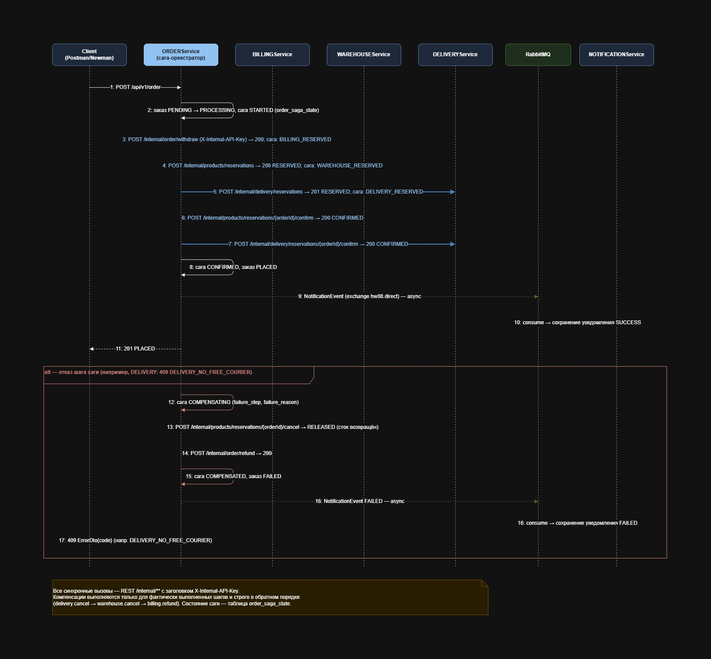
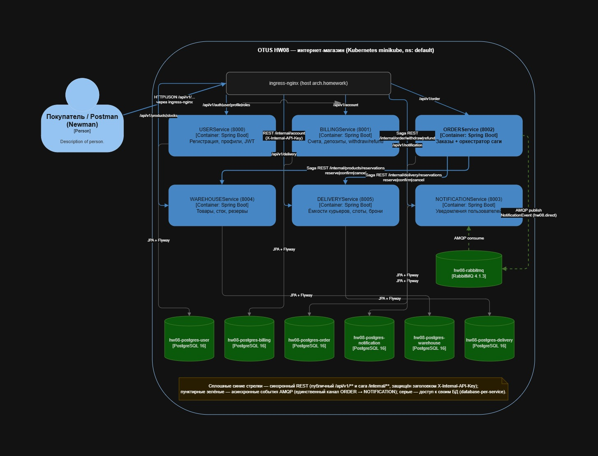

# FP - Идемпотентность и коммутативность API в HTTP и очередях

Домашнее задание №9 по курсу "Microservice Architecture" OTUS.

## Цель

Выполнить домашнее задание №9 (см. файл [README.md](./README.md)). Спроектировать взаимодействие сервисов при создании заказов. 
Запустить 6 микросервиса (User, Billing, Order, Delivery, Warehouse, Notification) в Kubernetes (minikube + Helm)
с доступом через `http://{{baseUrl}}/api/v1/...` (nginx ingress) и прогнать postman-сценарии через newman.

## Решение задачи производилось под Windows 11, Docker Desktop и MINIKUBE

## Директории проекта

- `USERService/`, `BILLINGService/`, `ORDERService/`, `DELIVERYService/` , `WAREHOUSEService/`, `NOTIFICATIONService/` - Spring Boot микросервисы
- `COMMONDomain/` - общая библиотека домена
- `DEV/` - файлы docker для локальной разработки
- `fpchart/` - Helm chart с манифестами Kubernetes
- `scripts/` - PowerShell-скрипты по этапам
- `postman/` - коллекции Postman и environment для Newman (k8s-прогоны - `postman/k8s/`, локальные - `postman/local/`)
- `reports/` - HTML-отчёты newman по прогонам postman-коллекций (`reports/k8s/`, `reports/local/`)
- `diagrams/` - диаграммы (сиквенс саги, C4 Container) в формате draw.io

---

## Архитектура Minikube Cluster

```
┌──────────────────────────────────────────────────────────────────────────────────────────────────────┐
│                            Minikube Cluster (namespace: default)                                     │
│                                                                                                      │
│  ingress-nginx (subchart), host: arch.homework                                                       │
│   Основной ingress (публичный API + internal для тестов):                                            │
│    /api/v1/auth|user|profile|roles         → fp-user-service:8000                                  │
│    /api/v1/account                         → fp-billing-service:8001                               │
│    /api/v1/order                           → fp-order-service:8002                                 │
│    /api/v1/notification                    → fp-notification-service:8003                          │
│    /api/v1/products|stocks                 → fp-warehouse-service:8004                             │
│    /api/v1/delivery                        → fp-delivery-service:8005                              │
│    /internal/products | /internal/delivery → warehouse/delivery (только для postman-тестов,          │
│                                               доступ защищён заголовком X-Internal-API-Key)          │
│   health-ingress (rewrite → /actuator/health):                                                       │
│    /health/user | billing | order | notification | warehouse | delivery   (6 путей)                  │
│                                                                                                      │
│  Deployments (replicas=1):                                                                           │
│   Сага создания заказа - синхронный REST /internal/** (по k8s DNS, минуя ingress):                   │
│    fp-order-service ──► fp-billing-service    POST /internal/order/withdraw|refund               │
│    fp-order-service ──► fp-warehouse-service  /internal/products/reservations (reserve/          │
│                                                    confirm/cancel/status)                            │
│    fp-order-service ──► fp-delivery-service   /internal/delivery/reservations (reserve/          │
│                                                    confirm/cancel/status)                            │
│   Автосоздание биллинг-аккаунта при регистрации:                                                     │
│    fp-user-service ──► fp-billing-service     POST /internal/account                             │
│   Асинхронные уведомления - AMQP (единственный канал через брокер):                                  │
│    fp-order-service ─ publish ─► fp-rabbitmq (exchange notifications.events) ◄─ listen ─                  │
│                                                    fp-notification-service                         │
│                                                                                                      │
│  StatefulSets postgres:16-alpine (PVC 1Gi каждый, database-per-service):                             │
│   fp-postgres-user | fp-postgres-billing | fp-postgres-order                                   │
│   fp-postgres-notification | fp-postgres-warehouse | fp-postgres-delivery                      │
│  Deployment rabbitmq:4.1.3-management: fp-rabbitmq (5672, 15672)                                   │
└──────────────────────────────────────────────────────────────────────────────────────────────────────┘
```

Внутренние вызовы биллинга (`/internal/account`, `/internal/order/*`) в ingress не публикуются - сервис-сервис взаимодействие идёт по k8s DNS.

---

## Паттерн распределённой транзакции: оркестрируемая Сага (Saga)

Создание заказа в решении - распределённая транзакция, затрагивающая три независимых микросервиса
со своими базами данных: деньги (BILLINGService), товар на складе (WAREHOUSEService) и курьер на слоте
доставки (DELIVERYService). Единой ACID-транзакции между ними быть не может (database-per-service),
поэтому применён паттерн **сага (Saga)**: серия локальных транзакций, после каждой из которой при отказе
выполняются компенсирующие операции, откатывающие уже сделанные шаги. Итог - eventual consistency.

Выбран вариант **оркестрируемой саги (Saga with Orchestrator)** - централизованное управление цепочкой
шагов из одного места. Альтернативы отклонены:

- **2PC/XA** - блокирующий протокол с координатором как единой точкой отказа; не подходит для независимо
  развиваемых сервисов со своими БД и длительного многостадийного процесса.
- **Хореография (событийная сага)** - без единой точки управления трудно отслеживать состояние цепочки
  из трёх и более шагов и запускать компенсации в гарантированно обратном порядке.

### Как реализована

- **Оркестратор** - ORDERService (метод `createOrder` в `OrderServiceImpl`). Состояние саги хранится
  в отдельной таблице `order_saga_state` (1:1 с заказом по уникальному `order_id`): поля `saga_status`,
  `failure_step`, `failure_reason` - прозрачность и аудит каждой саги.
- Все шаги и компенсации - **синхронные REST-вызовы** на внутренние эндпоинты `/internal/**` с заголовком
  `X-Internal-API-Key` (см. п. 6): оркестратору нужен немедленный результат шага, чтобы принять решение
  о следующем шаге или запуске компенсаций.
- **Форвардные шаги**: (1) BILLING `POST /internal/order/withdraw` - списание средств;
  (2) WAREHOUSE `POST /internal/products/reservations` - резерв товара (available −= qty, reserved += qty);
  (3) DELIVERY `POST /internal/delivery/reservations` - резерв курьера на слот.
- **Confirm-фаза** после успеха всех шагов: WAREHOUSE `.../{orderId}/confirm` (reserved −= qty, товар списан),
  DELIVERY `.../{orderId}/confirm`; для BILLING confirm - no-op (деньги уже списаны). Заказ → PLACED,
  сага → CONFIRMED.
- **Компенсации** при отказе любого шага выполняются строго в обратном порядке и только для фактически
  выполненных шагов: DELIVERY `.../{orderId}/cancel` → WAREHOUSE `.../{orderId}/cancel`
  (available += qty, reserved −= qty) → BILLING `POST /internal/order/refund`. Заказ → FAILED.
- Внешние HTTP-вызовы выполняются **вне транзакции БД**: `createOrder` не помечен `@Transactional`,
  каждое сохранение состояния - короткая транзакция репозитория. Нет длинных транзакций, удерживающих
  соединения на время HTTP-обменов.
- **Надёжность**: все шаги идемпотентны (billing - уникальность `(orderId, тип операции)` + частичный
  уникальный индекс; warehouse - per-item `idempotencyKey`; delivery - одна бронь на `orderId`) - повтор
  шага или компенсации безопасен. Ветвление логики - по HTTP-статусу и машинному коду `ErrorDto.code`
  (общие `ErrorCodes` из COMMONDomain). Транзитные ошибки (5xx, тайм-ауты, 409
  `CONCURRENT_MODIFICATION`) ретраятся до 3 попыток с экспоненциальным backoff; бизнес-отказы ведут
  к немедленной компенсации. Отказ самой компенсации переводит сагу в статус `COMPENSATION_FAILED`
  и требует ручного разбирательства; зависшие после краха саги доводятся scheduled-recovery
  (см. раздел «Идемпотентность и отказоустойчивость»).
- Уведомление пользователя об итоге саги (PLACED/FAILED) - асинхронно через RabbitMQ в NOTIFICATIONService
  (см. п. 8).
- Следствие: PLACED-заказ после успешной саги **неотменяем** - ресурсы CONFIRMED и откат невозможен;
  `POST /api/v1/order/{id}/cancel` вернёт 409 `ORDER_STATE_CONFLICT`.

### Шаги саги

| Шаг | Сервис           | Forward                                | Confirm                      | Компенсация                   |
|-----|------------------|----------------------------------------|------------------------------|-------------------------------|
| 1   | BILLINGService   | `POST /internal/order/withdraw`        | no-op                        | `POST /internal/order/refund` |
| 2   | WAREHOUSEService | `POST /internal/products/reservations` | `POST .../{orderId}/confirm` | `POST .../{orderId}/cancel`   |
| 3   | DELIVERYService  | `POST /internal/delivery/reservations` | `POST .../{orderId}/confirm` | `POST .../{orderId}/cancel`   |

### Статусы саги

`STARTED → BILLING_RESERVED → WAREHOUSE_RESERVED → DELIVERY_RESERVED → CONFIRMED`;
при отказе: `COMPENSATING → COMPENSATED` или `COMPENSATION_FAILED`.

### Полный поток (happy path + ветка компенсации) - на сиквенс-диаграмме


### Общая схема взаимодействия контейнеров


---

## Перед запуском

1. Запустить Docker Desktop
2. Убедиться, что установлены `minikube`, `helm`, `node`, `newman`, `newman-reporter-htmlextra`

---

## Подготовка окружения

### 1. Очистка старого окружения

```bash
# Удалить старый релиз hw08 если он есть
helm uninstall hw08
```
или
```bash
# воспользоваться скриптом удаления
.\scripts\07-helm-fp-uninstall.ps1
```

```bash
# Удалить PersistentVolume для старого PostgreSQL если они остались
kubectl delete pvc data-hw08-postgresql-*
```

### 2. Запуск minikube

```bash
.\scripts\02-start-minikube.ps1
```

**Важно:** `minikube start --memory=10240` (10 ГБ) - 6 сервисов + 6 PostgreSQL + RabbitMQ + ingress.

### 3. Сборка и публикация Docker образов

```bash
.\scripts\01-build-and-push.ps1 -DockerHubLogin akinxela
```

Образы: `akinxela/otusapp:fp-user`, `:fp-billing`, `:fp-order`, `:fp-delivery`, `:fp-warehouse`, `:fp-notification`.

### 4. Добавить DNS записи

```bash
# Узнать IP minikube кластера
minikube ip
```

Добавить в `C:\Windows\System32\drivers\etc\hosts`:
```
<minikube-ip> arch.homework
```

Если ingress недоступен - запустить 
```bash
# Запустить minikube tunnel 
minikube tunnel
```

---

## Установка приложения

### 4. Установка через Helm

```bash
.\scripts\03-helm-fp-install.ps1 -Namespace 'otus-msa-fp'
```

**Важно:** namespace - `otus-msa-fp`. (Otus Microservice Architecture FP)
Скрипт запускается с параметром `-Namespace otus-msa-fp`. Если параметр не указан, то используется значение по умолчанию namespace=`default`.
Если namespace, заданный через параметр еще не создан, то скрипт автоматически его создает.

Проверка статуса:
```bash
kubectl get pods -n 'otus-msa-fp'
```

---

## Важные моменты реализации

### 5. Мультимодульный проект
В рамках домашнего задания, для упрощения выбран мультимодульный проект Gradle. 
В реальном проекте, разработка каждого микросервиса должна осуществляться в отдельном git репозитории

### 6. Внутреннее взаимодействие микросервисов
Взаимодействие сервис-сервис реализовано только через синхронный REST на внутренние эндпоинты
`/internal/...` (без публичного API и без ingress внутри кластера).

Защита: каждый запрос к `/internal/**` обязан содержать заголовок `X-Internal-API-Key` со значением,
совпадающим с `INTERNAL_API_KEY` целевого сервиса (env, в k8s - Secret → env). Проверку выполняет общий
servlet-фильтр `InternalApiFilterConfig` из COMMONDomain, подключённый ко всем сервисам: заголовок
отсутствует или ключ неверный - **401 Unauthorized** с `ErrorDto` (общий обработчик
`InternalApiKeyExceptionHandler`); если ключ в сервисе не сконфигурирован - fail-closed **500**.

В кластере вызовы идут по k8s DNS мимо ingress (env `BILLING_SERVICE_URL`, `WAREHOUSE_SERVICE_URL`,
`DELIVERY_SERVICE_URL`); наружу через ingress выведены только `/internal/products` и `/internal/delivery`
- осознанно для postman k8s-тестов, доступ по-прежнему возможен только с ключом. Internal-эндпоинты
биллинга наружу не публикуются.

Таблица внутренних вызовов:

| Кто          | Кого             | Эндпоинт                                                                                                                    | Назначение                                                 |
|--------------|------------------|-----------------------------------------------------------------------------------------------------------------------------|------------------------------------------------------------|
| USERService  | BILLINGService   | `POST /internal/account`                                                                                                    | автосоздание биллинг-аккаунта при регистрации пользователя |
| ORDERService | BILLINGService   | `POST /internal/order/withdraw`                                                                                             | списание средств (шаг саги)                                |
| ORDERService | BILLINGService   | `POST /internal/order/refund`                                                                                               | возврат (компенсация саги / отмена заказа)                 |
| ORDERService | WAREHOUSEService | `POST /internal/products/reservations`                                                                                      | резерв товара (all-or-nothing по позициям заказа)          |
| ORDERService | WAREHOUSEService | `POST /internal/products/reservations/{orderId}/confirm` \| `/cancel`, `GET .../{orderId}`                                  | подтверждение/снятие резерва, статус                       |
| ORDERService | DELIVERYService  | `POST /internal/delivery/reservations`                                                                                      | резерв курьера на слот                                     |
| ORDERService | DELIVERYService  | `POST /internal/delivery/reservations/{orderId}/confirm` \| `/cancel`, `GET .../{orderId}`, `GET .../by-id/{reservationId}` | подтверждение/отмена/статус брони                          |

Идемпотентность внутренних операций делает безопасными повторные вызовы оркестратором (повтор шага или
компенсации не приводит к двойным эффектам).

### 7. Тесты

| Сервис              | Количество тестов |
|---------------------|-------------------|
| BILLINGService      | 39                |
| DELIVERYService     | 29                |
| NOTIFICATIONService | 7                 |
| ORDERService        | 76                |
| USERService         | 0                 |
| WAREHOUSEService    | 21                |

### 8. Общая библиотека
По принципу DRY общие для всех микросервисов классы вынесены в отдельную библиотеку COMMONDomain:

- базовые классы сущностей `AbstractEntity` / `AuditableEntity` (id, optimistic-lock `@Version`, аудит
  created/updated/createdBy/lastModifiedBy);
- единый контракт ошибок: `ErrorDto` (`message, status, timestamp, code`) и машинные коды ошибок
  `ErrorCodes` (14 констант: `INSUFFICIENT_STOCK`, `BILLING_INSUFFICIENT_FUNDS`, `DELIVERY_NO_FREE_COURIER`,
  `ORDER_STATE_CONFLICT`, `CONCURRENT_MODIFICATION` и др.);
- общие исключения (`NotFoundException`, `DuplicateResourceException`, `BillingServiceException`,
  `ProductReservationException`, `InternalApiKeyException` и др.);
- межсервисные DTO (wire-контракты) биллинга, склада, доставки и `NotificationEvent`;
- инфраструктура защиты `/internal/**`: `InternalApiFilterConfig` + `InternalApiKeyConfig`;
- `EnvLoader` - подхват `fp/.env` при локальном запуске.

Зачем: единый wire-контракт DTO между оркестратором и сервисами в одном месте исключает рассинхронизацию
контрактов; один общий фильтр защищает `/internal/**` во всех сервисах; по контракту ошибок
(`ErrorDto` + машинные коды) сага-оркестратор ветвит логику (компенсация vs отказ); единообразная база
сущностей и аудита ускоряет добавление нового сервиса.

В реальном проекте COMMONDomain собирается отдельно и подключается к каждому микросервису как зависимость
(опубликованный артефакт), а не как модуль одного репозитория.

### 9. Использование брокера сообщений.
Брокер сообщений RabbitMQ используется в решении **только для одного асинхронного канала между двумя
микросервисами**: ORDERService → NOTIFICATIONService. ORDERService публикует `NotificationEvent`
в exchange `notifications.events` (очередь `notification.queue`) - уведомления об итогах создания заказа
(PLACED/FAILED); NOTIFICATIONService потребляет сообщения и сохраняет уведомления. Только эти два сервиса
подключены к брокеру (`spring-boot-starter-amqp` только в них). Таким образом используется архитектурный
паттерн - «событийное взаимодействие с использованием брокера сообщений для нотификаций (уведомлений)».

Принципиально: **сага и все шаги распределённой транзакции реализованы через синхронный REST API
(`/internal/**`), не через брокер**. Оркестратору требуется немедленный результат каждого шага, чтобы
принять решение о следующем шаге или запуске компенсаций; событийная схема сделала бы управление состоянием
саги существенно сложнее. Брокер выбран именно для уведомлений, т.к. это fire-and-forget сценарий:
отправитель не ждёт ответа, потеря/задержка не влияет на консистентность заказа, а асинхронность
разгружает основной поток саги.

---

### 10. Идемпотентность и отказоустойчивость

**Важно** Все изменения аддитивны для wire-контрактов, обратная совместимость сохранена (hw08).

#### 10.1. Idempotency-Key для POST /api/v1/order (ORDERService)

- Заголовок `Idempotency-Key` (UUID; невалидный формат - 400 `MALFORMED_REQUEST`; заголовок отсутствует -
  поведение без изменений).
- Ключ + SHA-256 payload + владелец сохраняются в таблицу `idempotency_keys` (миграция V4) **в одной
  транзакции с первым сохранением заказа**: повтор ключа никогда не создаёт второй заказ.
- Семантика replay: при совпадении payload возвращается сохранённый ответ (201 + заказ) или текущее
  состояние заказа (200 - сага в процессе либо завершилась провалом); другой payload/владелец -
  409 `IDEMPOTENCY_KEY_CONFLICT`.
- Scheduled-очистка истёкших ключей (TTL `app.idempotency.ttl`, по умолчанию 24ч).

#### 10.2. Идемпотентный consumer уведомлений (NOTIFICATIONService)

- `NotificationEvent.eventId` (UUID-строка, генерируется оркестратором; поле аддитивное).
- Consumer дедуплицирует по `eventId` через таблицу `processed_messages` (миграция V2): маркер и
  уведомление фиксируются одной транзакцией; конкурентная повторная доставка (redelivery) трактуется
  как no-op. Сообщения без eventId (legacy) сохраняются без дедупликации.
- DLQ подключена: у `notification.queue` объявлены `x-dead-letter-exchange`/`x-dead-letter-routing-key`;
  consumer ретраит до 3 попыток с backoff, после исчерпания "ядовитое" сообщение уходит в
  `notification.queue.dlq`, а не выбрасывается. `concurrentConsumers=1` зафиксирован для порядка
  per-order. Эксплуатация: аргументы существующей очереди RabbitMQ изменить нельзя - перед деплоем
  на занятый брокер очередь `notification.queue` нужно удалить.

#### 10.3. Идемпотентность billing deposit и усиление replay

- Публичный `POST /api/v1/account/{userId}/deposit` принимает опциональный `idempotencyKey` в теле:
  повтор - replay прежней транзакции, другая сумма - 409 `IDEMPOTENCY_KEY_CONFLICT`
  (миграция V4: `transactions.idempotency_key` + частичный уникальный индекс).
- `withdraw`: replay сверяет userId/amount (иначе 409); гонка на уникальном индексе
  `(order_id, transaction_type)` завершается повторным SELECT и replay вместо 500.
- Warehouse/delivery `reserve`: replay со сверкой payload (productId/quantity; date/slot) - 409 при
  несовпадении; дубли позиций в запросе с разными ключами - 400.

#### 10.4. Transactional Outbox + надёжный producer (ORDERService)

- `NotificationEventPublisher` больше не публикует напрямую в очередь, а записывает событие в таблицу 
  `notification_outbox` (миграция V5) **в одной транзакции с финальным сохранением заказа** (обе ветки -
  PLACED и FAILED).
- Scheduled `OutboxPublisher` вычитывает events со статусом NEW и публикует в RabbitMQ (отметка SENT, attempts++, FAILED
  после исчерпания попыток / повреждённого payload). eventId outbox = eventId события - повторные
  публикации безопасны благодаря дедупликации consumer'а.
- `publisher-confirm-type: correlated` + `publisher-returns: true`: nack/returned возвращают событие
  в статус NEW для повторной публикации.

#### 10.5. Recovery сага-оркестратора (ORDERService)

- Scheduled-задача (60с) подбирает саги без прогресса дольше `app.saga.recovery.stale-after`
  (по умолчанию 5 мин) в статусах STARTED/BILLING_RESERVED/WAREHOUSE_RESERVED/DELIVERY_RESERVED/
  COMPENSATING.
- Фактическое состояние восстанавливается read-запросами без побочных эффектов: billing
  `GET /internal/order/{orderId}/withdraw-status` (новый эндпоинт), warehouse/delivery
  `GET .../reservations/{orderId}`.
- Все forward-шаги фактически выполнены → confirm-фаза → заказ PLACED; иначе - компенсации в обратном
  порядке от последнего фактически выполненного шага → заказ FAILED. Отдельный кейс: сага CONFIRMED,
  но заказ не PLACED (крах между transition и финальным save) → достраивается PLACED + outbox-событие.
- Защита от конкуренции - optimistic `@Version`; COMPENSATION_FAILED остаётся для ручного
  разбирательства.

#### 10.6. Ретраи транзитных ошибок и разрешение неопределённости confirm

- Классификация ошибок: транзитные (5xx, таймауты `ResourceAccessException`, 409
  `CONCURRENT_MODIFICATION`) ретраятся до 3 попыток (backoff 200мс × 2); бизнес-отказы
  (`INSUFFICIENT_STOCK`, `BILLING_INSUFFICIENT_FUNDS`, `DELIVERY_NO_FREE_COURIER`) - сразу компенсация.
  `BillingServiceClient` извлекает машинные коды через `DownstreamErrors` (как warehouse/delivery).
- Таймаут/ошибка warehouse/delivery confirm после исчерпания ретраев: read-запрос состояния резерва -
  если резерв уже CONFIRMED (confirm дошёл, ответ потерян), сага продолжается без компенсации.

#### 10.7. Контракт idempotency-key склада - замена Long на String

- `ReservationItemRequestDto.idempotencyKey` и колонка таблицы `product_reservations.idempotency_key` -
  `VARCHAR(64)` (миграция V4 WAREHOUSE: `ALTER COLUMN ... TYPE VARCHAR(64) USING ...::text`).
- ORDERService строит детерминированный ключ `"order-{orderId}-p{productId}"` - без коллизий и
  диапазонных ограничений числового множителя (`IDEMPOTENCY_KEY_MULTIPLIER` удалён). Контракт
  внутренний, breaking change допустим (WAREHOUSE↔ORDER деплоятся одним релизом).
- Warehouse `cancel` на статус CONFIRMED: вместо 400 - 409 с машинным кодом
  `RESERVATION_ALREADY_CONFIRMED` (откат финальных ресурсов невозможен; оркестратор учитывает код).

---

### 11. Ключевые принятые решения

11.1. Оркестрируемая сага в ORDERService (не 2PC, не хореография); состояние саги - отдельная таблица
   `order_saga_state` (1:1 с заказом).
11.2. Порядок шагов BILLING → WAREHOUSE → DELIVERY; компенсации в обратном порядке только по фактически
   выполненным шагам; confirm биллинга - no-op.
11.3. Внешние HTTP-вызовы вне транзакции БД (`createOrder` без `@Transactional`), сохранения состояния -
   короткими транзакциями репозитория.
11.4. Идемпотентность всех шагов саги и компенсаций: billing - уникальность `(orderId, тип операции)`
   + частичный уникальный индекс (миграция V3); warehouse - per-item `idempotencyKey`; delivery - одна
   бронь на `orderId`; refund без исходного withdraw - мягкий no-op 200 (компенсация не ломается).
11.5. Единый контракт ошибок: HTTP-статус + машинный код `ErrorDto.code` (общие `ErrorCodes`);
   бизнес-отказы - 409 с кодом (`INSUFFICIENT_STOCK`, `BILLING_INSUFFICIENT_FUNDS`,
   `DELIVERY_NO_FREE_COURIER`), технические - 409 `CONCURRENT_MODIFICATION` / `DATA_INTEGRITY_VIOLATION`,
   400/404 - немедленный отказ шага.
11.6. Защита `/internal/**` общим фильтром COMMONDomain по заголовку `X-Internal-API-Key`
   (401 при неверном/отсутствующем ключе; fail-closed 500, если ключ не сконфигурирован).
11.7. COMMONDomain - общая библиотека домена, DTO-контрактов, ошибок и internal-фильтра (DRY).
11.8. RabbitMQ - только асинхронные уведомления ORDER → NOTIFICATION; сага - синхронный REST.
11.9. Отмена PLACED-заказа после успешной саги невозможна (ресурсы CONFIRMED) → 409 `ORDER_STATE_CONFLICT`;
   отменены могут быть только резервы в статусе RESERVED.
11.10. База: database-per-service - 6 отдельных PostgreSQL (StatefulSet + PVC 1Gi), Flyway-миграции,
    `ddl-auto: validate`.
11.11. Helm chart `fpchart`: namespace `otus-msa-fp`, host `arch.homework`, ingress публикует публичный API
    и два internal-маршрута только для тестов; health-ingress - 6 путей с rewrite на `/actuator/health`.
11.12. Мультимодульный Gradle-проект вместо отдельных git-репозиториев (упрощение в рамках ДЗ).
11.13. LAZY-загрузка в WAREHOUSEService: `@NamedEntityGraph` + entity graphs в репозиториях + bytecode
    enhancement (Gradle-плагин `org.hibernate.orm`) - inverse-side `@OneToOne` без enhancement физически
    не может быть LAZY.
11.14. Доменные исключения с фабриками и машинным кодом (`ProductReservationException`,
    `DeliveryReservationException`, `CourierAssignmentException` → 500 как «should be unreachable»,
    `OrderStateConflictException`) вместо catch-all на `IllegalStateException` - снята маскировка
    непредвиденных ошибок под бизнес-400.
11.15. Биллинг-аккаунт создаётся автоматически при регистрации пользователя (USERService → BILLINGService
    `POST /internal/account`, идемпотентно).
11.16. Публичный `POST /api/v1/order` идемпотентен по опциональному заголовку `Idempotency-Key` (UUID):
    ключ резервируется в одной транзакции с первым сохранением заказа, успешный ответ сохраняется
    для replay, повтор ключа никогда не создаёт второй заказ (см. раздел 10. Идемпотентность и отказоустойчивость).
11.17. Идемпотентность шагов усилена сверкой payload при replay: warehouse - productId/quantity,
    delivery - date/slot, billing withdraw - userId/amount, deposit - сумма по опциональному
    `idempotencyKey`; несовпадение - 409 `IDEMPOTENCY_KEY_CONFLICT`.
11.18. Канал уведомлений: eventId в `NotificationEvent` + дедупликация consumer'а (таблица
    `processed_messages`), DLQ с ретраями, transactional outbox + publisher confirms у producer'а.
11.19. Отказоустойчивость оркестратора: scheduled-recovery зависших саг + ретраи транзитных ошибок
    шагов с разрешением неопределённости confirm через read-запросы состояния резервов.

---

## Postman-тесты

### 12. Запуск тестов (Kubernetes)

```bash
.\scripts\06-run-postman-k8s.ps1 -HtmlReport
```

Отчёты сохраняются в `reports/k8s/` с timestamp в имени файла.
Т.к. отчеты собирались в файлы html (с помощью newman-reporter-htmlextra), то для их просмотра необходимо открыть файлы отчетов в любом браузере.
Чтобы посмотреть данных запроса и данных ответа, необходимо развернуть "схлопнутые" части отчета.

#### 12.1. Структура коллекций

Шесть коллекций в `postman/k8s/` используют `{{baseUrl}}` = `http://arch.homework` (через Ingress helm chart `fpchart`):

| Коллекция                       | Сценарий                                                                                                                                                                    |
|---------------------------------|-----------------------------------------------------------------------------------------------------------------------------------------------------------------------------|
| `otus-hw9-success-k8s`          | Happy path саги BILLING -> WAREHOUSE -> DELIVERY: 201 PLACED, резервы CONFIRMED, баланс 90, сток 19, уведомление SUCCESS                                                    |
| `otus-hw9-failed-billing-k8s`   | Отказ на шаге BILLING (нулевой баланс, депозита нет): 502, заказ FAILED, компенсаций нет, уведомление FAILED                                                                |
| `otus-hw9-failed-warehouse-k8s` | Отказ на шаге WAREHOUSE (сток меньше qty): 409 INSUFFICIENT_STOCK, refund, заказ FAILED, уведомление FAILED                                                                 |
| `otus-hw9-failed-delivery-k8s`  | Отказ на шаге DELIVERY (нет свободного курьера в слоте): 409 DELIVERY_NO_FREE_COURIER, refund и снятие резерва стока, уведомление FAILED                                    |
| `otus-hw9-cancel-conflict-k8s`  | Попытка отмены размещённого заказа: 409 ORDER_STATE_CONFLICT, заказ и резервы остаются CONFIRMED                                                                            |
| `otus-hw9-idempotency-k8s`      | Idempotency-Key: повтор POST /order с тем же ключом/payload -> тот же заказ (201, списание одно); другой payload -> 409 IDEMPOTENCY_KEY_CONFLICT; новый ключ -> новый заказ |

Каждая коллекция начинается с health-проверок шести сервисов через `/health/<service>` (health-ingress с rewrite на `/actuator/health`), 
далее проходит E2E-сценарий и опрашивает NOTIFICATIONService до появления уведомления (до 10 попыток). 
Internal-эндпоинты склада и доставки (`/internal/products`, `/internal/delivery`) вызываются с заголовком `X-Internal-API-Key`; 
internal-эндпоинты биллинга через ingress не публикуются - межсервисные вызовы в кластере идут по k8s DNS.

**Важно:** Тесты используют `{{baseUrl}}` с initial значением `http://arch.homework`; домен должен резолвиться на IP ingress-контроллера (minikube tunnel и/или запись в файле hosts).

**Важно (апгрейд с предыдущей версии hw08):** у очереди `notification.queue` появились DLX-аргументы
(`x-dead-letter-exchange`, `x-dead-letter-routing-key`). RabbitMQ отклоняет изменение аргументов уже
существующей очереди, поэтому перед `helm upgrade` на занятом стенде очередь нужно удалить
(RabbitMQ management UI или `rabbitmqctl delete_queue notification.queue`); иначе приложение не сможет её переобъявить.

#### 12.2. Запуск тестов (локальный стенд)

```bash
.\scripts\05-run-postman-local.ps1 -HtmlReport
```

Прогон шести локальных коллекций из `postman/local/` последовательно, против локального стека
микросервисов: 6 сервисов на портах 8000–8005 (USER, BILLING, ORDER, NOTIFICATION, WAREHOUSE,
DELIVERY), инфраструктура - `DEV/docker-compose.yaml` (6 PostgreSQL + RabbitMQ). Отчёты сохраняются
в `reports/local/` с timestamp в имени файла.

Локальные коллекции зеркалят k8s-сценарии из таблицы выше (включая `otus-hw9-idempotency`),
но обращаются напрямую к URL сервисов (`{{userServiceUrl}}` … `{{deliveryServiceUrl}}`) вместо
`{{baseUrl}}`; health-проверки - `GET {{*ServiceUrl}}/actuator/health` каждого сервиса.

Предпосылки:

- поднят `DEV/docker-compose.yaml` (контейнеры healthy);
- шесть сервисов запущены локально с переменными из `fp/.env` (например, run-конфигурациями IDE);
- в `fp/.env` задан `INTERNAL_API_KEY` - обязателен: без него `/internal/**` отдают 401.

Особенности:

- **Секрет не попадает в коллекции:** скрипт читает `INTERNAL_API_KEY` из `fp/.env` (или из
  параметра `-InternalApiKey` - имеет приоритет) и передаёт newman через
  `--env-var internalApiKey=...`; в консоль значение не выводится (`internalApiKey=***`).
- **Устойчивость к повторным прогонам:** резервы доставки прошлых прогонов не удаляются, а даты
  коллекций зациклены, поэтому в коллекциях с точной ёмкостью курьеров (success, cancel-conflict,
  failed-delivery, idempotency) перед `PUT courier-capacity` выполняется шаг-зонд
  `GET /api/v1/delivery/courier-capacity/{deliveryDate}`: при 404 (ёмкость ещё не настроена)
  берётся слот по умолчанию и `reservedMax = 0`; при 200 - самый занятый слот по `reservedCount`.
  Затем вставляется `courierCount = reservedMax + N` (N = 1 для success/cancel-conflict/failed-delivery,
  N = 2 для idempotency) - повторные прогоны не дают ложных `DELIVERY_NO_FREE_COURIER`.
  В failed-billing/failed-warehouse зонда нет (заказ падает до шага доставки).

#### 12.3. E2E-сценарий саги на connekt (saga-order.connekt.kts)

`saga-order.connekt.kts` - E2E-сценарий саги создания заказа на connekt DSL на
локальном стенде (хосты и ключ - из `connekt.env.json` / `connekt.private.env.json`):
S1 успех + confirm → S2 отказ биллинга → S3 отказ склада → S4 отказ доставки (занятость курьеров
рассчитывается зондом ёмкости - повторные прогоны устойчивы к старым резервам) → S5 конфликт отмены,
плюс assert'ы на уведомления. Статусы/коды саги и машинный код `DELIVERY_NO_FREE_COURIER`
проверяются так же, как в postman-коллекциях; `idempotencyKey` резервов склада читается по строковому
контракту (`"order-{orderId}-p{productId}"`).

---

### 13. Удаление приложения

```bash
.\scripts\07-helm-fp-uninstall.ps1
```
