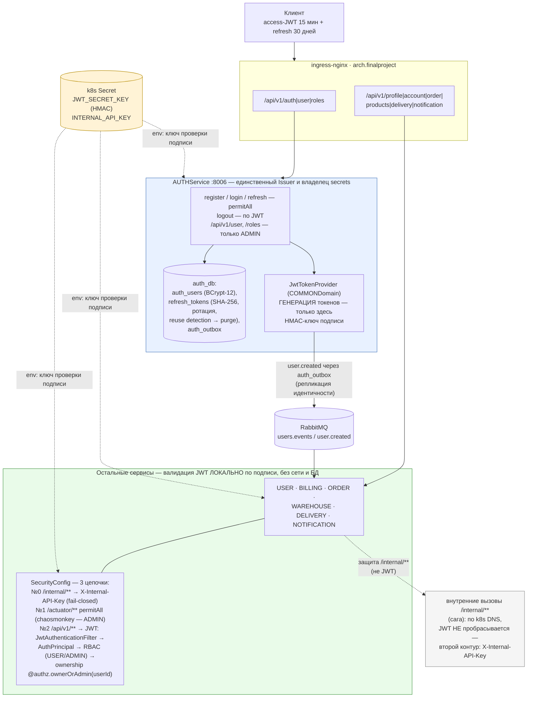

# Архитектура аутентификации: единый Issuer + локальная валидация

> Источник фактов: `OTUS - Microservices - FP Solution.md` §6.1 и `OTUS - Microservices - FP Solution.md` §6.1. Статичная схема (не из newman-отчётов), редактируется вручную вместе с `.mmd`/`.png`/`.svg`.

AUTHService — единственный центр генерации токенов и владелец secrets; все остальные сервисы валидируют JWT локально по HMAC-подписи общими компонентами COMMONDomain, без обращения к AUTH или его БД (нет единой точки отказа для чтения запросов).

## Легенда

- Сплошные стрелки — синхронный HTTP-трафик; пунктирные (`-.-`) — предоставление конфигурации (env-переменные из k8s Secret) и примечание о внутреннем контуре.
- `AUTHZ0` — единственный сервис с правами генерации JWT (`JwtTokenProvider`); `SVCS` — все остальные сервисы, используют тот же класс COMMONDomain только для **валидации** подписи локально.
- `SEC` (`JWT_SECRET_KEY`, `INTERNAL_API_KEY`) — общий k8s Secret, пробрасывается как env во все поды (AUTH — для подписи, остальные — только для проверки подписи).
- `INT` — второй контур защиты: вызовы `/internal/**` (сага ORDER → BILLING/WAREHOUSE/DELIVERY) идут по k8s DNS и проверяются по `X-Internal-API-Key`, JWT туда **не** пробрасывается.
- `MQ` — асинхронная репликация идентичности: `user.created` через `auth_outbox` достигает USER (проекция профиля) и BILLING (создание счёта) без прямого обращения к AUTH.
