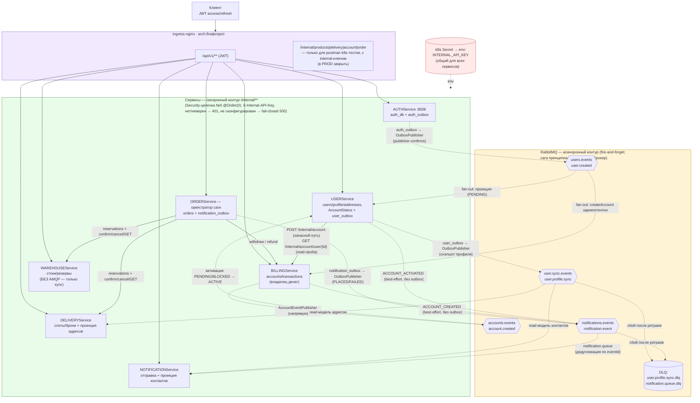

# Два контура межсервисного взаимодействия: синхронный REST /internal/** и асинхронный RabbitMQ

> Источник фактов: `OTUS - Microservices - FP Solution.md` §6, §9 и `OTUS - Microservices - FP Solution.md` §6, §9. Статичная схема (не из newman-отчётов), редактируется вручную вместе с `.mmd`/`.png`/`.svg`.

Синхронный контур — только REST `/internal/...` по k8s DNS (`http://fp-billing-service:8001/...`), мимо ingress, защита — `X-Internal-API-Key` (Security-цепочка №0 `@Order(0)`, fail-closed). Асинхронный контур — 4 exchange RabbitMQ: репликация идентичности (`user.created`), синхронизация профиля (`user.profile.sync`), активация аккаунта (`account.created`), уведомления (`notification.event`). Сага принципиально идёт через синхронный REST, не через брокер.

## Легенда

- Сплошные стрелки — синхронный REST (клиент через ingress по JWT; сервис→сервис по `/internal/**` через k8s DNS с `X-Internal-API-Key`); пунктирные — асинхронные сообщения RabbitMQ.
- Зеленый контур — синхронный (сага заказа: ORDER вызывает BILLING/WAREHOUSE/DELIVERY; идемпотентные шаги и компенсации), жёлтый — асинхронный (4 exchange + DLQ), фиолетовый — ingress, красный — общий секрет internal-ключа.
- Transactional outbox у AUTH/USER/ORDER (критичные события); BILLING/USER публикуют `notification.event` best-effort напрямую (потеря допустима).
- WAREHOUSE — единственный сервис без AMQP: склад участвует только в синхронном контуре саги.
- Вывод `/internal/**` через ingress наружу — осознанно для postman k8s-тестов (доступ только с internal-ключом; в PROD закрыть).
