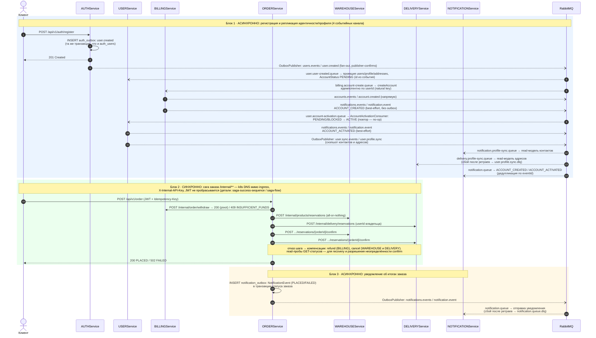

# Межсервисное взаимодействие end-to-end: асинхронная репликация + синхронная сага + асинхронное уведомление

> Источник фактов: `OTUS - Microservices - FP Solution.md` §6, §9 и `OTUS - Microservices - FP Solution.md` §6, §9 («Полный путь данных пользователя»). Статичная схема (не из newman-отчётов), редактируется вручную вместе с `.mmd`/`.png`/`.svg`.

Один сквозной сценарий из трёх блоков: (1) регистрация — событие `user.created` из `auth_outbox` реплицирует идентичность в USER и BILLING, `account.created` активирует профиль, `user.profile.sync` разносит контакты/адреса в NOTIFICATION и DELIVERY; (2) заказ — синхронная сага по `/internal/**` (k8s DNS мимо ingress, `X-Internal-API-Key`, JWT не пробрасывается); (3) итоги заказа — `NotificationEvent` из `notification_outbox` уходит в NOTIFICATION. Детали саги — в `saga-success-sequence` / `saga-failed-billing-sequence` / `saga-flow`.

## Легенда

- `->>` сплошная — синхронный HTTP-вызов (запрос/ответ), `-->>` — синхронный ответ, `--)` — асинхронное сообщение через RabbitMQ (fire-and-forget).
- Цветные блоки: синий — асинхронная репликация идентичности/профиля, зелёный — синхронная сага, жёлтый — асинхронное уведомление.
- Transactional outbox (AUTH `auth_outbox`, USER `user_outbox`, ORDER `notification_outbox`) — событие пишется в той же транзакции, что и бизнес-изменение, и публикуется `OutboxPublisher` с publisher-confirms; BILLING/USER в `notifications.events` — best-effort напрямую через `RabbitTemplate` (потеря допустима, ERROR-лог).
- Все консьюмеры идемпотентны (дедупликация по `eventId`/natural key); после исчерпания ретраев — DLQ (`user.profile.sync.dlq`, `notification.queue.dlq`).
- Все шаги и компенсации саги идемпотентны; сага принципиально синхронная — оркестратору нужен немедленный вердикт шага.
