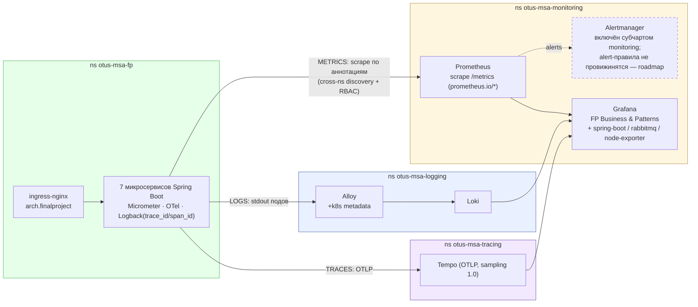

# Observability-топология: 4 namespace, метрики/логи/трейсы → Grafana

> Источник фактов: `OTUS - Microservices - FP Solution.md` §14–16. Статичная схема (не из newman-отчётов), редактируется вручную вместе с `.mmd`/`.png`/`.svg`.

Приложение в `otus-msa-fp` отдаёт три сигнала: метрики (`/metrics`, scrape Prometheus из `otus-msa-monitoring` по аннотациям `prometheus.io/*` с cross-ns discovery + RBAC), логи (stdout подов → Alloy с k8s metadata → Loki в `otus-msa-logging`) и трейсы (OTLP → Tempo в `otus-msa-tracing`, sampling 1.0). Grafana — единая точка просмотра поверх всех трёх источников.

## Легенда

- Сплошные стрелки — потоки телеметрии (метрики/логи/трейсы и их подача в Grafana); пунктир в Alertmanager — компонент развёрнут субчартом, но alert-правила не провижинятся (осознанное ограничение, roadmap).
- `TZ=UTC` на всех подах — единая шкала времени для корреляции сигналов.
- `resilience4j_*` и бизнес-метрики саг/outbox/DLQ выходят через Micrometer тем же путём (scrape по аннотациям).
