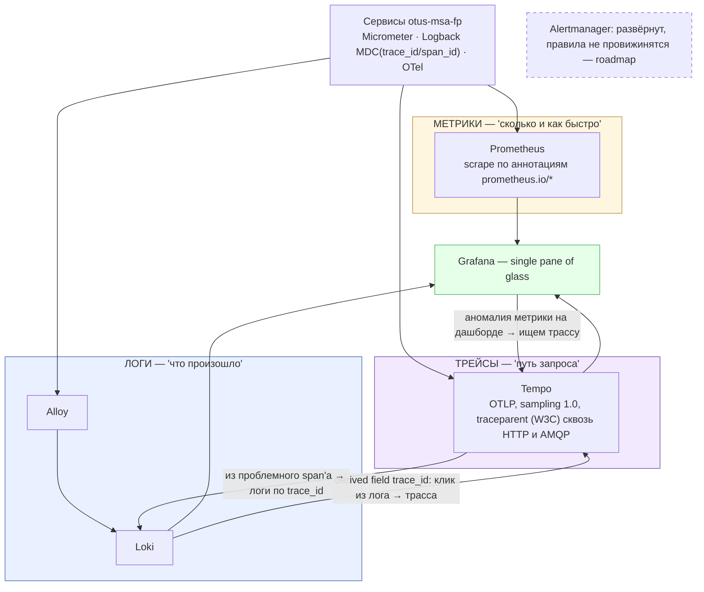

# Три столпа observability и корреляция через trace_id

> Источник фактов: `OTUS - Microservices - FP Solution.md` §14–16. Статичная схема (не из newman-отчётов), редактируется вручную вместе с `.mmd`/`.png`/`.svg`.

Метрики («сколько и как быстро»), логи («что произошло») и трейсы («путь запроса») связаны воедино через `trace_id`: Logback кладёт `trace_id`/`span_id` в MDC каждой строки лога, W3C `traceparent` пробрасывается сквозь HTTP и AMQP. Derived field в Loki даёт клик по `trace_id` в логе → переход к трассе в Tempo; из проблемного span'а — обратно к логам по `trace_id`; с аномалии метрики на дашборде — поиск трассы.

## Легенда

- Три столпа: МЕТРИКИ (Prometheus), ЛОГИ (Alloy → Loki), ТРЕЙСЫ (Tempo); переходы между ними — по `trace_id`.
- Дашборды Grafana: «FP Business & Patterns» (саги, outbox, DLQ, revenue) + готовые spring-boot / rabbitmq / node-exporter.
- Alertmanager (пунктир) — развёрнут субчартом monitoring, alert-правила не провижинятся (roadmap).
