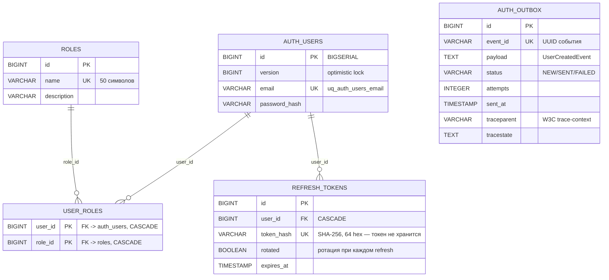

# ER: auth_db (AUTHService) — идентичность, роли, refresh-токены, outbox

> Источник: Flyway-миграции `AUTHService/src/main/resources/db/migration/V1–V6`. Компактная схема: только ключевые таблицы и поля. Аудит-колонки (`version`/`created`/`updated`/`created_by`/`last_modified_by`) опущены, кроме упомянутых явно.

- `auth_users` — единственные credentials в проекте (email UNIQUE + `password_hash`); ACCESS-токен валидируется локально без БД.
- `refresh_tokens` — токен не хранится: только `token_hash` (SHA-256, UNIQUE) + флаг `rotated` (ротация при каждом refresh) + `expires_at`.
- `auth_outbox` — Transactional Outbox события `user.created` (регистрация): event_id UUID UNIQUE, статусы NEW/SENT/FAILED, trace-context с V6.

