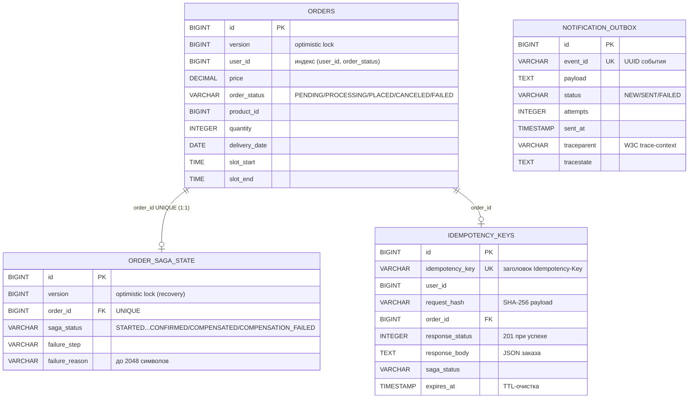

# ER: order_db (ORDERService) — заказы, состояние саги, идемпотентность, outbox

> Источник: Flyway-миграции `ORDERService/src/main/resources/db/migration/V1–V6`. Компактная схема: только ключевые таблицы и поля (PK/FK/UK, `order_status`, `saga_status`, `version`, `idempotency_key`, outbox-статусы). Аудит-колонки (`created`/`updated`/`created_by`/`last_modified_by`) намеренно опущены.

- `orders` — бизнес-заказ; `order_saga_state` — состояние оркестрируемой саги 1:1 с заказом (UNIQUE `order_id`),оптимистичная блокировка колонкой `version`.
- `idempotency_keys` — UNIQUE `idempotency_key` + `request_hash` (SHA-256 payload): повтор POST /api/v1/order не создаёт второй заказ, возвращает сохранённый `response_status`/`response_body`.
- `notification_outbox` — Transactional Outbox канала ORDER → NOTIFICATION (event_id UUID UNIQUE, статусы NEW/SENT/FAILED, trace-context с V6).

