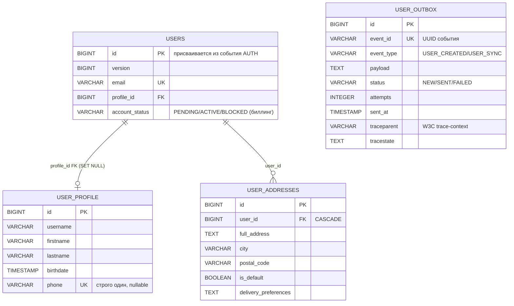

# ER: user_db (USERService) — проекция идентичности, профиль, адреса, outbox

> Источник: Flyway-миграции `USERService/src/main/resources/db/migration/V1–V8`. Компактная схема: только ключевые таблицы и поля. Аудит-колонки опущены. Таблицы `roles`/`user_roles` и credential-колонки физически удалены миграцией V7 (аутентификация переехала в AUTHService).

- `users` — проекция идентичности "для людей": `id` присваивается из события AUTH (`user.created`), credentials не хранятся; `account_status` (PENDING/ACTIVE/BLOCKED) — статус биллинг-аккаунта по событийной хореографии USER ↔ BILLING.
- `user_profile` — профиль; `phone` UNIQUE, строго один (nullable). USERService — source of truth контактов.
- `user_addresses` — адреса доставки 1:N (source of truth; снимок адресов публикуется в `UserSyncEvent`, DELIVERY ведёт свою read-модель по natural key `(user_id, source_address_id)`).
- `user_outbox` — Transactional Outbox двух типов событий: `USER_CREATED` (USER → BILLING) и `USER_SYNC` (USER → NOTIFICATION/DELIVERY), event_id UUID UNIQUE, статусы NEW/SENT/FAILED, trace-context с V8.

