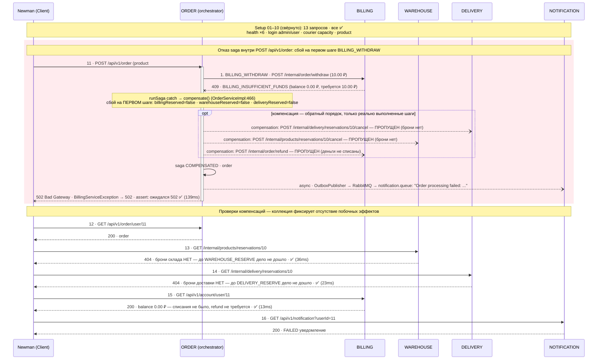

# Saga FAILED (billing) — sequence-диаграмма прогона otus-fp-failed-billing-k8s

> Сгенерировано 2026-09-10 15:58 UTC скриптом `scripts/08-gen-saga-diagrams.ps1` (генератор `scripts/gen-saga-diagrams.mjs`). Не редактировать вручную — перегенерировать.
- Источник: `reports/k8s/newman-json-otus-fp-failed-billing-k8s-20260910-173713.json` — 19 запросов, 36 assertions (0 failed), длительность 15.1s, старт 2026-09-10T14:37:36.862Z

## Легенда

- `->> / -->>` — синхронный REST-вызов (сплошная/пунктирная стрелка с наконечником).
- `--) / --x` — асинхронная доставка RabbitMQ (`--)`), сбой/ошибка (`--x`, `-x`).
- Внутренние вызовы ORDER → BILLING/WAREHOUSE/DELIVERY (`/internal/**`) производные из кода
  `OrderServiceImpl.runSaga/compensate` — newman их не видит; коллекции проверяют результат.
- Уведомления: transactional outbox → scheduled `OutboxPublisher` → RabbitMQ → `NOTIFICATIONService.NotificationConsumer`.
- ✅ / ❌ — статус assertions newman по факту прогона, `(Nms)` — фактическое время ответа.

Прогон: **newman-json-otus-fp-failed-billing-k8s-20260910-173713.json**. Отказ на первом шаге saga (BILLING_WITHDRAW → BILLING_INSUFFICIENT_FUNDS), компенсации пропущены — откатывать нечего; отсутствие побочных эффектов подтверждают проверки (404/404, balance 0, FAILED-уведомление).

