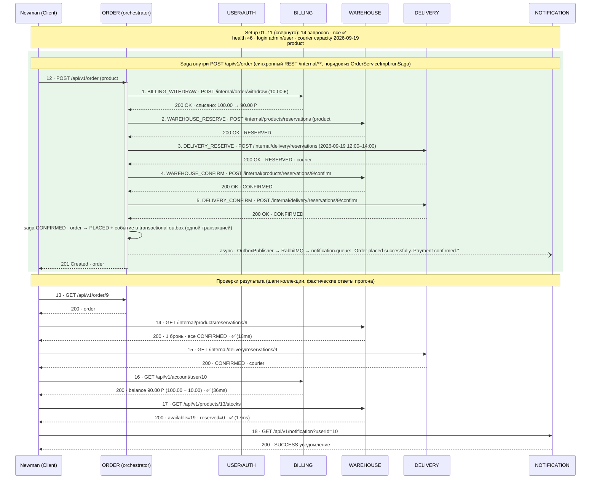

# Saga SUCCESS — sequence-диаграмма прогона otus-fp-success-k8s

> Сгенерировано 2026-09-10 15:58 UTC скриптом `scripts/08-gen-saga-diagrams.ps1` (генератор `scripts/gen-saga-diagrams.mjs`). Не редактировать вручную — перегенерировать.
- Источник: `reports/k8s/newman-json-otus-fp-success-k8s-20260910-173713.json` — 21 запрос, 41 assertions (0 failed), длительность 17.9s, старт 2026-09-10T14:37:16.091Z

## Легенда

- `->> / -->>` — синхронный REST-вызов (сплошная/пунктирная стрелка с наконечником).
- `--) / --x` — асинхронная доставка RabbitMQ (`--)`), сбой/ошибка (`--x`, `-x`).
- Внутренние вызовы ORDER → BILLING/WAREHOUSE/DELIVERY (`/internal/**`) производные из кода
  `OrderServiceImpl.runSaga/compensate` — newman их не видит; коллекции проверяют результат.
- Уведомления: transactional outbox → scheduled `OutboxPublisher` → RabbitMQ → `NOTIFICATIONService.NotificationConsumer`.
- ✅ / ❌ — статус assertions newman по факту прогона, `(Nms)` — фактическое время ответа.

Прогон: **newman-json-otus-fp-success-k8s-20260910-173713.json**. Saga-часть — шаги 12, 13, 14, 15, 16, 17, 18; setup (14 запросов) свёрнут в note.

